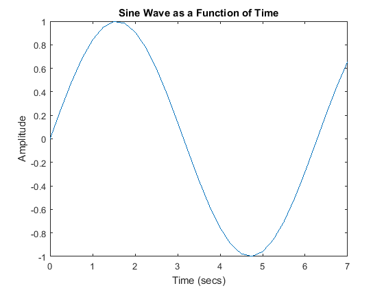

**Доступ:** MATLAB Online (basic).
**Джерело:** адаптовано з [MATLAB Basics Tutorial](https://ctms.engin.umich.edu/CTMS/index.php?aux=Basics_Matlab) (CTMS, CC BY-SA 4.0).
**Основні команди MATLAB:** `plot`, `polyval`, `roots`, `conv`, `deconv`, `inv`, `eig`, `poly`, `tf`, `zero`.

MATLAB — це інтерактивне середовище для чисельних обчислень і візуалізації даних; інженери-фахівці з керування широко використовують його для аналізу та проєктування. Базові можливості MATLAB розширюють численні пакети (toolbox) для різних предметних галузей; у цьому курсі ми активно користуємося **Control System Toolbox**.

Ідея цих модулів така: тримайте конспект в одному вікні, а MATLAB — у другому. Усі графіки й обчислення з конспекту можна відтворити, копіюючи текст із конспекту в командне вікно MATLAB або в m-файл.

## Результати

Після модуля ви зможете створювати вектори й матриці, виконувати матричні обчислення, подавати многочлени двома способами, будувати графіки, писати скрипти та знаходити довідку командою `help`.

## Вектори

Почнімо з чогось простого — вектора. Введіть елементи вектора (розділені пробілами) у квадратних дужках і присвойте їх змінній. Наприклад, щоб створити вектор `a`, уведіть у командному вікні MATLAB:

```matlab
a = [1 2 3 4 5 6 9 8 7]
```

```text
a =
     1     2     3     4     5     6     9     8     7
```

Припустімо, потрібен вектор з елементами від 0 до 20, рівномірно розподіленими з кроком 2 (так часто створюють вектор часу):

```matlab
t = 0:2:20
```

```text
t =
     0     2     4     6     8    10    12    14    16    18    20
```

Працювати з векторами майже так само просто, як і створювати їх. Щоб додати 2 до кожного елемента вектора `a`:

```matlab
b = a + 2
```

```text
b =
     3     4     5     6     7     8    11    10     9
```

Якщо два вектори мають однакову довжину, їх можна просто додати:

```matlab
c = a + b
```

```text
c =
     4     6     8    10    12    14    20    18    16
```

Віднімання векторів однакової довжини працює точно так само.

## Функції

Щоб спростити роботу, MATLAB містить багато стандартних функцій. Кожна функція — це блок коду, що виконує конкретне завдання. У MATLAB є всі звичні функції: `sin`, `cos`, `log`, `exp`, `sqrt` та багато інших. Уживані сталі, як-от `pi`, а також `i` чи `j` для уявної одиниці, теж уже вбудовані.

```matlab
sin(pi/4)
```

```text
ans =
    0.7071
```

Щоб дізнатися, як користуватися будь-якою функцією, уведіть у командному вікні `help [ім'я функції]`.

MATLAB дозволяє й писати власні функції — за допомогою команди `function`.

## Побудова графіків

Будувати графіки в MATLAB так само просто. Нехай потрібно побудувати синусоїду як функцію часу. Спершу створіть вектор часу (крапка з комою після оператора каже MATLAB не виводити всі значення), а потім обчисліть синус у кожен момент. Команди після `plot` (`title`, `xlabel`, `ylabel`) додають підписи до графіка.

```matlab
t = 0:0.25:7;
y = sin(t);

plot(t,y)
title('Sine Wave as a Function of Time')
xlabel('Time (secs)')
ylabel('Amplitude')
```



На графіку показано приблизно один період синусоїди. Базова побудова графіків у MATLAB дуже проста, а команда `plot` має широкі додаткові можливості.

## Многочлени у вигляді векторів

У MATLAB многочлен подають вектором. Щоб створити многочлен, просто введіть його коефіцієнти у вектор **у порядку спадання степенів**. Наприклад, нехай маємо такий многочлен:

$$
s^4 + 3s^3 - 15s^2 - 2s +9
$$

У MATLAB його записують так:

```matlab
x = [1 3 -15 -2 9]
```

```text
x =
     1     3   -15    -2     9
```

MATLAB трактує вектор довжини $n+1$ як многочлен $n$-го степеня. Тому, якщо в многочлені бракує якихось коефіцієнтів, у відповідних місцях вектора треба поставити нулі. Наприклад, многочлен

$$
s^4 + 1
$$

у MATLAB подають так:

```matlab
y = [1 0 0 0 1]
```

```text
y =
     1     0     0     0     1
```

Значення многочлена знаходять функцією `polyval`. Наприклад, щоб обчислити наведений вище многочлен у точці $s = 2$:

```matlab
z = polyval([1 0 0 0 1],2)
```

```text
z =
    17
```

Можна також знайти корені многочлена — це стає в пригоді для многочленів високого степеня, як-от

$$
s^4 + 3s^3 - 15s^2 - 2s + 9
$$

Для цього достатньо однієї команди:

```matlab
roots([1 3 -15 -2 9])
```

```text
ans =
   -5.5745
    2.5836
   -0.7951
    0.7860
```

Щоб перемножити два многочлени, треба згорнути їхні коефіцієнти — це робить функція `conv`:

```matlab
x = [1 2];
y = [1 4 8];
z = conv(x,y)
```

```text
z =
     1     6    16    16
```

Ділення многочленів так само просте. Функція `deconv` повертає і частку, і остачу. Поділімо `z` на `y` і перевірмо, чи дістанемо `x`:

```matlab
[xx, R] = deconv(z,y)
```

```text
xx =
     1     2
R =
     0     0     0     0
```

Як бачите, це саме той многочлен `x`, що й раніше. Якби `y` не ділило `z` націло, вектор остачі був би ненульовим.

## Многочлени через змінну `s`

Інший спосіб подати многочлен — скористатися змінною Лапласа `s`. Саме цей спосіб переважно застосовують у цьому курсі. Наразі облишмо подробиці області Лапласа й просто подаватимемо многочлени через змінну `s`. Щоб визначити цю змінну, уведіть у командному вікні:

```matlab
s = tf('s')
```

```text
s =
 
  s
 
Continuous-time transfer function.
```

Пригадаймо наведений вище многочлен:

$$
s^4 + 3s^3 - 15s^2 - 2s +9
$$

У MATLAB його записують так:

```matlab
polynomial = s^4 + 3*s^3 - 15*s^2 - 2*s + 9
```

```text
polynomial =
 
  s^4 + 3 s^3 - 15 s^2 - 2 s + 9
 
Continuous-time transfer function.
```

Замість функції `roots` для пошуку коренів такого многочлена використовують функцію `zero`:

```matlab
zero(polynomial)
```

```text
ans =
   -5.5745
    2.5836
   -0.7951
    0.7860
```

Результат той самий, що й раніше з командою `roots` і коефіцієнтами многочлена.

Через змінну `s` многочлени можна й перемножувати. Перевизначмо `x` і `y`:

```matlab
x = s + 2;
y = s^2 + 4*s + 8;
z = x * y
```

```text
z =
 
  s^3 + 6 s^2 + 16 s + 16
 
Continuous-time transfer function.
```

Отриманий многочлен має ті самі коефіцієнти, що й вектор, який вище повернула функція `conv`.

## Матриці

Матриці вводять так само, як і вектори, але рядки елементів розділяють крапкою з комою (`;`) або переходом на новий рядок:

```matlab
B = [1 2 3 4; 5 6 7 8; 9 10 11 12]

B = [ 1  2  3  4
      5  6  7  8
      9 10 11 12 ]
```

```text
B =
     1     2     3     4
     5     6     7     8
     9    10    11    12
B =
     1     2     3     4
     5     6     7     8
     9    10    11    12
```

Матриці в MATLAB можна перетворювати багатьма способами. Наприклад, транспонування виконують апострофом:

```matlab
C = B'
```

```text
C =
     1     5     9
     2     6    10
     3     7    11
     4     8    12
```

> **Зауваження.** Якби матриця `C` була комплексною, апостроф дав би **ермітове спряження** (транспонування з комплексним спряженням). Щоб дістати звичайне транспонування в такому разі, використовують `.'` (для дійсних матриць обидві операції збігаються).

Тепер перемножмо матриці `B` і `C`. Пам'ятайте: для матриць порядок множення має значення.

```matlab
D = B * C

D = C * B
```

```text
D =
    30    70   110
    70   174   278
   110   278   446
D =
   107   122   137   152
   122   140   158   176
   137   158   179   200
   152   176   200   224
```

Ще одна можливість — поелементне множення двох матриць оператором `.*` (матриці мають бути однакового розміру):

```matlab
E = [1 2; 3 4]
F = [2 3; 4 5]
G = E .* F
```

```text
E =
     1     2
     3     4
F =
     2     3
     4     5
G =
     2     6
    12    20
```

Квадратну матрицю, як-от `E`, можна піднести до степеня — тобто помножити саму на себе потрібну кількість разів:

```matlab
E^3
```

```text
ans =
    37    54
    81   118
```

А щоб піднести до куба **кожен елемент** матриці, використовують поелементний варіант:

```matlab
E.^3
```

```text
ans =
     1     8
    27    64
```

Можна також знайти обернену матрицю:

```matlab
X = inv(E)
```

```text
X =
   -2.0000    1.0000
    1.5000   -0.5000
```

або її власні значення:

```matlab
eig(E)
```

```text
ans =
   -0.3723
    5.3723
```

Є навіть функція для пошуку коефіцієнтів характеристичного многочлена матриці — `poly` повертає вектор цих коефіцієнтів:

```matlab
p = poly(E)
```

```text
p =
    1.0000   -5.0000   -2.0000
```

Пам'ятайте: власні значення матриці — це те саме, що корені її характеристичного многочлена:

```matlab
roots(p)
```

```text
ans =
    5.3723
   -0.3723
```

## Скрипти (m-файли)

Команди можна вводити безпосередньо в MATLAB, а можна зібрати всі потрібні команди в **m-файл** і просто запустити його. Якщо тримати всі m-файли в тій самій папці, з якої запущено MATLAB, середовище завжди їх знаходитиме.

Робочий процес у MATLAB Online:

1. Увійдіть у [MATLAB Online](https://matlab.mathworks.com/).
2. Створіть окрему папку курсу в MATLAB Drive.
3. Створіть скрипт, наприклад `first_model.m`, і збережіть його в цій папці.
4. Виконайте скрипт і збережіть отриманий графік.

## Довідка в MATLAB

MATLAB має доволі гарну вбудовану довідку. Уведіть

```matlab
help commandname
```

щоб дістати більше інформації про будь-яку команду. Щоправда, потрібно знати ім'я команди, яку ви шукаєте.

Насамкінець кілька зауважень.

Значення будь-якої змінної можна побачити в будь-який момент, просто ввівши її ім'я:

```matlab
B
```

```text
B =
     1     2     3     4
     5     6     7     8
     9    10    11    12
```

В одному рядку можна записати кілька операторів, розділивши їх крапкою з комою або комою.

Також ви могли помітити: якщо результат операції не присвоєно жодній змінній, MATLAB зберігає його в тимчасовій змінній `ans`.

## Контрольні запитання

- Яка різниця між скриптом (m-файлом) і командним вікном?
- Чому оператор `.*` відрізняється від `*`, а `.^` — від `^`?
- У якому порядку записують коефіцієнти многочлена у вектор і що робити з пропущеними степенями?
- Як пов'язані `eig(E)`, `poly(E)` і `roots(poly(E))`?

## Практика

1. Побудуйте перехідну характеристику ланки першого порядку `y = 1 - exp(-t/T)` для трьох різних сталих часу `T` на одному графіку й поясніть, як стала часу впливає на швидкодію.
2. Задайте многочлен двома способами — вектором коефіцієнтів і через змінну `s` — і переконайтеся, що `roots` та `zero` дають однакові корені.
3. Для довільної квадратної матриці перевірте, що власні значення (`eig`) збігаються з коренями характеристичного многочлена (`roots(poly(...))`).
