**Доступ:** MATLAB Online (basic).
**Джерело:** адаптовано з [Simulink Basics Tutorial](https://ctms.engin.umich.edu/CTMS/index.php?aux=Basics_Simulink) (CTMS, CC BY-SA 4.0).
**Основні бібліотеки блоків:** Sources, Sinks, Continuous, Discrete, Math Operations, Ports & Subsystems.

Simulink — це графічне розширення MATLAB для моделювання та симуляції систем. Одна з головних його переваг — можливість моделювати **нелінійні** системи, чого передавальна функція не дозволяє. Інша перевага — можливість задавати **ненульові початкові умови**: коли будують передавальну функцію, початкові умови вважаються нульовими.

У Simulink системи зображують на екрані у вигляді структурних схем. Доступно багато елементів таких схем — передавальні функції, суматори тощо, — а також віртуальні пристрої введення й виведення: генератори сигналів і осцилографи. Simulink інтегровано з MATLAB, тож дані легко передавати між програмами.

## Результати

Після модуля ви зможете зібрати модель із блоків, з'єднати їх лініями, змінити параметри блоків і моделювання, запустити симуляцію та побудувати замкнену систему з ПІ-регулятором, керовану зі змінних MATLAB.

## Запуск Simulink

Simulink запускають із командного рядка MATLAB командою:

```matlab
simulink
```

Як варіант, можна натиснути кнопку **Simulink** угорі вікна MATLAB:

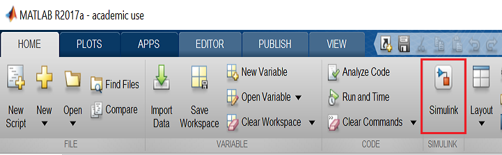

Під час запуску Simulink відкриває єдине вікно — **Simulink Start Page**:

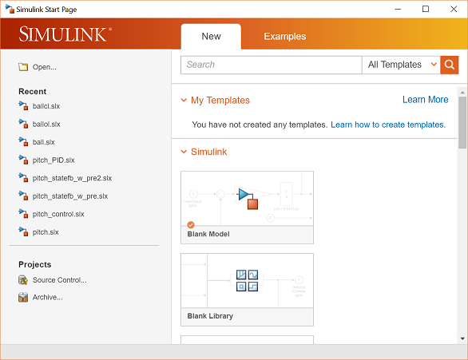

Щойно ви клацнете **Blank Model**, з'явиться нове вікно:

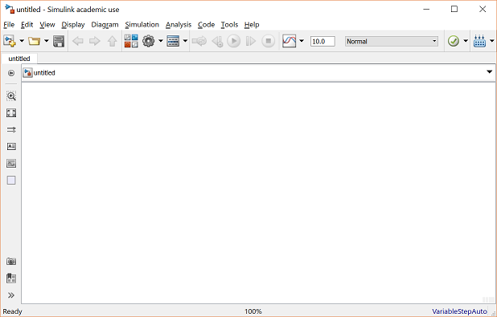

## Файли моделей

У Simulink **модель** — це набір блоків, що загалом представляє систему. Крім створення моделі з нуля, раніше збережені файли моделей можна завантажити або з меню **File**, або з командного рядка MATLAB.

Наприклад, модель, збережену у файлі `simple.slx`, відкривають, увівши в командному вікні MATLAB:

```matlab
simple
```

(Як варіант — через пункт **Open** у меню File або сполученням Ctrl+O у Simulink.) Має з'явитися таке вікно моделі:

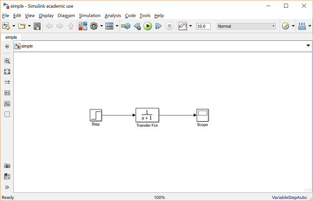

Нову модель створюють пунктом **New** у меню File будь-якого вікна Simulink (або сполученням Ctrl+N).

## Базові елементи

У Simulink є два основні класи об'єктів: **блоки** й **лінії**. Блоки формують, змінюють, комбінують, виводять і відображають сигнали. Лінії передають сигнали від одного блока до іншого.

### Блоки

У бібліотеці Simulink є кілька загальних класів блоків:

- **Sources** — формування різноманітних сигналів;
- **Sinks** — виведення або відображення сигналів;
- **Continuous** — елементи систем неперервного часу (передавальні функції, моделі у просторі станів, ПІД-регулятори тощо);
- **Discrete** — лінійні елементи дискретного часу (дискретні передавальні функції, дискретні моделі у просторі станів тощо);
- **Math Operations** — поширені математичні операції (підсилення, сума, добуток, модуль тощо);
- **Ports & Subsystems** — блоки, корисні для побудови системи.

Блоки мають від нуля до кількох вхідних і вихідних клем. Невикористані вхідні клеми позначено маленьким **незафарбованим трикутником**, невикористані вихідні — маленьким трикутним вістрям. Блок нижче має невикористану вхідну клему ліворуч і невикористану вихідну — праворуч:

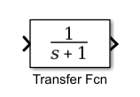

### Лінії

Лінії передають сигнали в напрямку, вказаному стрілкою. Лінія завжди має передавати сигнал від вихідної клеми одного блока до вхідної клеми іншого. Єдиний виняток — лінія може **відгалужуватися** від іншої лінії, розділяючи сигнал між двома блоками-приймачами:

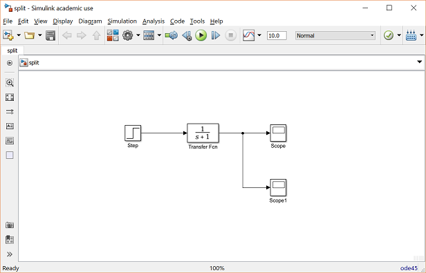

Лінії ніколи не можуть «вливати» сигнал в іншу лінію — сигнали об'єднують лише через блок, наприклад суматор.

Сигнал може бути скалярним або векторним. Для одновимірних систем (SISO) зазвичай використовують скалярні сигнали, для багатовимірних (MIMO) — векторні, що складаються з двох або більше скалярних. Лінії для скалярних і векторних сигналів виглядають однаково; тип сигналу визначається блоками на кінцях лінії.

## Простий приклад


Модель `simple` складається з трьох блоків: **Step**, **Transfer Function** і **Scope**. Step — це блок із бібліотеки Sources, джерело ступінчастого вхідного сигналу. Цей сигнал передається лінією в напрямку стрілки до блока Transfer Function із бібліотеки Continuous. Блок Transfer Function перетворює свій вхідний сигнал і видає новий сигнал лінією до блока Scope. Scope — це блок із бібліотеки Sinks, який відображає сигнал подібно до осцилографа.

### Зміна параметрів блоків

Параметри блока змінюють подвійним клацанням на ньому. Наприклад, якщо двічі клацнути на блоці Transfer Function у моделі `simple`, побачите такий діалог:

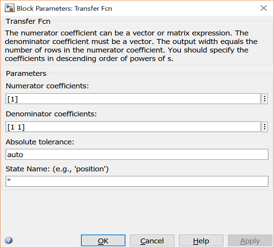

У ньому є поля для чисельника й знаменника передавальної функції блока. Ввівши вектор коефіцієнтів потрібного многочлена, задають потрібну передавальну функцію. Наприклад, щоб змінити знаменник на

$$
s^2 + 2s + 4
$$

уведіть у поле знаменника `[1 2 4]` і натисніть кнопку закриття. Вікно моделі зміниться так:


Блок Step теж можна відкрити подвійним клацанням:

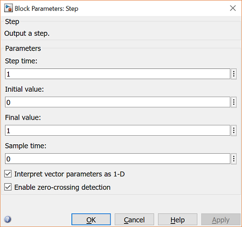

Типові параметри в цьому діалозі формують ступінчасту функцію, що виникає в момент часу 1 с і стрибає з початкового рівня 0 до рівня 1 (тобто одиничний стрибок при $t = 1$). Кожен із цих параметрів можна змінити.

Найскладніший із трьох — блок Scope. Подвійне клацання на ньому відкриває порожній екран осцилографа:

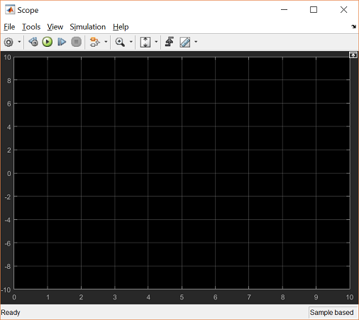

Коли моделювання виконається, у цьому вікні відобразиться сигнал, що надходить на осцилограф.

## Запуск моделювання

Для цього розділу працюватимемо з моделлю `simple2.slx`:

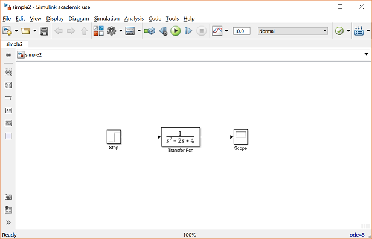

Перш ніж запускати моделювання, відкрийте вікно осцилографа подвійним клацанням на блоці Scope. Далі, щоб почати моделювання, виберіть **Run** у меню Simulation, натисніть кнопку Play угорі екрана або натисніть Ctrl+T.

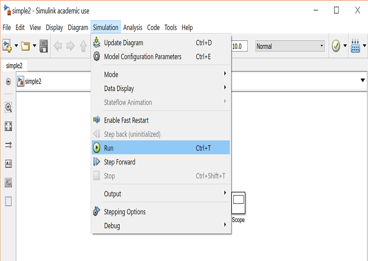

Моделювання виконається дуже швидко, і вікно осцилографа набуде такого вигляду:

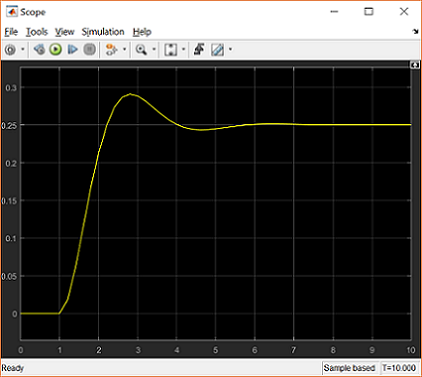

Зверніть увагу: перехідний процес починається лише при $t = 1$. Це можна змінити подвійним клацанням на блоці Step.

Тепер змінімо параметри системи й змоделюймо її знову. Двічі клацніть на блоці Transfer Function і змініть знаменник на `[1 20 400]`. Перезапустіть моделювання (Ctrl+T) — в осцилографі побачите таке:

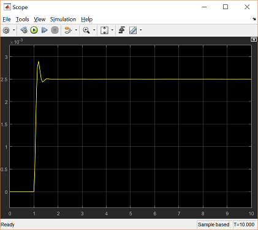

Оскільки нова передавальна функція має дуже швидку реакцію, вона стиснулася у вузьку смужку вікна. Проблема насправді не в осцилографі, а в самому моделюванні: Simulink прорахував систему протягом цілих десяти секунд, хоча система вийшла на усталений режим уже невдовзі після першої секунди.

Щоб це виправити, треба змінити параметри самого моделювання. У вікні моделі виберіть **Model Configuration Parameters** у меню Simulation — побачите такий діалог:

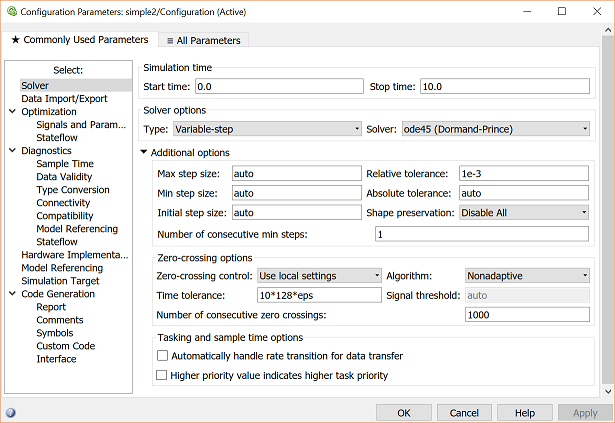

Параметрів моделювання багато, але нас цікавлять лише час початку й час завершення, які задають проміжок моделювання. Змініть **Start time** з 0.0 на 0.8 (адже стрибок відбувається лише при $t = 1.0$), а **Stop time** — з 10.0 на 2.0 (невдовзі після того, як система встановиться). Закрийте діалог і перезапустіть моделювання. Тепер вікно осцилографа показує перехідну характеристику значно краще:

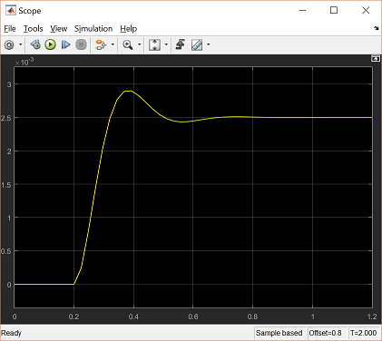

## Побудова систем

У цьому розділі ви навчитеся будувати системи в Simulink із блоків бібліотек. Ви побудуєте ось таку систему:


Спершу зберемо всі потрібні блоки з бібліотек, потім змінимо їхні параметри, далі з'єднаємо блоки лініями — і нарешті змоделюємо систему, щоб переконатися, що вона працює.

### Збирання блоків

1. Створіть нову модель (**New** у меню File або Ctrl+N) — дістанете порожнє вікно моделі.
2. Перейдіть на вкладку **Tools** і виберіть **Library Browser**.
3. Клацніть на розділі **Sources** у браузері бібліотек Simulink.

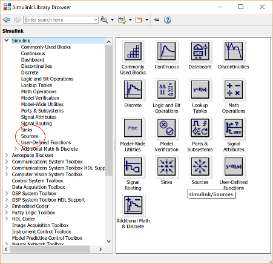

Відкриється бібліотека Sources — джерела, які формують сигнали:

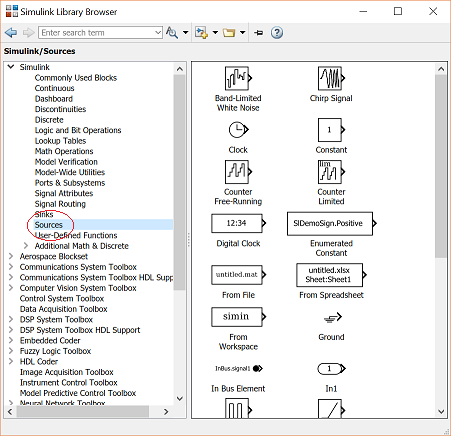

4. Перетягніть блок **Step** із вікна Sources у ліву частину вікна вашої моделі.

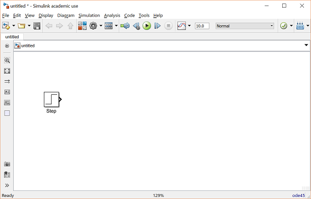

5. Клацніть на розділі **Math Operations** у головному вікні Simulink.
6. Перетягніть звідти блоки **Sum** і **Gain** у вікно моделі та розташуйте їх праворуч від блока Step саме в такому порядку.
7. Клацніть на розділі **Continuous**.
8. Перетягніть звідти блок **PID Controller** і розташуйте його праворуч від блока Gain.
9. З тієї самої бібліотеки перетягніть блок **Transfer Function** і розташуйте його праворуч від PID Controller.

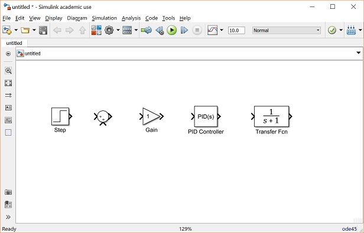

10. Клацніть на розділі **Sinks** і перетягніть блок **Scope** у праву частину вікна моделі.

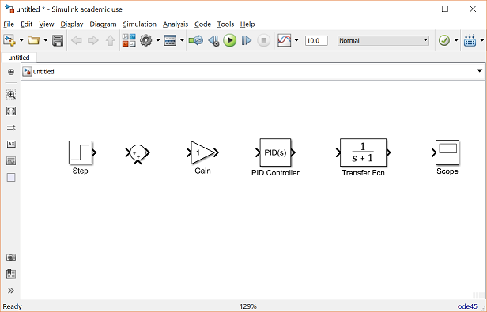

### Зміна параметрів блоків

- Двічі клацніть на блоці **Sum**. Оскільки другий вхід треба віднімати, уведіть у поле списку знаків `+-`. Закрийте діалог.
- Двічі клацніть на блоці **Gain**. Змініть підсилення на `2.5` і закрийте діалог.
- Двічі клацніть на блоці **PID Controller** і задайте пропорційне підсилення `1`, а інтегральне — `2`. Закрийте діалог.
- Двічі клацніть на блоці **Transfer Function**. Чисельник залиште `[1]`, а знаменник змініть на `[1 2 4]`. Закрийте діалог. Модель має виглядати так:


- Змініть назву блока PID Controller на **PI Controller**, двічі клацнувши на написі «PID Controller».

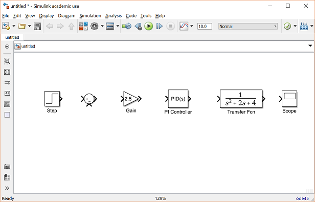

- Так само змініть назву блока Transfer Function на **Plant**. Тепер усі блоки задано правильно, і модель має виглядати так:


### З'єднання блоків лініями

Тепер, коли блоки розставлено, з'єднаймо їх.

- Протягніть мишею від вихідної клеми блока Step до додатного входу блока Sum. Інший варіант — клацнути на блоці Step, а потім Ctrl+клацнути на блоці Sum. Маєте побачити таке:


- Отримана лінія повинна мати **зафарбований** наконечник стрілки. Якщо наконечник незафарбований і червоний, як показано нижче, це означає, що лінія ні до чого не приєднана:


- Незавершену лінію можна продовжити, трактуючи незафарбований наконечник як вихідну клему й малюючи далі так само. Якщо ж лінію треба перемалювати або вона приєдналася не до тієї клеми, її слід вилучити й намалювати заново: клацніть на лінії (чи будь-якому іншому об'єкті), щоб виділити її, і натисніть Delete.
- Проведіть лінію від виходу блока Sum до входу Gain, далі від Gain до PI Controller, від PI Controller до Plant і від Plant до Scope. Маєте дістати:

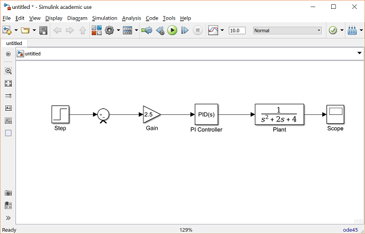

- Залишилася лінія зворотного зв'язку, що з'єднує вихід блока Plant із від'ємним входом блока Sum. Вона відрізняється двома речами. По-перше, ця лінія огинає схему, а не йде найкоротшим (прямокутним) шляхом, тому її малюють у кілька етапів. По-друге, у неї немає вихідної клеми, з якої можна почати, — тож лінія має **відгалужуватися** від наявної лінії.
- Протягніть лінію від від'ємного входу блока Sum прямо вниз і відпустіть мишу, залишивши лінію незавершеною. Далі від кінця цієї лінії клацніть і протягніть до лінії між Plant і Scope. Модель матиме такий вигляд:

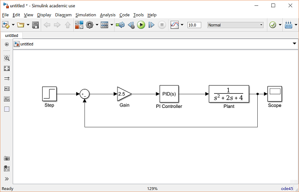

- Насамкінець додамо підписи, щоб позначити сигнали. Щоб розмістити підпис будь-де в моделі, двічі клацніть у потрібній точці. Почніть із подвійного клацання над лінією, що виходить із блока Step. З'явиться порожнє текстове поле з курсором:

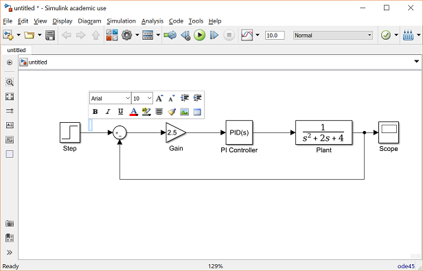

- Уведіть у ньому `r`, позначивши сигнал завдання, і клацніть поза полем, щоб завершити редагування.
- Так само підпишіть сигнал похибки (`e`), сигнал керування (`u`) і вихідний сигнал (`y`). Остаточна модель має виглядати так:


Щоб зберегти модель, виберіть **Save As** у меню File і задайте потрібну назву.

### Моделювання

Тепер, коли модель готова, її можна змоделювати. Виберіть **Run** у меню Simulation. Двічі клацніть на блоці **Scope**, щоб побачити його вихід:

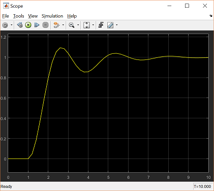

### Використання змінних MATLAB

Іноді параметри — наприклад, підсилення — обчислюють у MATLAB, щоб використати в моделі Simulink. У такому разі не обов'язково вводити результат обчислення в Simulink вручну. Припустімо, ми обчислили підсилення в MATLAB і зберегли його у змінній `K`. Відтворіть це, увівши в командному рядку MATLAB:

```matlab
K = 2.5
```

Тепер цю змінну можна використати в блоці Gain. У моделі Simulink двічі клацніть на блоці Gain і введіть у поле **Gain** значення `K`:

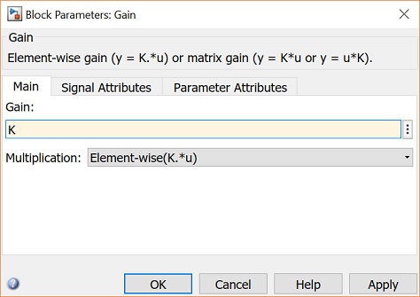

Закрийте діалог. Зверніть увагу: тепер блок Gain у моделі показує змінну `K`, а не число.


Тепер можна перезапустити моделювання й переглянути вихід на осцилографі — результат буде той самий, що й раніше:

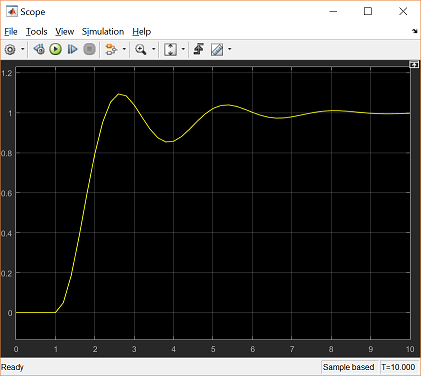

Відтепер, якщо в MATLAB виконати обчислення, що змінюють будь-яку зі змінних моделі, наступний запуск моделювання використає нові значення. Спробуйте: змініть у MATLAB підсилення `K`, увівши в командному рядку:

```matlab
K = 5
```

Запустіть моделювання знову й відкрийте вікно осцилографа. Побачите такий вихід, який відображає нове, більше підсилення:

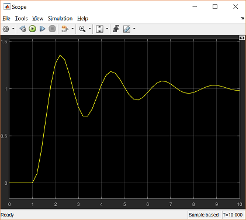

Окрім змінних і сигналів, між MATLAB і Simulink можна обмінюватися навіть цілими системами.

## Контрольні запитання

- Чим блок відрізняється від лінії та чому лінію не можна «влити» в іншу лінію?
- Що означає незафарбований червоний наконечник стрілки на лінії?
- Чому швидка реакція системи «стискається» у вузьку смужку осцилографа і як це виправити?
- Яка перевага від запису `K` замість числа в полі підсилення блока Gain?

## Практика

1. Створіть модель із блоків Step, Transfer Fcn і Scope: задайте в блоці **Transfer Fcn** чисельник `[1]`, а знаменник `[1 1]`. Встановіть час моделювання 10 секунд і порівняйте графік із результатом модуля 1.
2. Повторіть побудову замкненої системи з ПІ-регулятором і підпишіть усі чотири сигнали (`r`, `e`, `u`, `y`).
3. Винесіть підсилення в змінну `K`, задайте три різні значення з командного рядка MATLAB і порівняйте перехідні характеристики, не змінюючи саму модель.
