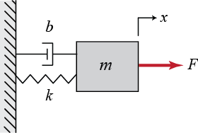
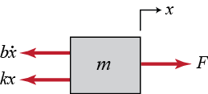
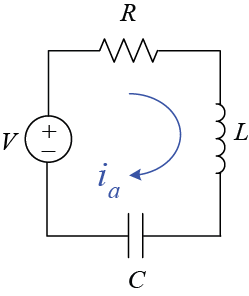

**Доступ:** MATLAB Online (basic).
**Джерело:** адаптовано з [Introduction: System Modeling](https://ctms.engin.umich.edu/CTMS/index.php?example=Introduction&section=SystemModeling) (CTMS, CC BY-SA 4.0).
**Основні команди MATLAB:** `ss`, `tf`.

Перший крок у проєктуванні системи керування — побудова відповідної математичної моделі об'єкта. Модель можна вивести або з фізичних законів, або з експериментальних даних. У цьому модулі вводяться подання у просторі станів і через передавальну функцію, розглядаються базові підходи до моделювання механічних та електричних систем і показано, як створювати такі моделі в MATLAB.

## Динамічні системи

Динамічні системи — це системи, які змінюються з часом за сталим правилом. Для багатьох фізичних систем це правило записують як набір диференціальних рівнянь першого порядку:

$$
\dot{\mathbf{x}} = \frac{d\mathbf{x}}{dt} = \mathbf{f}\left( \mathbf{x}(t), \mathbf{u}(t), t \right)
$$

Тут $\mathbf{x}(t)$ — **вектор стану**, тобто набір змінних, що описують конфігурацію системи в момент часу $t$. Наприклад, у простій механічній системі «маса — пружина — демпфер» двома змінними стану можуть бути положення та швидкість маси. Вектор $\mathbf{u}(t)$ — зовнішні входи системи в момент $t$, а $\mathbf{f}$ — можливо нелінійна функція, що дає похідну вектора стану $d\mathbf{x}/dt$ у конкретний момент часу.

Стан у будь-який майбутній момент $\mathbf{x}(t_1)$ можна визначити точно, якщо відомі початковий стан $\mathbf{x}(t_0)$ та історія входів $\mathbf{u}(t)$ між $t_0$ і $t_1$, інтегруванням наведеного рівняння. Самі змінні стану не є однозначними, проте існує мінімальна їх кількість $n$, потрібна, щоб описати стан системи та передбачити її подальшу поведінку. Число $n$ називають **порядком системи**; воно задає розмірність простору станів і зазвичай відповідає кількості незалежних елементів, здатних накопичувати енергію.

Наведене співвідношення дуже загальне, але його важко аналізувати. Є два поширені спрощення.

По-перше, якщо функція $\mathbf{f}$ не залежить явно від часу, тобто $\dot{\mathbf{x}} = \mathbf{f}(\mathbf{x},\mathbf{u})$, систему називають **стаціонарною** (інваріантною в часі). Це зазвичай розумне припущення, бо самі фізичні закони від часу не залежать. Для стаціонарних систем коефіцієнти функції $\mathbf{f}$ сталі, хоча змінні стану $\mathbf{x}(t)$ та керуючі входи $\mathbf{u}(t)$ залишаються залежними від часу.

По-друге, припущення про лінійність. Насправді майже кожна фізична система нелінійна: $\mathbf{f}$ є складною функцією стану та входів. Нелінійності виникають по-різному, і однією з найпоширеніших у системах керування є **насичення**, коли елемент системи досягає жорсткої фізичної межі. На щастя, у достатньо малому діапазоні роботи (згадайте дотичну до кривої) динаміка більшості систем приблизно лінійна. Тоді систему рівнянь першого порядку можна подати матричним рівнянням $\dot{\mathbf{x}} = A\mathbf{x} + B\mathbf{u}$.

До появи цифрових комп'ютерів практично можливим був аналіз лише лінійних стаціонарних систем (ЛСС). Тому більшість результатів теорії керування спирається саме на ці припущення. Вони виявилися надзвичайно дієвими, і чимало складних інженерних задач розв'язано методами ЛСС. Справжня сила систем зі зворотним зв'язком полягає в тому, що вони зберігають працездатність (є робастними) за неминучої невизначеності моделі.

## Подання у просторі станів

Для неперервних лінійних стаціонарних систем стандартне подання у просторі станів має вигляд:

$$
\dot{\mathbf{x}} = A\mathbf{x} + B\mathbf{u}
$$

$$
\mathbf{y} = C\mathbf{x} + D\mathbf{u}
$$

де $\mathbf{x}$ — вектор змінних стану (n×1), $\dot{\mathbf{x}}$ — його похідна за часом (n×1), $\mathbf{u}$ — вектор входу або керування (p×1), $\mathbf{y}$ — вектор виходу (q×1), $A$ — матриця системи (n×n), $B$ — матриця входу (n×p), $C$ — матриця виходу (q×n), $D$ — матриця прямого зв'язку (q×p).

Рівняння виходу потрібне тому, що частина змінних стану часто недоступна для безпосереднього вимірювання або не становить інтересу. Матриця виходу $C$ задає, які змінні стану (чи їх комбінації) доступні регулятору. Часто вихід не залежить від входу напряму, а лише через змінні стану; тоді $D$ є нульовою матрицею.

Подання у просторі станів, яке також називають поданням у часовій області, легко описує багатовимірні системи (MIMO), системи з ненульовими початковими умовами та, через загальне рівняння вище, нелінійні системи. Саме тому воно широко використовується в «сучасній» теорії керування.

## Подання передавальною функцією

ЛСС мають надзвичайно важливу властивість: якщо вхід системи синусоїдальний, то вихід також буде синусоїдальним із тією самою частотою, але, можливо, з іншими амплітудою та фазою. Ці відмінності залежать від частоти й утворюють **частотну характеристику** системи.

За допомогою перетворення Лапласа подання системи в часовій області перетворюють на подання «вхід — вихід» у частотній області, відоме як **передавальна функція**. При цьому диференціальне рівняння перетворюється на алгебричне, яке зазвичай аналізувати простіше.

Перетворення Лапласа функції часу $f(t)$ визначається так:

$$
F(s) = \mathcal{L}\{f(t)\} = \int_0^\infty e^{-st}f(t)dt
$$

де параметр $s=\sigma+j\omega$ — комплексна змінна частоти. На практиці рідко доводиться обчислювати перетворення безпосередньо (хоча вміти це потрібно): значно частіше користуються таблицями перетворень.

Особливо важливим є перетворення Лапласа n-ї похідної функції:

$$
\mathcal{L}\left\{ \frac{d^nf}{dt^n} \right\} = s^n F(s)- s^{n-1} f(0) - s^{n-2} \dot{f}(0) - ... - f^{(n-1)}(0)
$$

Частотні методи найчастіше застосовують для аналізу одновимірних ЛСС (SISO), описуваних диференціальним рівнянням зі сталими коефіцієнтами:

$$
a_n \frac{d^ny}{dt^n} + ... + a_1 \frac{dy}{dt} + a_0 y(t) = b_m \frac{d^mu}{dt^m} + ... + b_1 \frac{du}{dt} + b_0 u(t)
$$

Його перетворення Лапласа:

$$
a_n s^n Y(s) + ... + a_1 sY(s)+ a_0 Y(s) = b_m s^m U(s) + ... + b_1 sU(s)+ b_0 U(s)
$$

де $Y(s)$ і $U(s)$ — зображення $y(t)$ та $u(t)$. Зверніть увагу: під час пошуку передавальної функції завжди вважають усі початкові умови $y(0)$, $\dot{y}(0)$, $u(0)$ тощо нульовими. Отже, передавальна функція від входу $U(s)$ до виходу $Y(s)$:

$$
G(s) = \frac{Y(s)}{U(s)} = \frac{b_m s^m + b_{m-1} s^{m-1} + ... + b_1 s + b_0}{a_n s^n + a_{n-1} s^{n-1} + ... + a_1 s + a_0}
$$

Корисно розкласти чисельник і знаменник на множники — у так звану форму «нулі — полюси — коефіцієнт підсилення»:

$$
G(s) = \frac{N(s)}{D(s)} = K \frac{(s-z_1)(s-z_2)...(s-z_{m-1})(s-z_m)}{(s-p_1)(s-p_2)...(s-p_{n-1})(s-p_n)}
$$

**Нулі** передавальної функції $z_1,\ldots,z_m$ — корені полінома чисельника, тобто значення $s$, за яких $N(s)=0$. **Полюси** $p_1, \ldots,p_n$ — корені полінома знаменника, тобто значення $s$, за яких $D(s)=0$. І нулі, і полюси можуть бути комплексними. Коефіцієнт підсилення системи дорівнює $K = b_m/a_n$.

Передавальну функцію можна визначити й безпосередньо з подання у просторі станів:

$$
G(s) = \frac{Y(s)}{U(s)} = C(s\mathbf{I}-A)^{-1}B+D
$$

## Механічні системи

Основою аналізу механічних систем є закони руху Ньютона. Другий закон стверджує, що сума сил, які діють на тіло, дорівнює добутку його маси на прискорення. Третій закон для наших цілей означає, що два тіла в контакті зазнають контактних сил однакової величини, спрямованих протилежно.

$$
\Sigma \mathbf{F} = m \mathbf{a} = m \frac{d^2 \mathbf{x}}{dt^2}
$$

Застосовуючи це рівняння, найкраще спершу побудувати розрахункову схему (діаграму вільного тіла) з усіма прикладеними силами.

## Приклад: система «маса — пружина — демпфер»



Розрахункову схему системи показано нижче. Сила пружини пропорційна переміщенню маси $x$, а сила в'язкого тертя — швидкості маси $v=\dot{x}$. Обидві сили протидіють руху маси, тому спрямовані у від'ємному напрямі осі $x$. Зауважте також, що $x=0$ відповідає положенню маси за нерозтягнутої пружини.



Тепер підсумуємо сили та застосуємо другий закон Ньютона за кожним напрямом. У цьому випадку сил уздовж осі $y$ немає, а вздовж осі $x$ маємо:

$$
\Sigma F_x = F(t) - b \dot{x} - k x = m \ddot{x}
$$

Це рівняння, яке називають **рівнянням руху**, повністю характеризує динамічний стан системи. Згодом ми побачимо, як за його допомогою обчислювати реакцію системи на будь-який зовнішній вплив $F(t)$, а також аналізувати стійкість і якість.

Щоб отримати подання у просторі станів, потрібно звести рівняння другого порядку до двох рівнянь першого порядку. Для цього виберемо змінними стану положення та швидкість:

$$
\mathbf{x} = \left[ \begin{array}{c} x \\ \dot{x} \end{array}\right]
$$

Змінна положення відповідає потенціальній енергії, накопиченій у пружині, а змінна швидкості — кінетичній енергії маси. Демпфер лише розсіює енергію й не накопичує її. Обираючи змінні стану, часто корисно міркувати саме про те, які величини описують накопичену в системі енергію.

Рівняння стану має вигляд:

$$
\mathbf{\dot{x}} = \left[ \begin{array}{c} \dot{x} \\ \ddot{x} \end{array} \right] = \left[ \begin{array}{cc} 0 & 1 \\ -\frac{k}{m}  & -\frac{b}{m} \end{array} \right] \left[ \begin{array}{c} x \\ \dot{x} \end{array} \right] + \left[ \begin{array}{c} 0 \\ \frac{1}{m} \end{array} \right] F(t)
$$

Якщо, наприклад, нас цікавить керування положенням маси, то рівняння виходу таке:

$$
y = \left[ \begin{array}{cc} 1 & 0 \end{array} \right] \left[ \begin{array}{c} x \\ \dot{x} \end{array} \right]
$$

## Введення моделей простору станів у MATLAB

Тепер покажемо, як ввести отримані рівняння у файл сценарію MATLAB. Призначимо змінним такі числові значення:

| Змінна | Зміст | Значення |
| --- | --- | --- |
| `m` | маса | 1.0 кг |
| `k` | жорсткість пружини | 1.0 Н/м |
| `b` | коефіцієнт демпфування | 0.2 Н·с/м |
| `F` | вхідна сила | 1.0 Н |

Створіть новий m-файл і введіть такі команди:

```matlab
m = 1;
k = 1;
b = 0.2;
F = 1;

A = [0 1; -k/m -b/m];
B = [0 1/m]';
C = [1 0];
D = [0];

sys = ss(A,B,C,D)
```

```text
sys =
 
  A = 
         x1    x2
   x1     0     1
   x2    -1  -0.2
 
  B = 
       u1
   x1   0
   x2   1
 
  C = 
       x1  x2
   y1   1   0
 
  D = 
       u1
   y1   0
 
Continuous-time state-space model.
```

Перетворення Лапласа для цієї системи за нульових початкових умов:

$$
m s^2 X(s) + b s X(s) + k X(s) = F(s)
$$

отже, передавальна функція від вхідної сили до вихідного переміщення:

$$
\frac{X(s)}{F(s)} = \frac{1}{m s^2 + b s + k}
$$

## Введення моделей передавальних функцій у MATLAB

Тепер створимо в MATLAB виведену вище передавальну функцію. Додайте такі команди до того самого файлу, де визначено параметри системи:

```matlab
s = tf('s');
sys = 1/(m*s^2+b*s+k)
```

```text
sys =
 
        1
  ---------------
  s^2 + 0.2 s + 1
 
Continuous-time transfer function.
```

Тут використано символьну змінну `s` для означення моделі. Такий спосіб рекомендовано в більшості випадків, проте іноді — наприклад, у старіших версіях MATLAB або під час взаємодії з Simulink — модель потрібно задати безпосередньо коефіцієнтами поліномів чисельника та знаменника:

```matlab
num = [1];
den = [m b k];
sys = tf(num,den)
```

```text
sys =
 
        1
  ---------------
  s^2 + 0.2 s + 1
 
Continuous-time transfer function.
```

## Електричні системи

Подібно до законів Ньютона для механічних систем, фундаментальними інструментами моделювання електричних систем є закони Кірхгофа. **Перший закон Кірхгофа** (для струмів) стверджує, що сума струмів, які входять у вузол кола, дорівнює сумі струмів, що виходять із нього. **Другий закон Кірхгофа** (для напруг) стверджує, що сума різниць потенціалів уздовж будь-якого замкненого контуру дорівнює нулю. Застосовуючи його, напруги джерел зазвичай беруть зі знаком «плюс», а напруги навантажень — зі знаком «мінус».

## Приклад: RLC-коло

Розглянемо просте послідовне з'єднання трьох пасивних елементів — резистора, котушки індуктивності та конденсатора, тобто **RLC-коло**.



Оскільки це коло є одним контуром, кожен вузол має лише один вхід і один вихід; отже, за першим законом Кірхгофа струм $i(t)$ однаковий у всьому колі в будь-який момент часу. Застосувавши другий закон Кірхгофа до контуру з урахуванням позначених на схемі знаків, дістаємо рівняння:

$$
V(t) - R i - L \frac{di}{dt} - \frac{1}{C} \int i dt = 0
$$

Зверніть увагу, що це рівняння має форму, аналогічну до механічної системи «маса — пружина — демпфер». Обидві системи є системами другого порядку, у яких заряд (інтеграл струму) відповідає переміщенню, індуктивність — масі, опір — в'язкому тертю, а обернена ємність — жорсткості пружини. Такі аналогії дуже корисні для розуміння поведінки динамічних систем.

Подання у просторі станів отримаємо, обравши змінними стану заряд конденсатора та струм у колі (через котушку):

$$
\mathbf{x} = \left[ \begin{array}{c} q \\ i \end{array}\right]
$$

де

$$
q = \int i dt
$$

Отже, рівняння стану:

$$
\mathbf{\dot{x}} = \left[ \begin{array}{c} i \\ \frac{di}{dt} \end{array} \right] = \left[ \begin{array}{cc} 0 & 1 \\ -\frac{1}{LC} & -\frac{R}{L} \end{array} \right] \left[ \begin{array}{c} q \\ i \end{array} \right] + \left[ \begin{array}{c} 0 \\ \frac{1}{L} \end{array} \right] V(t)
$$

Виходом оберемо струм:

$$
y = \left[ \begin{array}{cc} 0 & 1 \end{array} \right] \left[ \begin{array}{c} q \\ i \end{array} \right]
$$

Передавальну функцію можна знайти перетворенням Лапласа, як це було зроблено для механічної системи, або безпосередньо з рівнянь стану:

$$
\frac{I(s)}{V(s)} = C(s \mathbf{I}-A)^{-1}B+D = \left[ \begin{array}{cc} 0 & 1 \end{array} \right] \left( s \left[ \begin{array}{cc} 1 & 0 \\ 0 & 1 \end{array} \right] - \left[ \begin{array}{cc} 0 & 1 \\ -\frac{1}{LC} & -\frac{R}{L} \end{array} \right] \right)^{-1} \left[ \begin{array}{c} 0 \\ \frac{1}{L} \end{array} \right]
$$

$$
\Rightarrow \ \frac{I(s)}{V(s)} = \frac{s}{Ls^2+Rs+\frac{1}{C}}
$$

Моделі RLC-кола у просторі станів і через передавальну функцію вводяться в MATLAB так само, як і для системи «маса — пружина — демпфер».

## Ідентифікація систем

У цьому модулі показано моделювання на основі фізичних принципів. Проте часто це неможливо: параметри системи невідомі або самі процеси недостатньо вивчені. Тоді для побудови моделі покладаються на експериментальні вимірювання та статистичні методи — цей процес називають **ідентифікацією систем**.

Ідентифікацію виконують за даними в часовій або частотній області. Додаткові відомості дає [System Identification Toolbox](http://www.mathworks.com/products/sysid/), який, однак, не входить до безплатного набору MATLAB Online (basic).

## Перетворення між формами подання

Більшість операцій у MATLAB можна виконувати над передавальною функцією, моделлю простору станів або формою «нулі — полюси — коефіцієнт підсилення». Перехід між цими поданнями виконується просто відповідними функціями, тому модель зручно тримати у формі, найзручнішій для конкретної задачі.

## Практика

1. Уведіть модель «маса — пружина — демпфер» обома способами та переконайтеся, що вони описують ту саму систему.
2. Знайдіть полюси моделі й поясніть, як коефіцієнт $b$ впливає на їх положення.
3. Побудуйте модель RLC-кола з власними значеннями $R$, $L$, $C$ і порівняйте її поведінку з механічним аналогом.
