**Доступ:** MATLAB Online (basic).
**Джерело:** адаптовано з [Introduction: System Analysis](https://ctms.engin.umich.edu/CTMS/index.php?example=Introduction&section=SystemAnalysis) (CTMS, CC BY-SA 4.0).
**Основні команди MATLAB:** `tf`, `ssdata`, `pole`, `eig`, `step`, `pzmap`, `bode`, `linearSystemAnalyzer`.

Коли математичну модель системи отримано — у просторі станів або у формі передавальної функції — її можна проаналізувати, щоб передбачити поведінку системи в часовій і частотній областях. Системи керування часто проєктують, щоб поліпшити стійкість, швидкодію, усталену похибку або усунути небажані коливання. У цьому модулі показано, як визначити ці динамічні властивості з моделі.

## Огляд часової характеристики

Часова характеристика описує, як стан динамічної системи змінюється в часі під дією певного вхідного сигналу. Оскільки отримані моделі складаються з диференціальних рівнянь, для визначення часової характеристики потрібно виконати інтегрування. Для деяких простих систем існує аналітичний розв'язок у замкненій формі, проте для більшості систем — особливо нелінійних або зі складними вхідними сигналами — інтегрування виконують чисельно. MATLAB надає для цього багато зручних засобів.

Часова характеристика лінійної динамічної системи є сумою **перехідної складової**, що залежить від початкових умов, і **усталеної складової**, що залежить від вхідного сигналу. Вони відповідають загальному (вільному) та частинному розв'язкам визначального диференціального рівняння.

## Огляд частотної характеристики

Усі приклади цього курсу описуються лінійними диференціальними рівняннями зі сталими коефіцієнтами, тобто є лінійними стаціонарними (ЛСС). ЛСС мають надзвичайно важливу властивість: якщо вхід синусоїдальний, то усталений вихід також буде синусоїдальним із тією самою частотою, але загалом з іншими амплітудою та фазою. Ці відмінності залежать від частоти й утворюють частотну характеристику системи.

Частотну характеристику знаходять із передавальної функції так: створюють вектор частот (від нуля, або «сталої складової», до нескінченності) і обчислюють значення передавальної функції об'єкта на цих частотах. Якщо $G(s)$ — передавальна функція розімкненої системи, а $\omega$ — вектор частот, то будують залежність $G(j\omega)$ від $\omega$. Оскільки $G(j\omega)$ — комплексне число, можна будувати як його модуль і фазу (діаграма Боде), так і його положення на комплексній площині (діаграма Найквіста). Обидва способи подають ту саму інформацію по-різному.

## Стійкість

Ми користуватимемося означенням стійкості «обмежений вхід — обмежений вихід» (BIBO): система стійка, якщо її вихід залишається обмеженим для всіх обмежених (скінченних) входів. Практично це означає, що система не «піде врознос» під час роботи.

Подання передавальною функцією особливо зручне для аналізу стійкості. Якщо всі полюси передавальної функції (значення $s$, за яких знаменник дорівнює нулю) мають від'ємні дійсні частини, система стійка. Якщо хоча б один полюс має додатну дійсну частину, система нестійка. На комплексній s-площині всі полюси мають лежати в лівій півплощині. Якщо пара полюсів лежить на уявній осі, система перебуває на межі стійкості й схильна до коливань. Система з суто уявними полюсами не вважається BIBO-стійкою: для неї існують скінченні входи, що дають необмежену реакцію.

Полюси моделі ЛСС легко знайти командою `pole`:

```matlab
s = tf('s');
G = 1/(s^2+2*s+5)
pole(G)
```

```text
G =
 
        1
  -------------
  s^2 + 2 s + 5
 
Continuous-time transfer function.

ans =
  -1.0000 + 2.0000i
  -1.0000 - 2.0000i
```

Отже, ця система стійка, бо дійсні частини обох полюсів від'ємні. Стійкість можна визначити й із подання у просторі станів: полюси передавальної функції є власними значеннями матриці системи $A$. Для обчислення власних значень використовують команду `eig` — або безпосередньо для моделі, `eig(G)`, або для матриці системи:

```matlab
[A,B,C,D] = ssdata(G);
eig(A)
```

```text
ans =
  -1.0000 + 2.0000i
  -1.0000 - 2.0000i
```

## Порядок системи

Порядок динамічної системи — це порядок найвищої похідної в її визначальному диференціальному рівнянні. Рівнозначно, це найвищий степінь $s$ у знаменнику передавальної функції. Далі розглянуто важливі властивості систем першого та другого порядку.

## Системи першого порядку

Системи першого порядку найпростіші для аналізу. Типові приклади — системи «маса — демпфер» та RC-кола.

Загальна форма диференціального рівняння першого порядку:

$$
\dot{y} + a y = b u \quad \textrm{or} \ \quad \tau \dot{y} + y = k_{dc} u
$$

Передавальна функція першого порядку має вигляд:

$$
G(s) = \frac{b}{s+a} = \frac{k_{dc}}{\tau s + 1}
$$

де параметри $k_{dc}$ і $\tau$ повністю визначають характер системи першого порядку.

### Коефіцієнт підсилення на нульовій частоті

Коефіцієнт $k_{dc}$ — це відношення амплітуди усталеної реакції на ступінчастий вплив до амплітуди самого впливу. Для стійких передавальних функцій за теоремою про кінцеве значення цей коефіцієнт дорівнює значенню передавальної функції при $s = 0$. Для наведених форм $k_{dc} = b/a$.

### Стала часу

Стала часу системи першого порядку дорівнює $T_c = \tau = 1/a$. Це час, за який реакція системи досягає 63% усталеного значення за ступінчастого впливу (з нульових початкових умов) або спадає до 37% початкового значення у вільному русі. Загальніше вона задає характерний часовий масштаб динаміки системи.

### Полюси й нулі

Системи першого порядку мають єдиний дійсний полюс, у цьому випадку при $s = -a$. Отже, система стійка, якщо $a$ додатне, і нестійка, якщо $a$ від'ємне. Стандартна система першого порядку не має нулів.

### Перехідна характеристика

Реакцію системи на ступінчастий вплив амплітудою $u$ обчислюють так:

```matlab
k_dc = 5;
Tc = 10;
u = 2;

s = tf('s');
G = k_dc/(Tc*s+1)

step(u*G)
```

```text
G =
 
     5
  --------
  10 s + 1
 
Continuous-time transfer function.
```

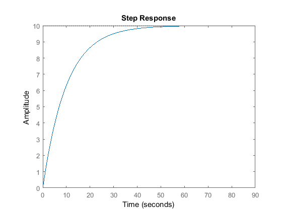

MATLAB також має графічний інтерфейс для аналізу ЛСС, який відкривається командою `linearSystemAnalyzer('step',G)`.

Якщо клацнути правою кнопкою на графіку перехідної характеристики й вибрати **Characteristics**, на графік можна накласти кілька показників якості: пікове значення, час встановлення, час наростання та усталене значення.

### Час встановлення

Час встановлення $T_s$ — це час, потрібний виходу системи, щоб увійти в певний відсотковий коридор (наприклад, 2%) навколо усталеного значення за ступінчастого впливу. Для системи першого порядку найпоширеніші значення такі:

| Допуск | 10% | 5% | 2% | 1% |
| --- | --- | --- | --- | --- |
| $T_s$ | $2.3/a = 2.3\,T_c$ | $3/a = 3\,T_c$ | $3.9/a = 3.9\,T_c$ | $4.6/a = 4.6\,T_c$ |

Як і очікувано, чим жорсткіший допуск, тим довше реакція входить у відповідний коридор.

### Час наростання

Час наростання $T_r$ — це час, потрібний виходу, щоб зрости від нижчого рівня x% до вищого рівня y% кінцевого усталеного значення. Для систем першого порядку типовим є діапазон 10%–90%.

### Діаграми Боде

Діаграми Боде показують модуль і фазу частотної характеристики $G(j\omega)$ залежно від частоти $\omega$. Побудувати їх можна командою `bode(G)`:

```matlab
bode(G)
```

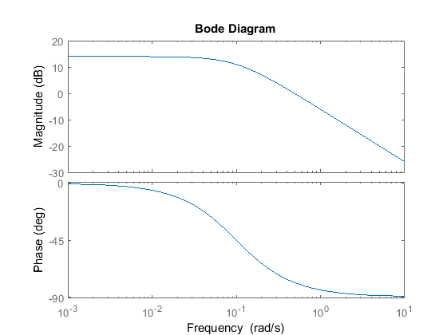

Той самий результат дає графічний інтерфейс `linearSystemAnalyzer('bode',G)`.

На діаграмах Боде використовують логарифмічну шкалу частот, щоб охопити ширший діапазон. Модуль подають у логарифмічних одиницях — децибелах:

$$
M_{dB} = 20 \log_{10} (M)
$$

Шкала в децибелах дозволяє показати на одному графіку значно більший діапазон значень. Крім того, як ми побачимо далі, коли елементи й регулятори з'єднані послідовно, передавальна функція всієї системи є добутком окремих передавальних функцій. У децибелах графік модуля загальної системи є просто сумою окремих графіків, і те саме стосується графіка фази.

Низькочастотний модуль для системи першого порядку дорівнює $20\log(k_{dc})$. Графік модуля має злам на частоті, що дорівнює модулю полюса (тобто $\omega = a$), після чого спадає на 20 дБ на кожне десятикратне збільшення частоти (нахил −20 дБ/декаду). Графік фази асимптотично прямує до 0° на низьких частотах і до −90° на високих. У діапазоні від $0.1a$ до $10a$ фаза змінюється приблизно на −45° на декаду.

У модулі про частотні методи проєктування ми побачимо, як за діаграмами Боде оцінювати стійкість і якість замкненої системи.

## Системи другого порядку

Системи другого порядку поширені на практиці й є найпростішим типом динамічних систем, здатних до коливань. Приклади — системи «маса — пружина — демпфер» та RLC-кола. Насправді багато систем вищого порядку наближають системами другого порядку, щоб спростити аналіз.

Канонічна форма диференціального рівняння другого порядку:

$$
m \ddot{y} + b \dot{y} + k y = f(t) \quad \textrm{or} \ \quad \ddot{y} + 2\zeta\omega_n \dot{y} + \omega_n^2 y = k_{dc} \omega_n^2 u
$$

Канонічна передавальна функція другого порядку має два полюси й не має нулів:

$$
G(s) = \frac{1}{ms^2+bs+k} = \frac{k_{dc} \omega_n^2}{s^2 + 2\zeta\omega_n s + \omega_n^2}
$$

Поведінку канонічної системи другого порядку визначають параметри $k_{dc}$, $\zeta$ та $\omega_n$.

### Коефіцієнт підсилення на нульовій частоті

Коефіцієнт $k_{dc}$ знову дорівнює відношенню амплітуди усталеної реакції до амплітуди ступінчастого впливу, а для стійких систем — значенню передавальної функції при $s = 0$. Для наведених форм:

$$
k_{dc} = \frac{1}{k}
$$

### Коефіцієнт демпфування

Коефіцієнт демпфування $\zeta$ — безрозмірна величина, що характеризує швидкість згасання коливань у реакції системи через такі ефекти, як в'язке тертя чи електричний опір. З наведених означень:

$$
\zeta = \frac{b}{2 \sqrt{k m}}
$$

### Власна частота

Власна частота $\omega_n$ — це частота (в рад/с), з якою система коливалася б за відсутності демпфування, тобто за $\zeta = 0$:

$$
\omega_n = \sqrt{\frac{k}{m}}
$$

### Полюси й нулі

Канонічна передавальна функція другого порядку має два полюси:

$$
s_p = -\zeta \omega_n \pm j \omega_n \sqrt{1-\zeta^2}
$$

### Системи з недостатнім демпфуванням

Якщо $\zeta < 1$, система є **недодемпфованою**. Обидва полюси комплексні з від'ємними дійсними частинами, тому система стійка, але наближається до усталеного значення з коливаннями. Вільний рух відбувається з демпфованою власною частотою $\omega_d = \omega_n \sqrt{1-\zeta^2}$ (рад/с).

```matlab
k_dc = 1;
w_n = 10;
zeta = 0.2;

s = tf('s');
G1 = k_dc*w_n^2/(s^2 + 2*zeta*w_n*s + w_n^2);

pzmap(G1)
axis([-3 1 -15 15])
```

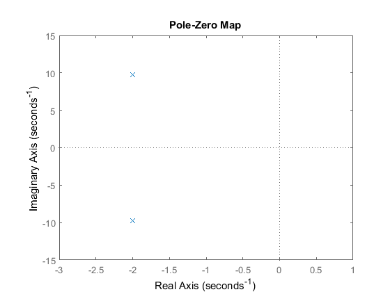

```matlab
step(G1)
axis([0 3 0 2])
```

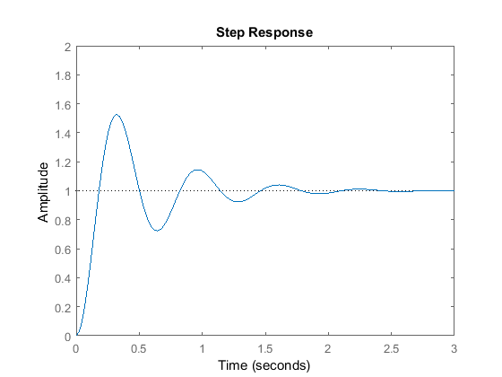

### Час встановлення

Час встановлення $T_s$ — час, за який вихід системи входить у заданий відсотковий коридор навколо усталеного значення. Для канонічної недодемпфованої системи другого порядку його наближено оцінюють так:

$$
T_s = \frac{- \ln(\mathrm{tolerance}\;\mathrm{fraction})}{\zeta \omega_n}
$$

Для найпоширеніших допусків:

| Допуск | 10% | 5% | 2% | 1% |
| --- | --- | --- | --- | --- |
| $T_s$ | $2.3/(\zeta\omega_n)$ | $3/(\zeta\omega_n)$ | $3.9/(\zeta\omega_n)$ | $4.6/(\zeta\omega_n)$ |

### Перерегулювання

Перерегулювання — це відсоток, на який перехідна характеристика перевищує своє кінцеве усталене значення. Для недодемпфованої системи другого порядку перерегулювання $Mp$ безпосередньо пов'язане з коефіцієнтом демпфування. Тут $Mp$ — десятковий дріб, де 1 відповідає 100%:

$$
Mp = e^{\left( \frac{-\zeta\pi}{\sqrt{1-\zeta^2}} \right)}
$$

Для недодемпфованих систем другого порядку час встановлення за допуском 1% $T_s$, час наростання 10–90% $T_r$ і перерегулювання $Mp$ пов'язані з коефіцієнтом демпфування та власною частотою так:

$$
T_s \approx \frac{4.6}{\zeta \omega_n}
$$

$$
T_r \approx \frac{1.8}{\omega_n}
$$

$$
\zeta = \frac{-\ln(Mp)}{\sqrt{\pi^2+\ln^2(Mp)}}
$$

### Системи з надлишковим демпфуванням

Якщо $\zeta > 1$, система є **передемпфованою**. Обидва полюси дійсні й від'ємні, тому система стійка й не коливається:

```matlab
zeta = 1.2;

G2 = k_dc*w_n^2/(s^2 + 2*zeta*w_n*s + w_n^2);

pzmap(G2)
axis([-20 1 -1 1])
```

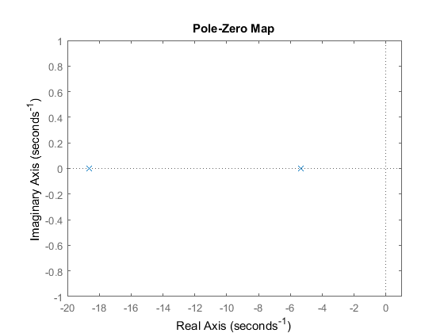

```matlab
step(G2)
axis([0 1.5 0 1.5])
```

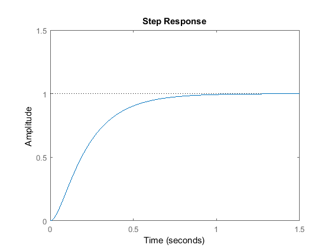

### Системи з критичним демпфуванням

Якщо $\zeta = 1$, система є **критично демпфованою**. Обидва полюси дійсні й мають однакову величину $s_p = -\zeta\omega_n$. Для канонічної системи другого порядку саме критичне демпфування дає найшвидший час встановлення.

```matlab
zeta = 1;

G3 = k_dc*w_n^2/(s^2 + 2*zeta*w_n*s + w_n^2);

pzmap(G3)
axis([-11 1 -1 1])
```

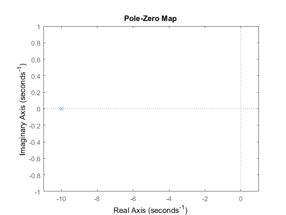

```matlab
step(G3)
axis([0 1.5 0 1.5])
```

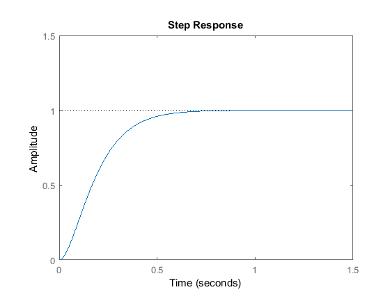

### Системи без демпфування

Якщо $\zeta = 0$, система є **недемпфованою**. Полюси суто уявні, тому система перебуває на межі стійкості, а її перехідна характеристика коливається нескінченно.

```matlab
zeta = 0;

G4 = k_dc*w_n^2/(s^2 + 2*zeta*w_n*s + w_n^2);

pzmap(G4)
axis([-1 1 -15 15])
```

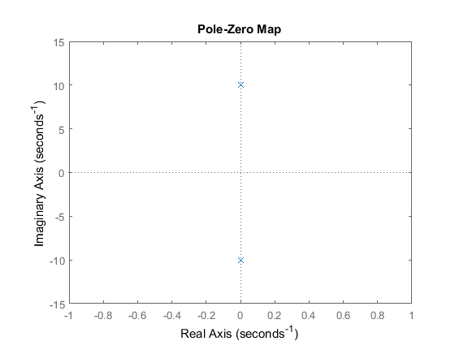

```matlab
step(G4)
axis([0 5 -0.5 2.5])
```

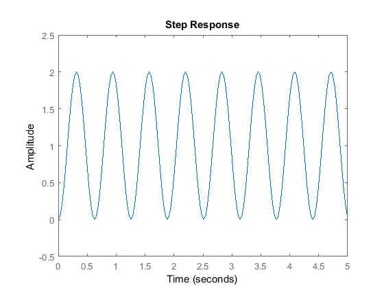

### Діаграма Боде

Нижче наведено діаграми модуля та фази для всіх режимів демпфування системи другого порядку:

```matlab
bode(G1,G2,G3,G4)
legend('underdamped: zeta < 1','overdamped: zeta > 1','critically-damped: zeta = 1','undamped: zeta = 0')
```

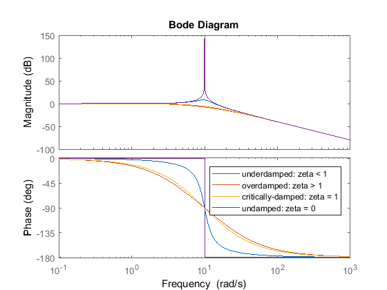

У границі модуль на діаграмі Боде системи другого порядку спадає на −40 дБ на декаду, а відносна фаза змінюється від 0° до −180°. Для недодемпфованих систем поблизу власної частоти $\omega_n$ = 10 рад/с помітний резонансний пік. Розмір і гострота цього піка залежать від демпфування й характеризуються добротністю:

$$
Q = \frac{1}{2\zeta}
$$

Добротність є важливою властивістю в обробці сигналів.

## Практика

1. Побудуйте перехідні характеристики для $\zeta$ = 0.1, 0.5, 1 і 2 та порівняйте перерегулювання й час встановлення.
2. Перевірте формулу $T_s \approx 4.6/(\zeta\omega_n)$, порівнявши її з характеристиками, накладеними на графік у MATLAB.
3. За заданим перерегулюванням 10% і часом наростання 0.5 с визначте потрібні $\zeta$ та $\omega_n$.
