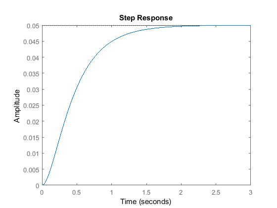
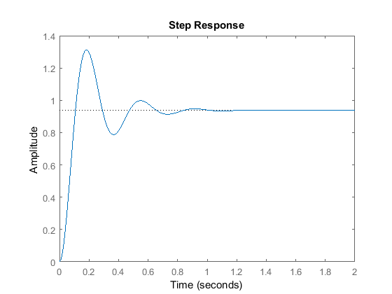
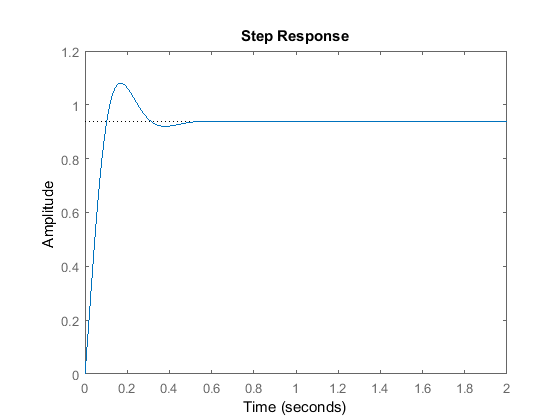
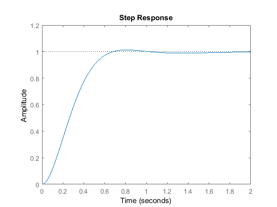
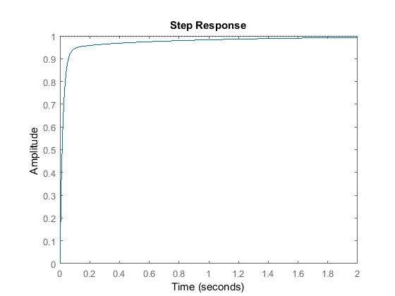
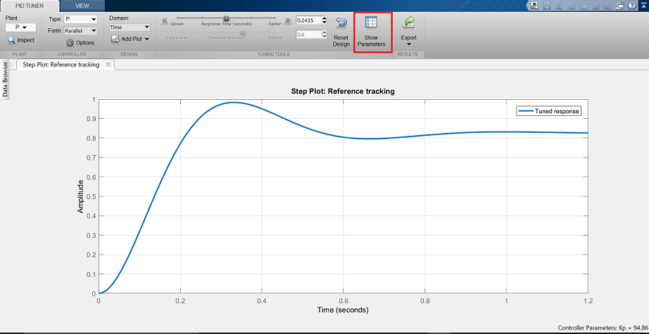
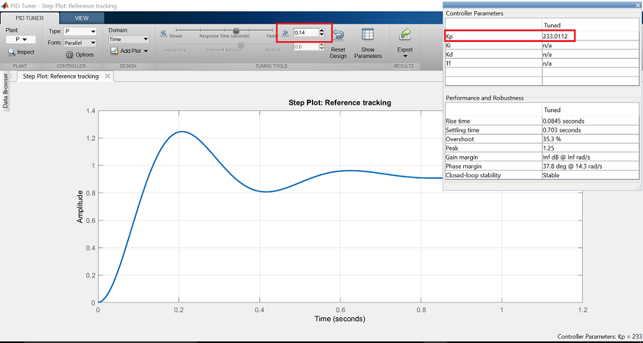
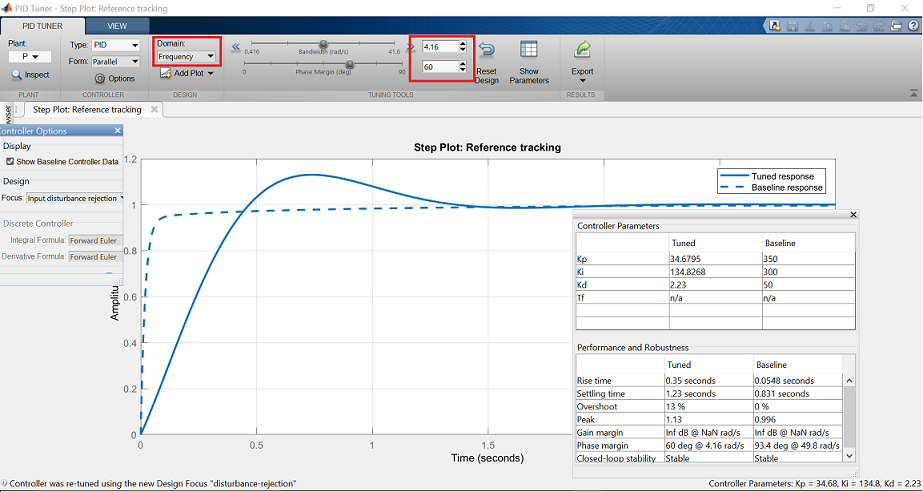

**Доступ:** MATLAB Online (basic).
**Джерело:** адаптовано з [Introduction: PID Controller Design](https://ctms.engin.umich.edu/CTMS/index.php?example=Introduction&section=ControlPID) (CTMS, CC BY-SA 4.0).
**Основні команди MATLAB:** `tf`, `step`, `pid`, `feedback`, `pidtune`.

У цьому модулі розглянуто просту, але універсальну структуру коригувального пристрою зі зворотним зв'язком — **пропорційно-інтегрально-диференціальний (ПІД) регулятор**. ПІД-регулятор широко застосовують, бо він зрозумілий і водночас дуже дієвий. Його привабливість у тому, що поняття диференціювання та інтегрування зрозумілі кожному інженерові, тому систему керування можна реалізувати навіть без глибокого знання теорії керування. Попри простоту, регулятор доволі витончений: він враховує історію системи (через інтегрування) і передбачає її майбутню поведінку (через диференціювання).

## Загальний огляд ПІД-регулятора

Розглядатимемо систему з одиничним зворотним зв'язком:


Вихід ПІД-регулятора, який дорівнює керуючому впливу на об'єкт, обчислюється в часовій області з похибки зворотного зв'язку так:

$$
u(t) = K_p e(t) + K_i \int e(t)dt + K_p \frac{de}{dt}
$$

Спершу розгляньмо, як ПІД-регулятор працює в замкненій системі. Змінна $e$ позначає похибку стеження — різницю між бажаним виходом $r$ і фактичним виходом $y$. Сигнал похибки $e$ подається на ПІД-регулятор, який обчислює і похідну, і інтеграл цього сигналу за часом. Керуючий сигнал $u$, що надходить на об'єкт, дорівнює сумі трьох доданків: пропорційного коефіцієнта $K_p$, помноженого на величину похибки, інтегрального коефіцієнта $K_i$, помноженого на інтеграл похибки, і диференціального коефіцієнта $K_d$, помноженого на похідну похибки.

Керуючий сигнал $u$ подається на об'єкт, і отримується новий вихід $y$. Далі цей вихід повертається зворотним зв'язком і порівнюється із завданням, що дає новий сигнал похибки $e$. Регулятор обчислює оновлений керуючий вплив, і процес триває, поки регулятор працює.

Передавальну функцію ПІД-регулятора отримують перетворенням Лапласа наведеного рівняння:

$$
K_p + \frac {K_i} {s} + K_d s = \frac{K_d s^2 + K_p s + K_i} {s}
$$

де $K_p$ — пропорційний коефіцієнт, $K_i$ — інтегральний коефіцієнт, $K_d$ — диференціальний коефіцієнт.

ПІД-регулятор у MATLAB можна задати безпосередньо як передавальну функцію:

```matlab
Kp = 1;
Ki = 1;
Kd = 1;

s = tf('s');
C = Kp + Ki/s + Kd*s
```

```text
C =
 
  s^2 + s + 1
  -----------
       s
 
Continuous-time transfer function.
```

Або скористатися об'єктом `pid`, щоб створити еквівалентний неперервний регулятор:

```matlab
C = pid(Kp,Ki,Kd)
```

```text
C =
 
             1          
  Kp + Ki * --- + Kd * s
             s          

  with Kp = 1, Ki = 1, Kd = 1
 
Continuous-time PID controller in parallel form.
```

Перетворимо об'єкт `pid` на передавальну функцію, щоб переконатися в однаковості результату:

```matlab
tf(C)
```

```text
ans =
 
  s^2 + s + 1
  -----------
       s
 
Continuous-time transfer function.
```

## Характеристики складових P, I та D

Збільшення пропорційного коефіцієнта $K_p$ пропорційно збільшує керуючий сигнал за того самого рівня похибки. Оскільки регулятор «тисне» сильніше, замкнена система зазвичай реагує швидше, але й дає більше перерегулювання. Ще один наслідок збільшення $K_p$ — зменшення, але не усунення усталеної похибки.

Додавання диференціальної складової $K_d$ надає регулятору здатність «передбачати» похибку. За простого пропорційного керування зі сталим $K_p$ керуючий сигнал зростає лише тоді, коли зростає похибка. З диференціальною складовою керуючий сигнал може стати великим уже тоді, коли похибка починає зростати, навіть якщо її величина ще відносно мала. Таке передбачення додає системі демпфування і зменшує перерегулювання. Водночас диференціальна складова не впливає на усталену похибку.

Додавання інтегральної складової $K_i$ допомагає зменшити усталену похибку. За наявності сталої залишкової похибки інтегратор накопичує її, збільшуючи керуючий сигнал і зменшуючи похибку. Недолік інтегральної складової в тому, що система стає повільнішою та схильнішою до коливань: коли сигнал похибки змінює знак, інтегратору потрібен час, щоб «розкрутитися» назад.

Загальний вплив кожного параметра на замкнену систему узагальнено в таблиці. Ці орієнтири справедливі в багатьох, але не в усіх випадках. Щоб дійсно знати вплив окремих коефіцієнтів, потрібен додатковий аналіз або випробування на реальній системі.

| Реакція замкненої системи | Час наростання | Перерегулювання | Час встановлення | Усталена похибка |
| --- | --- | --- | --- | --- |
| $K_p$ | зменшується | зростає | змінюється незначно | зменшується |
| $K_i$ | зменшується | зростає | зростає | зменшується |
| $K_d$ | змінюється незначно | зменшується | зменшується | не змінюється |

## Постановка задачі

Розгляньмо просту систему «маса — пружина — демпфер».


Рівняння руху цієї системи:

$$
m\ddot{x} + b\dot{x} + kx = F
$$

Виконавши перетворення Лапласа, дістаємо:

$$
ms^{2}X(s) + bsX(s) + kX(s) = F(s)
$$

Отже, передавальна функція від вхідної сили $F(s)$ до вихідного переміщення $X(s)$:

$$
\frac{X(s)}{F(s)} = \frac{1}{ms^2 + bs + k}
$$

Нехай

```text
    m = 1 kg
    b = 10 N s/m
    k = 20 N/m
    F = 1 N
```

Підставивши ці значення, отримуємо:

$$
\frac{X(s)}{F(s)} = \frac{1}{s^2 + 10s + 20}
$$

Мета задачі — показати, як кожна зі складових $K_p$, $K_i$ та $K_d$ сприяє досягненню типових цілей:

- малий час наростання;
- мінімальне перерегулювання;
- нульова усталена похибка.

## Перехідна характеристика розімкненої системи

Спершу подивімося на реакцію розімкненої системи. Створіть новий m-файл і виконайте такий код:

```matlab
s = tf('s');
P = 1/(s^2 + 10*s + 20);
step(P)
```



Коефіцієнт підсилення об'єкта на нульовій частоті дорівнює 1/20, тому кінцеве значення виходу для одиничного ступінчастого впливу становить 0.05. Це відповідає усталеній похибці 0.95, що дуже багато. До того ж час наростання становить близько однієї секунди, а час встановлення — близько 1.5 секунди. Спроєктуймо регулятор, який зменшить час наростання й час встановлення та усуне усталену похибку.

## Пропорційне керування

З наведеної вище таблиці видно, що пропорційний регулятор $K_p$ зменшує час наростання, збільшує перерегулювання та зменшує усталену похибку.

Передавальна функція замкненої системи з одиничним зворотним зв'язком і пропорційним регулятором, де $X(s)$ — вихід (дорівнює $Y(s)$), а завдання $R(s)$ — вхід:

$$
T(s) = \frac{X(s)}{R(s)} = \frac{K_p}{s^2 + 10s + (20 + K_p)}
$$

Нехай пропорційний коефіцієнт $K_p$ дорівнює 300:

```matlab
Kp = 300;
C = pid(Kp)
T = feedback(C*P,1)

t = 0:0.01:2;
step(T,t)
```

```text
C =
 
  Kp = 300
 
P-only controller.


T =
 
        300
  ----------------
  s^2 + 10 s + 320
 
Continuous-time transfer function.
```



Графік показує, що пропорційний регулятор зменшив і час наростання, і усталену похибку, збільшив перерегулювання та незначно зменшив час встановлення.

## Пропорційно-диференціальне керування

Тепер розгляньмо ПД-керування. З таблиці видно, що додавання диференціальної складової $K_d$ зменшує і перерегулювання, і час встановлення. Передавальна функція замкненої системи з ПД-регулятором:

$$
T(s) = \frac{X(s)}{R(s)} = \frac{K_d s + K_p}{s^2 + (10 + K_d) s + (20 + K_p)}
$$

Нехай $K_p$ дорівнює 300, як і раніше, а $K_d$ — 10:

```matlab
Kp = 300;
Kd = 10;
C = pid(Kp,0,Kd)
T = feedback(C*P,1)

t = 0:0.01:2;
step(T,t)
```

```text
C =
 
             
  Kp + Kd * s
             

  with Kp = 300, Kd = 10
 
Continuous-time PD controller in parallel form.


T =
 
     10 s + 300
  ----------------
  s^2 + 20 s + 320
 
Continuous-time transfer function.
```



Графік показує, що додавання диференціальної складової зменшило перерегулювання й час встановлення та майже не вплинуло на час наростання та усталену похибку.

## Пропорційно-інтегральне керування

Перш ніж переходити до ПІД-керування, дослідімо ПІ-керування. З таблиці видно, що додавання інтегральної складової $K_i$ зменшує час наростання, збільшує перерегулювання й час встановлення та зменшує усталену похибку. Передавальна функція замкненої системи з ПІ-регулятором:

$$
T(s) = \frac{X(s)}{R(s)} = \frac{K_p s + K_i}{s^3 + 10 s^2 + (20 + K_p )s + K_i}
$$

Зменшімо $K_p$ до 30 і задамо $K_i$ = 70:

```matlab
Kp = 30;
Ki = 70;
C = pid(Kp,Ki)
T = feedback(C*P,1)

t = 0:0.01:2;
step(T,t)
```

```text
C =
 
             1 
  Kp + Ki * ---
             s 

  with Kp = 30, Ki = 70
 
Continuous-time PI controller in parallel form.


T =
 
         30 s + 70
  ------------------------
  s^3 + 10 s^2 + 50 s + 70
 
Continuous-time transfer function.
```



Пропорційний коефіцієнт $K_p$ зменшено тому, що інтегральна складова також зменшує час наростання та збільшує перерегулювання, тобто дає подвійний ефект. Наведена реакція показує, що інтегральна складова усунула усталену похибку.

## Пропорційно-інтегрально-диференціальне керування

Тепер розгляньмо ПІД-керування. Передавальна функція замкненої системи з ПІД-регулятором:

$$
T(s) = \frac{X(s)}{R(s)} = \frac{K_d s^2 + K_p s + K_i}{s^3 + (10 + K_d)s^2 + (20 + K_p)s + K_i }
$$

Після кількох ітерацій налаштування бажану реакцію дали коефіцієнти $K_p$ = 350, $K_i$ = 300 і $K_d$ = 50:

```matlab
Kp = 350;
Ki = 300;
Kd = 50;
C = pid(Kp,Ki,Kd)
T = feedback(C*P,1);

t = 0:0.01:2;
step(T,t)
```

```text
C =
 
             1          
  Kp + Ki * --- + Kd * s
             s          

  with Kp = 350, Ki = 300, Kd = 50
 
Continuous-time PID controller in parallel form.
```



Отже, ми отримали замкнену систему без перерегулювання, з малим часом наростання та без усталеної похибки.

## Загальні поради щодо проєктування ПІД-регулятора

Проєктуючи ПІД-регулятор для заданої системи, дотримуйтеся такої послідовності:

- отримайте реакцію розімкненої системи та визначте, що саме потрібно поліпшити;
- додайте пропорційну складову, щоб зменшити час наростання;
- додайте диференціальну складову, щоб зменшити перерегулювання;
- додайте інтегральну складову, щоб зменшити усталену похибку;
- коригуйте коефіцієнти $K_p$, $K_i$ та $K_d$, доки не отримаєте бажану загальну реакцію; за потреби звіряйтеся з наведеною вище таблицею впливу складових.

Нарешті, пам'ятайте: реалізовувати всі три складові в одній системі не обов'язково. Якщо, наприклад, ПІ-регулятор задовольняє вимоги, диференціальна складова не потрібна. Тримайте регулятор настільки простим, наскільки це можливо.

Практичне налаштування ПІ-регулятора на реальному фізичному об'єкті також демонструє труднощі впровадження керування: насичення керуючого сигналу, накопичення інтегратора (integrator wind-up) і підсилення шуму.

## Автоматичне налаштування ПІД-регулятора

MATLAB має інструменти автоматичного вибору оптимальних коефіцієнтів, які роблять описаний вище процес проб і помилок непотрібним. Алгоритм налаштування доступний безпосередньо через `pidtune` або через графічний інтерфейс `pidTuner`.

Алгоритм автоматичного налаштування добирає коефіцієнти так, щоб збалансувати якість (час реакції, смуга пропускання) і робастність (запаси стійкості). Типово він проєктує регулятор із запасом за фазою 60°.

Спершу створімо пропорційний регулятор для системи «маса — пружина — демпфер». Тут `P` — раніше створена модель об'єкта, а `'p'` вказує, що потрібен саме пропорційний регулятор:

```matlab
pidTuner(P,'p')
```

Має з'явитися вікно `pidTuner`:



Зверніть увагу, що показана перехідна характеристика повільніша за ту, яку ми отримали вручну. Натисніть кнопку **Show Parameters** у верхньому правому куті. Як і очікувалося, пропорційний коефіцієнт менший за вибраний нами: $K_p$ = 94.86 проти 300.

Тепер параметри регулятора можна змінювати інтерактивно й одразу бачити результат. Перетягніть повзунок **Response Time** праворуч до 0.14 с — реакція справді пришвидшиться, а $K_p$ наблизиться до вибраного вручну значення. Поруч показано й інші показники якості та робастності. До зміни повзунка цільовий запас за фазою становив 60°: це типове значення `pidTuner`, яке зазвичай дає добрий баланс між робастністю та швидкодією.



Тепер спроєктуймо ПІД-регулятор. Якщо передати раніше створений (базовий) регулятор `C` другим параметром, `pidTuner` спроєктує ще один ПІД-регулятор і порівняє реакцію системи з базовою:

```matlab
pidTuner(P,C)
```

У вікні результатів видно, що автоматично налаштований регулятор реагує повільніше й дає більше перерегулювання, ніж базовий. Виберіть на панелі варіант **Domain: Frequency**, щоб відкрити параметри налаштування в частотній області.



Введіть 32 рад/с для **Bandwidth** і 90° для **Phase Margin**, щоб отримати регулятор, близький за якістю до базового. Пам'ятайте: більша смуга пропускання замкненої системи дає менший час наростання, а більший запас за фазою зменшує перерегулювання й поліпшує стійкість.

Нарешті, той самий регулятор можна отримати з командного рядка за допомогою `pidtune`:

```matlab
opts = pidtuneOptions('CrossoverFrequency',32,'PhaseMargin',90);
[C, info] = pidtune(P, 'pid', opts)
```

```text
C =
 
             1          
  Kp + Ki * --- + Kd * s
             s          

  with Kp = 320, Ki = 796, Kd = 32.2
 
Continuous-time PID controller in parallel form.

info = 
  struct with fields:

                Stable: 1
    CrossoverFrequency: 32
           PhaseMargin: 90
```

## Практика

1. Повторіть послідовність П → ПД → ПІ → ПІД для власної моделі та зафіксуйте показники якості на кожному кроці.
2. Порівняйте коефіцієнти, дібрані вручну та отримані через `pidtune`.
3. Поясніть, чому для цього об'єкта ПІ-регулятор усуває усталену похибку, а ПД-регулятор — ні.
