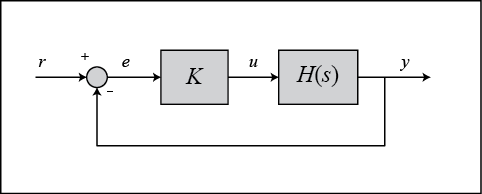
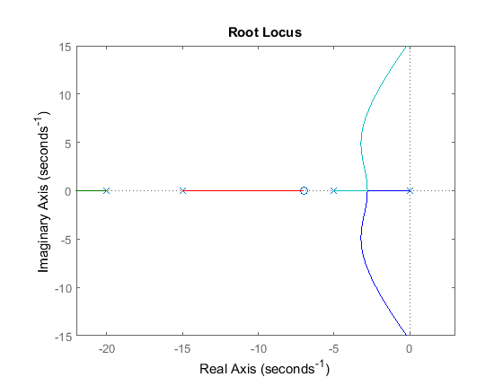
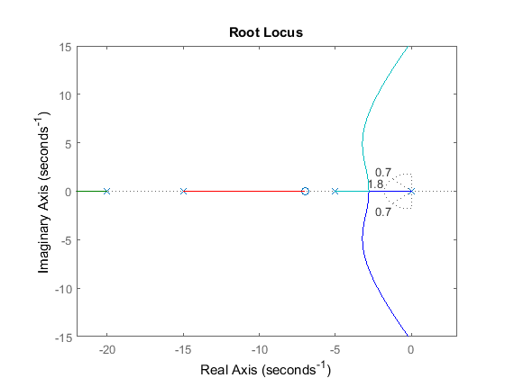
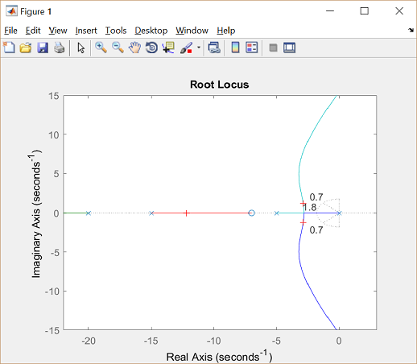
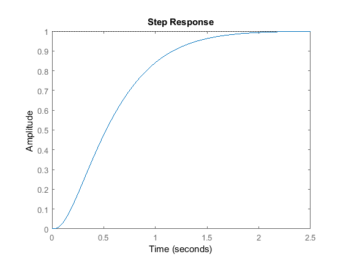
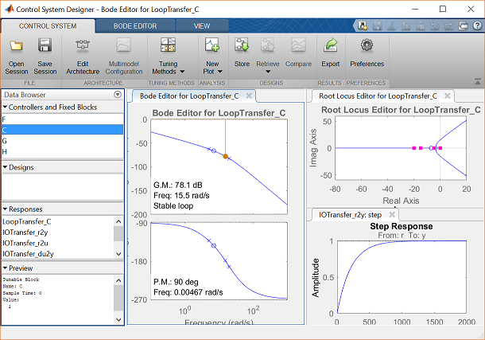
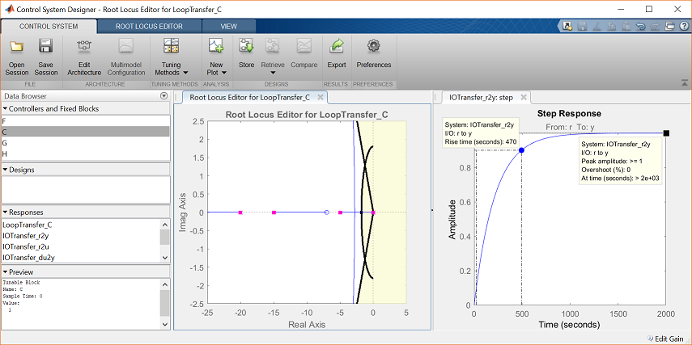
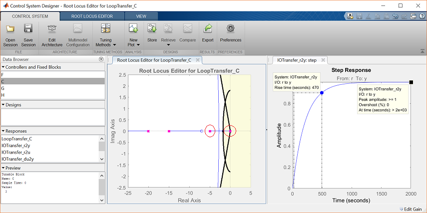
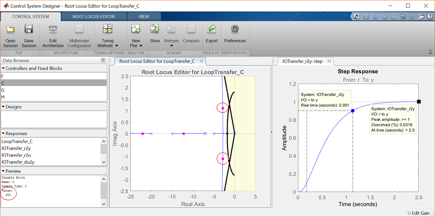

**Доступ:** MATLAB Online (basic).
**Джерело:** адаптовано з [Introduction: Root Locus Controller Design](https://ctms.engin.umich.edu/CTMS/index.php?example=Introduction&section=ControlRootLocus) (CTMS, CC BY-SA 4.0).
**Основні команди MATLAB:** `feedback`, `rlocus`, `step`, `controlSystemDesigner`.

У цьому модулі вводиться поняття кореневого годографа, показано, як побудувати його в MATLAB, і продемонстровано, як за його допомогою проєктувати регулятори, що задовольняють задані показники якості.

## Полюси замкненої системи

**Кореневий годограф** передавальної функції розімкненої системи $H(s)$ — це графік розташування (геометричного місця) всіх можливих полюсів замкненої системи, коли деякий параметр, найчастіше пропорційний коефіцієнт $K$, змінюється від 0 до $\infty$. На рисунку нижче показано структуру з одиничним зворотним зв'язком, але процедура однакова для будь-якої передавальної функції розімкненої системи $H(s)$, навіть якщо частина її елементів міститься в колі зворотного зв'язку.



Передавальна функція замкненої системи в цьому випадку:

$$
\frac{Y(s)}{R(s)} = \frac{KH(s)}{1 + KH(s)}
$$

Отже, полюсами замкненої системи є такі значення $s$, за яких $1 + KH(s) = 0$.

Якщо записати $H(s) = b(s)/a(s)$, то це рівняння можна переписати так:

$$
\Rightarrow\ a(s) + Kb(s) = 0
$$

$$
\Rightarrow\ \frac{a(s)}{K} + b(s) = 0
$$

Нехай $n$ — порядок $a(s)$, а $m$ — порядок $b(s)$ (порядок полінома відповідає найвищому степеню $s$).

Розглядатимемо всі додатні значення $K$. У границі за $K \rightarrow 0$ полюси замкненої системи є розв'язками рівняння $a(s) = 0$, тобто полюсами $H(s)$. У границі за $K \rightarrow \infty$ полюси замкненої системи є розв'язками $b(s) = 0$, тобто нулями $H(s)$.

Хоч би яке значення $K$ ми обрали, замкнена система має $n$ полюсів, де $n$ — кількість полюсів розімкненої передавальної функції $H(s)$. Отже, кореневий годограф має $n$ гілок: кожна починається в полюсі $H(s)$ і прямує до нуля $H(s)$. Якщо $H(s)$ має більше полюсів, ніж нулів (а так буває часто), тобто $m < n$, кажуть, що $H(s)$ має нулі на нескінченності. Тоді границя $H(s)$ за $s \rightarrow \infty$ дорівнює нулю. Кількість нулів на нескінченності дорівнює $n-m$ — різниці між кількістю полюсів і нулів розімкненої системи; саме стільки гілок годографа прямує до нескінченності вздовж асимптот.

Оскільки кореневий годограф показує всі можливі положення полюсів замкненої системи, він допомагає вибрати значення коефіцієнта $K$ для бажаної якості. Якщо якийсь із вибраних полюсів опиниться в правій півплощині, замкнена система буде нестійкою. Найбільший вплив на реакцію мають полюси, найближчі до уявної осі, тому навіть система з трьома-чотирма полюсами може поводитися подібно до системи другого чи першого порядку — залежно від розташування домінантних полюсів.

## Побудова кореневого годографа

Розгляньмо розімкнену систему з передавальною функцією

$$
H(s) = \frac{Y(s)}{U(s)} = \frac{s + 7}{s(s + 5)(s + 15)(s + 20)}
$$

Як спроєктувати для неї регулятор методом кореневого годографа? Припустімо, що вимоги до якості такі: перерегулювання 5% і час наростання 1 секунда. Створіть m-файл із назвою `rl.m`, задайте в ньому модель і скористайтеся командою `rlocus`:

```matlab
s = tf('s');
sys = (s + 7)/(s*(s + 5)*(s + 15)*(s + 20));
rlocus(sys)
axis([-22 3 -15 15])
```



## Вибір значення K за кореневим годографом

Побудований графік показує всі можливі положення полюсів замкненої системи для суто пропорційного регулятора. Не всі ці положення задовольняють наші вимоги. Щоб визначити прийнятну частину годографа, скористаємося командою `sgrid(zeta,wn)`, яка наносить лінії сталого коефіцієнта демпфування та сталої власної частоти. Її аргументи — коефіцієнт демпфування $\zeta$ і власна частота $\omega_n$ (кожен може бути вектором, якщо потрібен діапазон значень). У нашій задачі потрібне перерегулювання менше за 5%, що означає $\zeta$ більше за 0.7, і час наростання 1 секунда, що означає $\omega_n$ більше за 1.8:

```matlab
zeta = 0.7;
wn = 1.8;
sgrid(zeta,wn)
```



На графіку дві пунктирні прямі під кутом приблизно 45° позначають положення полюсів із $\zeta$ = 0.7: між ними полюси мають $\zeta$ > 0.7, а поза ними — $\zeta$ < 0.7. Півколо позначає положення полюсів із власною частотою $\omega_n$ = 1.8: усередині кола $\omega_n$ < 1.8, а ззовні — $\omega_n$ > 1.8.

Отже, щоб перерегулювання було меншим за 5%, полюси мають лежати між похилими пунктирними лініями, а щоб час наростання був меншим за 1 секунду — поза пунктирним півколом. Тепер ми знаємо, яка частина годографа задовольняє вимоги. Усі полюси в цій області лежать у лівій півплощині, тому замкнена система буде стійкою.

З графіка видно, що частина годографа потрапляє в бажану область. Отже, у цьому випадку достатньо лише пропорційного регулятора, щоб перемістити полюси в потрібну зону. Вибрати полюси на годографі можна командою

```matlab
[k,poles] = rlocfind(sys)
```

Клацніть на графіку в точці, де має бути полюс замкненої системи. Доцільно вибрати точки, позначені на рисунку нижче.



Оскільки годограф має кілька гілок, вибираючи один полюс, ви одночасно визначаєте положення й інших полюсів замкненої системи — усі вони відповідають тому самому значенню $K$. Пам'ятайте, що ці полюси також впливають на реакцію. З рисунка видно, що з чотирьох вибраних полюсів (позначених знаком «+») два найближчі до уявної осі лежать у бажаній області. Саме вони домінують у реакції, тому є підстави очікувати виконання вимог за пропорційного регулятора з таким $K$.

## Реакція замкненої системи

Щоб перевірити перехідну характеристику, потрібно знати передавальну функцію замкненої системи. Її можна отримати правилами перетворення структурних схем або доручити обчислення MATLAB (задавати значення `K` не потрібно, якщо використовувалася команда `rlocfind`):

```matlab
K = 350;
sys_cl = feedback(K*sys,1)
```

```text
sys_cl =
 
               350 s + 2450
  --------------------------------------
  s^4 + 40 s^3 + 475 s^2 + 1850 s + 2450
 
Continuous-time transfer function.
```

Двома аргументами функції `feedback` є передавальна функція прямого каналу та передавальна функція кола зворотного зв'язку розімкненої системи. У нашому випадку зворотний зв'язок одиничний. Якщо зворотний зв'язок неодиничний, зверніться до довідки MATLAB щодо функції `feedback`.

Перевіримо перехідну характеристику замкненої системи з вибраним $K$:

```matlab
step(sys_cl)
```



Як і очікувалося, ця реакція має перерегулювання менше за 5% і час наростання менший за 1 секунду.

## Використання Control System Designer

Ту саму задачу можна розв'язати в інтерактивному застосунку **Control System Designer**. Використовуючи ту саму модель, спершу означимо об'єкт $H(s)$:

```matlab
s = tf('s');
plant = (s + 7)/(s*(s + 5)*(s + 15)*(s + 20));
```

Функція `controlSystemDesigner` придатна і для аналізу, і для проєктування. Зосередимося на кореневому годографі як методі поліпшення перехідної характеристики замкненої системи. Уведіть у командному вікні:

```matlab
controlSystemDesigner(plant)
```

З'явиться показане нижче вікно. Застосунок також можна запустити з вкладки **APPS**, вибравши піктограму в групі **Control System Design and Analysis**. Тут видно кореневий годограф, діаграму Боде розімкненої системи та перехідну характеристику замкненої системи для заданого об'єкта з одиничним зворотним зв'язком і типовим регулятором $K = 1$.



Наступний крок — додати вимоги до якості на графік кореневого годографа. Це робиться безпосередньо на графіку: клацніть правою кнопкою й виберіть **Design Requirements → New**. Вимоги можна задати для часу встановлення, перерегулювання, коефіцієнта демпфування, власної частоти або як обмеження області.

Задамо вимоги до коефіцієнта демпфування та власної частоти так само, як раніше командою `sgrid`: межі вимог відповідають $\zeta$ = 0.7 і $\omega_n$ = 1.8. На графіку будь-яка область, що залишилася білою, є прийнятною для полюсів замкненої системи.

Щоб змінити масштаб, клацніть правою кнопкою на осі, виберіть **Properties**, а потім **Limits**. Задайте межі дійсної осі від −25 до 5, а уявної — від −2.5 до 2.5.

Також можна побачити поточні значення ключових показників реакції. На графіку перехідної характеристики клацніть правою кнопкою, перейдіть до **Characteristics** і виберіть **Peak Response**, а потім повторіть для **Rise Time**. З'являться дві великі точки, що позначають ці показники; клацнувши кожну з них, отримаєте вікно з даними.

Після закриття діаграми Боде обидва графіки матимуть такий вигляд:



Як показують характеристики перехідного процесу, перерегулювання прийнятне, але час наростання завеликий. Рожеві маркери на годографі позначають відповідні положення полюсів замкненої системи для поточного коефіцієнта $K$.

Щоб виправити це, потрібно вибрати нове значення $K$. Подібно до команди `rlocfind`, коефіцієнт регулятора можна змінити безпосередньо на графіку. Перетягніть рожевий маркер, найближчий до уявної осі (у початку координат), у прийнятну область годографа:



У полі **Preview** видно, що коефіцієнт підсилення контуру змінився на 360. За графіком перехідної характеристики замкненої системи обидві вимоги тепер виконано.



## Практика

1. Побудуйте кореневий годограф власного об'єкта та нанесіть межі $\zeta$ і $\omega_n$ за своїми вимогами.
2. Виберіть коефіцієнт $K$ і перевірте перехідну характеристику замкненої системи.
3. Поясніть, які полюси є домінантними у вашому варіанті та чому.
