**Доступ:** MATLAB Online (basic).
**Джерело:** адаптовано з [Introduction: Frequency Domain Methods for Controller Design](https://ctms.engin.umich.edu/CTMS/index.php?example=Introduction&section=ControlFrequency) (CTMS, CC BY-SA 4.0).
**Основні команди MATLAB:** `bode`, `nyquist`, `margin`, `lsim`, `step`, `feedback`, `controlSystemDesigner`.

Частотний метод проєктування може здаватися менш наочним, ніж інші підходи. Проте він має суттєві переваги, особливо в реальних задачах, коли передавальну функцію будують за експериментальними даними. У цьому модулі показано, як за частотною характеристикою розімкненої системи передбачити поведінку замкненої системи в часі.

## Запаси за амплітудою та фазою

Частотна характеристика описує, як система масштабує та зсуває синусоїдальний вхідний сигнал. Те, як це масштабування й зсув змінюються з частотою, дає корисні відомості про поведінку системи в часі. Зокрема, частотну характеристику використовують для оцінювання **робастності**: наскільки система близька до втрати стійкості. Для цього застосовують дві величини — запас за амплітудою та запас за фазою.

Розгляньмо систему з одиничним зворотним зв'язком:

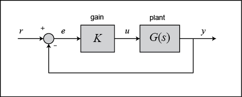

де $K$ — змінний (сталий) коефіцієнт підсилення, а $G(s)$ — об'єкт керування.

**Запас за амплітудою** — це зміна підсилення розімкненого контуру, потрібна, щоб замкнена система стала нестійкою. Системи з більшим запасом за амплітудою витримують більші зміни параметрів, перш ніж втратять стійкість.

**Запас за фазою** — це зміна фазового зсуву розімкненого контуру, потрібна, щоб замкнена система стала нестійкою. Запас за фазою також характеризує допустиме транспортне запізнення: якщо в контурі є запізнення, більше за $PM/\omega_{gc}$ (де $\omega_{gc}$ — частота в рад/с, на якій модуль дорівнює 0 дБ, а PM — запас за фазою в радіанах), замкнена система стане нестійкою. Запізнення $\tau_d$ можна уявити як додатковий блок у прямому каналі, що додає фазове відставання, але не впливає на модуль: такий блок має модуль 1 і фазу $-\omega \tau_d$.

Запас за фазою — це додаткове фазове відставання, потрібне, щоб фаза розімкненої системи досягла −180° на частоті, де її модуль дорівнює 0 дБ (частота зрізу за амплітудою $\omega_{gc}$). Відповідно, запас за амплітудою — це додаткове підсилення (зазвичай у дБ), потрібне, щоб модуль розімкненої системи досяг 0 дБ на частоті, де її фаза дорівнює −180° (частота зрізу за фазою $\omega_{pc}$).

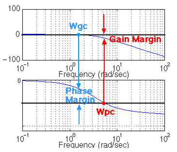

Зручність запасу за фазою в тому, що для його визначення після зміни підсилення контуру не потрібно перебудовувати діаграму Боде. Додавання підсилення лише зсуває графік модуля вгору або вниз, що рівнозначно зміні шкали на осі ординат. Достатньо знайти нову частоту зрізу й зчитати запас за фазою. Наприклад, побудуймо діаграму Боде:

```matlab
s = tf('s');
G = 50/(s^3 + 9*s^2 + 30*s +40);

bode(G)
grid on
title('Bode Plot with No Gain')
```

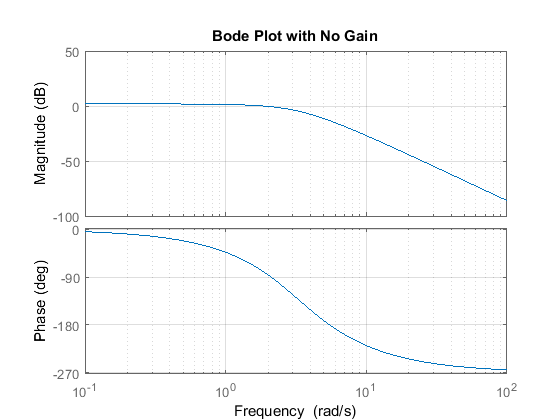

Запас за фазою становить приблизно 100°. Тепер додамо підсилення 100:

```matlab
bode(100*G)
grid on
title('Bode Plot with Gain = 100')
```

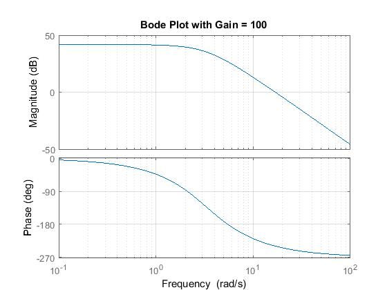

Як бачите, графік фази точно такий самий, а графік модуля зсунувся вгору на 40 дБ (підсилення 100). Запас за фазою тепер становить близько −60°. Той самий результат можна отримати, зсунувши вісь ординат графіка модуля вниз на 40 дБ: знайдіть на першій діаграмі точку перетину кривої з лінією −40 дБ і зчитайте запас за фазою.

MATLAB може обчислити й показати обидва запаси командою `margin(G)`, яка повертає запаси за амплітудою та фазою, відповідні частоти зрізу й графічне подання цих величин:

```matlab
margin(100*G)
```

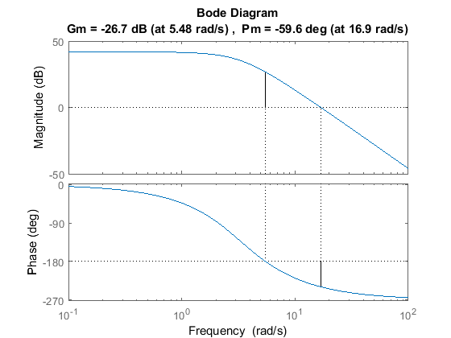

### Смуга пропускання

Частоту смуги пропускання означають як частоту, на якій модуль замкненої системи спадає на 3 дБ відносно свого значення на нульовій частоті. Проте, проєктуючи за частотною характеристикою, ми хочемо передбачити поведінку замкненої системи з характеристики розімкненої. Тому використовують наближення системою другого порядку: смуга пропускання дорівнює частоті, на якій модуль розімкненої системи лежить між −6 і −7.5 дБ, за умови що фаза розімкненої системи перебуває між −135° і −225°.

Щоб проілюструвати важливість смуги пропускання, подивімося, як змінюється вихід за різних частот входу. Синусоїдальні сигнали з частотою, меншою за $\omega_{bw}$, система відтворює «доволі добре». Сигнали з частотою, більшою за $\omega_{bw}$, послаблюються щонайменше в 0.707 раза за модулем і додатково зсуваються за фазою.

Нехай замкнена система описується передавальною функцією:

$$
G(s) = \frac{1}{s^2 + 0.5s + 1}
$$

```matlab
G = 1/(s^2 + 0.5*s + 1);
bode(G)
```

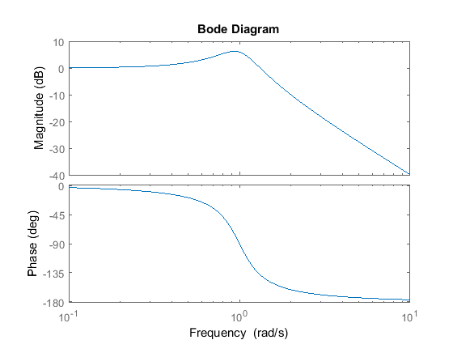

Оскільки це передавальна функція замкненої системи, смугою пропускання буде частота, що відповідає підсиленню −3 дБ. З графіка вона становить приблизно 1.4 рад/с. Також видно, що для частоти входу 0.3 рад/с модуль вихідної синусоїди має бути близьким до одиниці, а фаза — відставати на кілька градусів. Для частоти 3 рад/с модуль має бути близько −20 дБ (тобто в 10 разів меншим за вхід), а фаза — майже −180°, тобто сигнали будуть майже в протифазі. Перевірити це можна командою `lsim`.

Спершу візьмемо синусоїду з частотою, меншою за $\omega_{bw}$. Щоб чітко побачити усталений режим, обмежимо осі, відкинувши перехідний процес:

```matlab
G = 1/(s^2 + 0.5*s + 1);
w = 0.3;
t = 0:0.1:100;
u = sin(w*t);
[y,t] = lsim(G,u,t);
plot(t,y,t,u)
axis([50 100 -2 2])
```

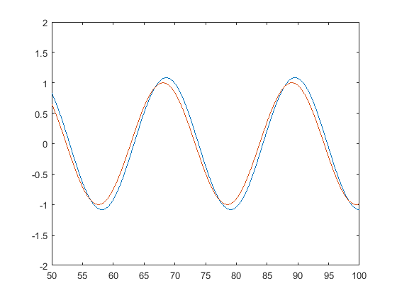

Вихід (синій) досить точно відтворює вхід (червоний), відстаючи на кілька градусів, як і передбачалося. Якщо ж задати частоту вище за смугу пропускання, реакція буде суттєво спотвореною:

```matlab
G = 1/(s^2 + 0.5*s + 1);
w = 3;
t = 0:0.1:100;
u = sin(w*t);
[y,t] = lsim(G,u,t);
plot(t,y,t,u)
axis([90 100 -1 1])
```

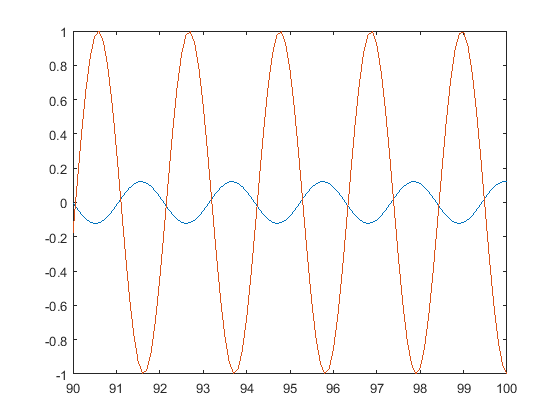

Модуль становить приблизно 1/10 від входу, як і передбачалося, а сигнал майже точно в протифазі (відставання 180°).

## Діаграма Найквіста

Діаграма Найквіста дає змогу передбачити стійкість і якість замкненої системи за поведінкою розімкненої. Критерій Найквіста придатний незалежно від стійкості розімкненої системи (тоді як методи Боде передбачають, що розімкнена система стійка). Тому його застосовують, коли діаграми Боде дають неоднозначну картину.

> **Зауваження.** Команда `nyquist` у MATLAB некоректно відображає системи з полюсами розімкненої системи на уявній осі. В оригінальному курсі для таких випадків пропонують файл `nyquist1.m`, який правильно обробляє полюси й нулі на уявній осі.

Діаграма Найквіста — це, по суті, графік $G(j\omega)$, де $G(s)$ — передавальна функція розімкненої системи, а $\omega$ — вектор частот, що охоплює всю праву півплощину. Під час побудови враховують і додатні частоти (від нуля до нескінченності), і від'ємні (від мінус нескінченності до нуля). Вектор частот виглядає приблизно так:

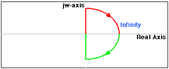

Проте якщо є полюси або нулі розімкненої системи на уявній осі, функція $G(s)$ у цих точках не визначена, тому контур доводиться обходити навколо них:

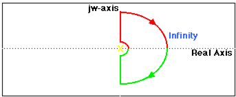

## Критерій Коші

Критерій Коші з комплексного аналізу стверджує: якщо взяти замкнений контур на комплексній площині й відобразити його комплексною функцією $G(s)$, то кількість обходів початку координат графіком $G(s)$ дорівнює кількості нулів $G(s)$, охоплених контуром, мінус кількість полюсів $G(s)$, охоплених контуром. Обходи вважають додатними, якщо вони збігаються за напрямом з початковим контуром, і від'ємними — якщо протилежні.

У задачах керування нас цікавить не стільки $G(s)$, скільки передавальна функція замкненої системи:

$$
\frac{G(s)}{1 + G(s)}
$$

Якщо $1 + G(s)$ охоплює початок координат, то $G(s)$ охоплює точку −1. Оскільки нас цікавить стійкість замкненої системи, треба знати, чи є полюси замкненої системи (нулі $1 + G(s)$) у правій півплощині.

Тому поведінка діаграми Найквіста поблизу точки −1 на дійсній осі надзвичайно важлива. На стандартній діаграмі це буває важко розгледіти; в оригінальному курсі для цього пропонують функцію `lnyquist.m`, яка будує діаграму в логарифмічному масштабі та зберігає характер поведінки поблизу точки −1.

Розгляньмо просту діаграму Найквіста для функції:

$$
G(s) = \frac{0.5}{s - 0.5}
$$

```matlab
s = tf('s');
G = 0.5/(s - 0.5);
nyquist(G)
axis([-1 0 -1 1])
```

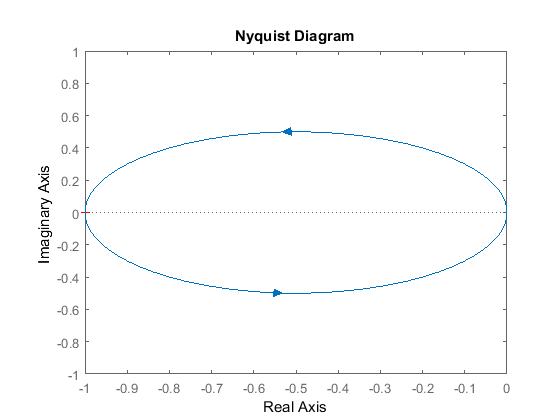

Тепер розгляньмо систему

$$
G(s) = \frac{s + 2}{s^2}
$$

Ця функція має полюс у початку координат. Порівняймо результати команд `nyquist`, `nyquist1` і `lnyquist`:

```matlab
G = (s + 2)/(s^2);
nyquist(G)
```

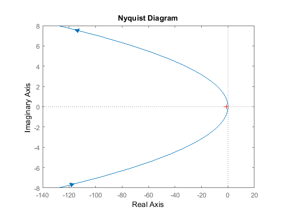

```matlab
nyquist1(G)
```

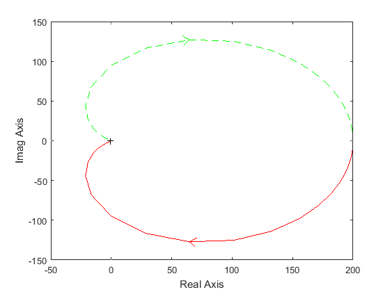

```matlab
lnyquist(G)
```

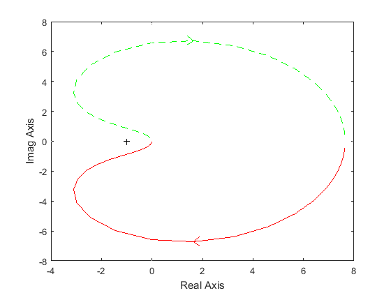

Стандартна діаграма тут неправильна: вона не відтворює поведінку за радіуса, що прямує до нескінченності (тобто за $s$, що прямує до нуля). Діаграма `nyquist1` має правильну форму, що дозволяє підрахувати обходи точки −1 і застосувати критерій Найквіста, проте роздивитися околицю точки −1 складно. Функція `lnyquist` використовує змінений масштаб, який зберігає і коректну поведінку поблизу −1, і загальну форму графіка.

## Якість замкненої системи за діаграмами Боде

Щоб передбачити якість замкненої системи за частотною характеристикою розімкненої, потрібні кілька припущень:

- система має бути стійкою в розімкненому стані, якщо ми проєктуємо за діаграмами Боде;
- для канонічних систем другого порядку коефіцієнт демпфування замкненої системи приблизно дорівнює запасу за фазою, поділеному на 100, якщо запас лежить між 0° і 60°; за запасу понад 60° це співвідношення застосовують обережно;
- для канонічних систем другого порядку існує співвідношення між коефіцієнтом демпфування, смугою пропускання та часом встановлення;
- як дуже грубу оцінку можна вважати, що смуга пропускання приблизно дорівнює власній частоті.

Застосуймо ці поняття до системи:

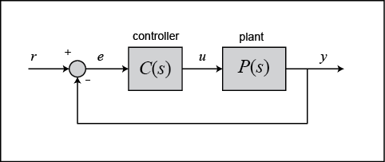

де $C(s)$ — регулятор, а $P(s)$:

$$
P(s) = \frac{10}{1.25s + 1}
$$

Вимоги до проєктування:

- нульова усталена похибка;
- максимальне перерегулювання менше за 40%;
- час встановлення менший за 2 секунди.

Задачу можна розв'язати графічно або чисельно; у MATLAB зручніший графічний підхід. Спершу подивімося на діаграму Боде:

```matlab
P = 10/(1.25*s + 1);
bode(P)
```

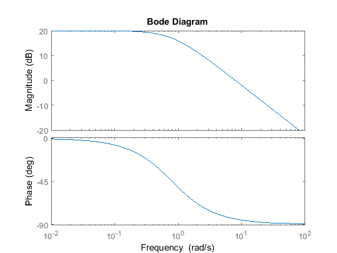

З цієї діаграми можна зчитати кілька характеристик. По-перше, смуга пропускання становить близько 10 рад/с. Оскільки для системи такого типу смуга приблизно дорівнює власній частоті, час наростання дорівнює 1.8/BW = 1.8/10 = 0.18 с; округлимо до 0.2 с.

Запас за фазою становить приблизно 95°. Співвідношення «коефіцієнт демпфування = PM/100» справедливе лише для PM < 60°. Оскільки система першого порядку, перерегулювання не буде.

Останній важливий показник — усталена похибка, яку також можна зчитати з діаграми Боде. Коефіцієнт похибки ($K_p$, $K_v$ або $K_a$) знаходять у точці перетину низькочастотної асимптоти з лінією $\omega$ = 1 рад/с. Оскільки на низьких частотах діаграма цієї системи горизонтальна (нахил 0), система з одиничним зворотним зв'язком є системою нульового типу. Підсилення становить 20 дБ (модуль 10), тобто коефіцієнт похибки дорівнює 10, а усталена похибка — 1/(1 + $K_p$) = 1/(1 + 10) = 0.091.

Якби система була першого типу, коефіцієнт похибки визначався б так:

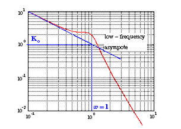

Перевірмо передбачення за перехідною характеристикою:

```matlab
sys_cl = feedback(P,1);
step(sys_cl)
title('Closed-Loop Step Response, No Controller')
```

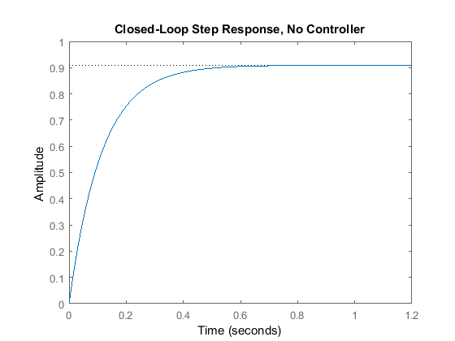

Передбачення справдилися: час наростання близько 0.2 с, перерегулювання немає, усталена похибка близько 9%.

Тепер виберімо регулятор, який задовольнить вимоги. Візьмемо ПІ-регулятор, бо він забезпечує нульову усталену похибку за ступінчастого впливу. До того ж ПІ-регулятор має нуль, положення якого ми можемо задати, що дає додаткову свободу проєктування:

$$
C(s) = \frac{K(s + a)}{s} = K + \frac{Ka}{s}
$$

Спершу знайдемо коефіцієнт демпфування, що відповідає перерегулюванню 40%. Підставивши це значення у співвідношення між перерегулюванням і демпфуванням, дістаємо приблизно 0.28. Отже, запас за фазою має бути щонайменше 30°. Щоб час встановлення був меншим за 1.75 с, смуга пропускання має бути не меншою за 12 рад/с.

Оскільки ми працюємо з діаграмами Боде розімкненої системи, шукана смуга пропускання відповідатиме підсиленню приблизно −7 дБ.

Подивімося, як на реакцію впливає лише інтегральна складова:

```matlab
P = 10/(1.25*s + 1);
C = 1/s;
bode(C*P, logspace(0,2))
```

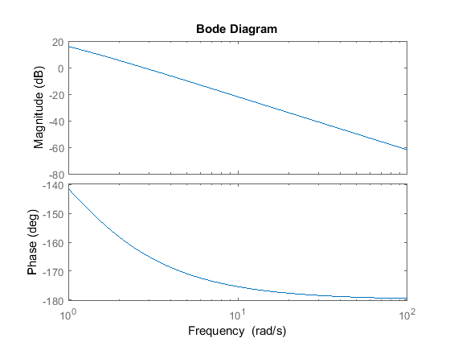

Запас за фазою й смуга пропускання замалі. Додамо підсилення та фазу за допомогою нуля; розмістимо його поки що в точці −1:

```matlab
P = 10/(1.25*s + 1);
C = (s + 1)/s;
bode(C*P, logspace(0,2))
```

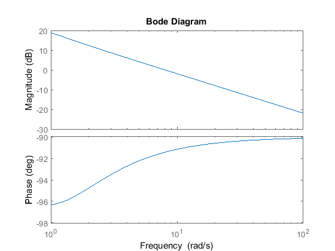

Нуль у −1 з одиничним підсиленням дає прийнятний результат: запас за фазою перевищує 60° (перерегулювання навіть менше за очікуване), а смуга пропускання становить близько 11 рад/с. Спробуймо підвищити смугу пропускання, не змінюючи істотно запас за фазою, — збільшимо підсилення до 5. Це зсуне графік модуля, а фаза залишиться незмінною:

```matlab
P = 10/(1.25*s + 1);
C = 5*((s + 1)/s);
bode(C*P, logspace(0,2))
```

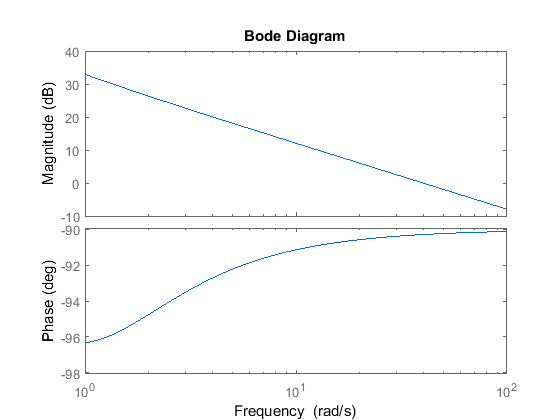

Перевірмо результат за перехідною характеристикою:

```matlab
sys_cl = feedback(C*P,1);
step(sys_cl)
```

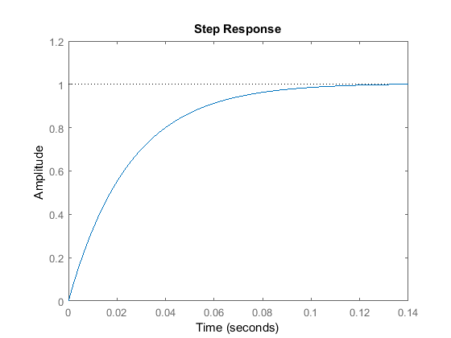

Реакція навіть краща, ніж ми очікували. Проте так щастить не завжди: зазвичай доводиться підбирати підсилення й положення полюсів або нулів, щоб задовольнити вимоги.

## Стійкість замкненої системи за діаграмою Найквіста

Згідно з критерієм Коші, кількість $N$ обходів точки −1 + j0 графіком $G(s)H(s)$ дорівнює кількості $Z$ нулів функції $1 + G(s)H(s)$, охоплених контуром, мінус кількість $P$ її полюсів, охоплених контуром, тобто $N = Z - P$. При цьому:

- нулі $1 + G(s)H(s)$ є полюсами замкненої системи;
- полюси $1 + G(s)H(s)$ є полюсами розімкненої системи.

Звідси:

- $P$ — кількість нестійких полюсів розімкненої системи $G(s)H(s)$;
- $N$ — кількість обходів точки −1 діаграмою Найквіста, причому обходи за годинниковою стрілкою вважають додатними, а проти — від'ємними;
- $Z$ — кількість полюсів замкненої системи в правій півплощині.

Критерій стійкості Найквіста пов'язує ці три величини:

$$
Z = P + N
$$

> Це лише одна з угод щодо знаків. За іншою угодою додатним $N$ вважають обходи проти годинникової стрілки, і тоді $Z = P - N$. У цьому курсі, як і в оригіналі, обходи за годинниковою стрілкою вважаємо додатними.

Навчитися правильно рахувати обходи важливо й не завжди просто. Корисний прийом: уявіть, що ви стоїте в точці −1 і стежите поглядом за рухом по діаграмі від початку до кінця. Скільки разів ви повернули голову на повні 360°? Якщо рух був за годинниковою стрілкою, $N$ додатне, якщо проти — від'ємне.

Знаючи кількість нестійких полюсів розімкненої системи $P$ і кількість обходів $N$, можна визначити стійкість замкненої системи. Якщо $Z = P + N$ є додатним ненульовим числом, замкнена система нестійка.

Діаграму Найквіста можна також використати, щоб знайти діапазон підсилень, за яких замкнена система залишається стійкою. Розгляньмо систему


де

$$
G(s) = \frac{s^2 + 10s + 24}{s^2 - 8s + 15}
$$

Спершу знайдемо кількість додатних дійсних полюсів розімкненої системи:

```matlab
roots([1 -8 15])
```

```text
ans =
     5
     3
```

Обидва полюси розімкненої системи додатні. Отже, для стійкості замкненої системи потрібні два обходи проти годинникової стрілки ($N = -2$), щоб $Z = P + N$ дорівнювало нулю. Якщо обходів менше або вони мають інший напрям, система буде нестійкою.

Подивімося на діаграму за підсилення 1:

```matlab
G = (s^2 + 10*s + 24)/(s^2 - 8*s + 15);
nyquist(G)
```

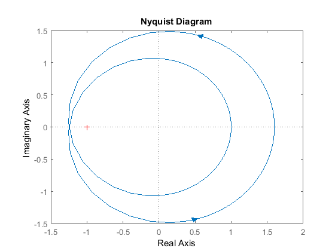

Є два обходи точки −1 проти годинникової стрілки, тому за підсилення 1 система стійка. Тепер збільшимо підсилення до 20:

```matlab
nyquist(20*G)
```

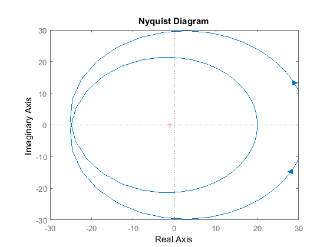

Діаграма розширилася, тому замкнена система залишатиметься стійкою за будь-якого подальшого збільшення підсилення. Проте зменшення підсилення стискає діаграму, і система може втратити стійкість. Перевіримо підсилення 0.5:

```matlab
nyquist(0.5*G)
```

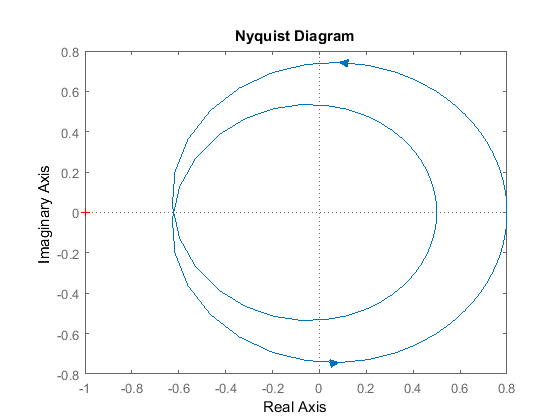

Тепер система нестійка. Добором можна встановити, що система стає нестійкою за підсилень, менших за 0.80.

### Звідки береться запас за амплітудою

Запас за амплітудою ми означили як зміну підсилення розімкненого контуру (у децибелах), потрібну за фазового зсуву −180°, щоб модуль розімкненої системи став 0 дБ. Розгляньмо систему, стійку за відсутності обходів точки −1:

$$
G(s) = \frac{50}{s^3 + 9s^2 + 30s + 40}
$$

Ця система не має полюсів розімкненої системи в правій півплощині, тому за відсутності обходів точки −1 замкнена система теж не матиме полюсів у правій півплощині. Наскільки можна збільшити підсилення, перш ніж система втратить стійкість?

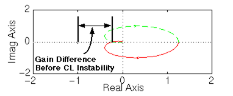

Ділянка від'ємної дійсної осі між −1/a (точкою, де фаза розімкненої системи дорівнює −180°, тобто де діаграма перетинає дійсну вісь) і −1 відповідає допустимому збільшенню підсилення до втрати стійкості. Якщо додане підсилення дорівнює $a$, діаграма торкнеться точки −1:

$$
G(j\omega) = \frac{-1}{a}
$$

або

$$
aG(j\omega) = -1
$$

Отже, запас за амплітудою дорівнює $a$ одиниць, а в децибелах:

$$
GM = 20\log_{10}(a)\ \mathrm{dB}
$$

Знайдімо запас за амплітудою для наведеної системи:

```matlab
G = 50/(s^3 + 9*s^2 + 30*s + 40);
nyquist(G)
```

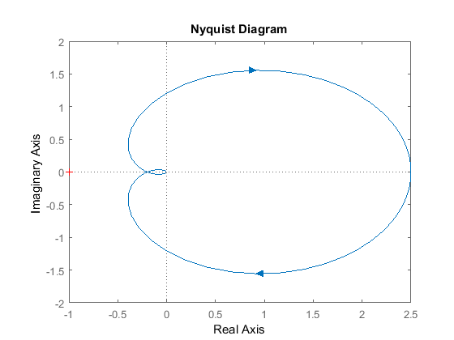

Щоб знайти $a$, потрібно визначити точку з фазовим зсувом рівно −180°, тобто точку, де передавальна функція дійсна (не має уявної частини). Чисельник уже дійсний, тому розгляньмо знаменник. За $s = j\omega$ уявні частини дають лише доданки з непарними степенями $s$. Отже, для дійсності $G(j\omega)$ потрібно, щоб

$$
-j\omega^3 + 30j\omega = 0
$$

звідки $\omega = 0$ (найправіша точка діаграми) або $\omega = \sqrt{30}$. Обчислимо значення $G(j\omega)$ у цій точці:

```matlab
w = sqrt(30);
polyval(50,j*w)/polyval([1 9 30 40],j*w)
```

```text
ans =
   -0.2174
```

Відповідь −0.2174 + 0i: уявна частина нульова, отже, обчислення правильне. Ця точка й була означена як −1/a, тому:

$$
\frac{-1}{a} = -0.2174
$$

$$
\Rightarrow a = 4.6
$$

$$
\Rightarrow GM = 20\log_{10}(4.6) = 13.26\ \mathrm{dB}
$$

Перевірмо точність, застосувавши підсилення $a$ = 4.6:

```matlab
a = 4.6;
nyquist(a*G)
```

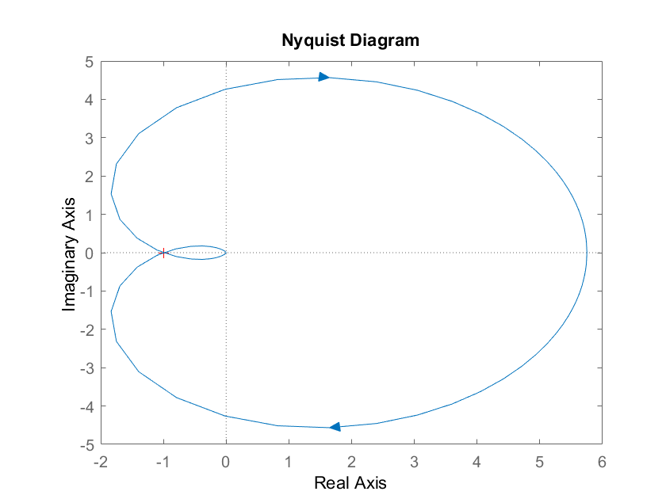

Графік проходить майже точно через точку −1, що підтверджує обчислення.

### Звідки береться запас за фазою

Запас за фазою ми означили як зміну фазового зсуву розімкненої системи за одиничного підсилення, потрібну, щоб замкнена система стала нестійкою.

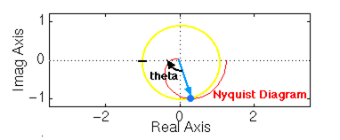

Система втратить стійкість, якщо діаграма Найквіста охопить точку −1. Якщо повернути діаграму на кут $\theta$, вона торкнеться точки −1 на від'ємній дійсній осі, що відповідає межі стійкості. Саме цей кут і називають запасом за фазою. Щоб знайти точку, від якої його вимірюють, будують коло одиничного радіуса, знаходять на діаграмі точку з модулем 1 (підсилення 0 дБ) і визначають фазовий зсув, потрібний, щоб ця точка опинилася під кутом −180°.

## Практика

1. Побудуйте `margin` для власного об'єкта й зафіксуйте обидва запаси та відповідні частоти.
2. Перевірте правило «коефіцієнт демпфування ≈ PM/100» на системі другого порядку й оцініть межі його застосовності.
3. Визначте діапазон підсилень, за яких ваша система залишається стійкою, і перевірте межі перехідною характеристикою.
