**Доступ:** MATLAB Online (basic).
**Джерело:** адаптовано з [Introduction: State-Space Methods for Controller Design](https://ctms.engin.umich.edu/CTMS/index.php?example=Introduction&section=ControlStateSpace) (CTMS, CC BY-SA 4.0).
**Основні команди MATLAB:** `eig`, `ss`, `lsim`, `place`, `acker`.

У цьому модулі показано, як проєктувати регулятори та спостерігачі методами простору станів (тобто в часовій області).

## Модель

Систему лінійних диференціальних рівнянь можна описати кількома способами. Для одновимірної (SISO) лінійної стаціонарної системи подання у просторі станів має вигляд:

$$
\frac{d\mathbf{x}}{dt} = A\mathbf{x} + Bu
$$

$$
y = C\mathbf{x} + Du
$$

де $\mathbf{x}$ — вектор змінних стану розміру n×1, $u$ — скалярний вхід, $y$ — скалярний вихід. Матриці $A$ (n×n), $B$ (n×1) і $C$ (1×n) задають зв'язки між змінними стану, входом і виходом. Зверніть увагу: це n диференціальних рівнянь першого порядку. Подання у просторі станів придатне і для багатовимірних (MIMO) систем, але в цьому курсі ми зосереджуємося на SISO.

Щоб продемонструвати метод, скористаємося прикладом **кульки, підвішеної в магнітному полі**. Струм у котушці створює магнітну силу, яка може зрівноважити силу тяжіння й утримувати кульку з магнітного матеріалу в повітрі.

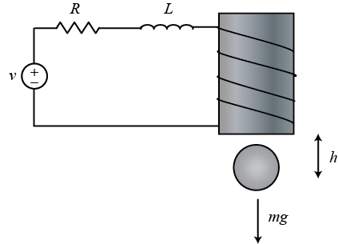

Рівняння системи:

$$
m\frac{d^2h}{dt^2} = mg - \frac{Ki^2}{h}
$$

$$
V = L\frac{di}{dt} + iR
$$

де $h$ — вертикальне положення кульки, $i$ — струм через електромагніт, $V$ — прикладена напруга, $m$ — маса кульки, $g$ — прискорення вільного падіння, $L$ — індуктивність, $R$ — опір, $K$ — коефіцієнт, що визначає магнітну силу, яка діє на кульку.

Для простоти візьмемо $m$ = 0.05 кг, $K$ = 0.0001, $L$ = 0.01 Гн, $R$ = 1 Ом, $g$ = 9.81 м/с². Система перебуває в рівновазі (кулька висить у повітрі), коли $h = K i^2/mg$, тобто за $dh/dt$ = 0. Лінеаризуємо рівняння навколо точки $h$ = 0.01 м, де номінальний струм становить приблизно 7 А, і дістаємо лінійні рівняння стану, у яких вектор станів

$$
x = \left[{\begin{array}{c} \Delta h \\ \Delta \dot{h} \\ \Delta i \end{array}}\right]
$$

є вектором 3×1, $u$ — відхилення вхідної напруги від рівноважного значення ($\Delta V$), а вихід $y$ — відхилення висоти кульки від рівноважного положення ($\Delta h$).

Введіть матриці системи в m-файл:

```matlab
A = [ 0   1   0
     980  0  -2.8
      0   0  -100 ];

B = [ 0
      0
      100 ];

C = [ 1 0 0 ];
```

## Стійкість

Насамперед з'ясуймо, чи є стійкою розімкнена система (без керування). Стійкість визначають власні значення матриці $A$, які дорівнюють полюсам передавальної функції. Власні значення матриці $A$ — це значення $s$, що є розв'язками рівняння $\det(sI - A) = 0$.

```matlab
poles = eig(A)
```

```text
poles =
   31.3050
  -31.3050
 -100.0000
```

Один із полюсів лежить у правій півплощині (має додатну дійсну частину), тому розімкнена система нестійка.

Подивімося, що відбувається з цією нестійкою системою за ненульової початкової умови:

```matlab
t = 0:0.01:2;
u = zeros(size(t));
x0 = [0.01 0 0];

sys = ss(A,B,C,0);

[y,t,x] = lsim(sys,u,t,x0);
plot(t,y)
title('Open-Loop Response to Non-Zero Initial Condition')
xlabel('Time (sec)')
ylabel('Ball Position (m)')
```

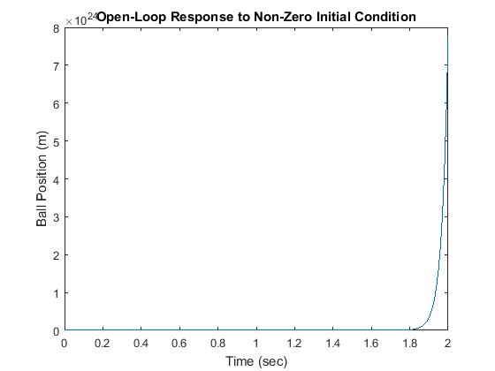

Здається, що відстань між кулькою та електромагнітом прямує до нескінченності, але насправді кулька раніше впаде на стіл чи підлогу — а також вийде за межі, у яких лінеаризація залишається справедливою.

## Керованість і спостережуваність

Система є **керованою**, якщо завжди існує керуючий вплив $u(t)$, що переводить будь-який стан системи в будь-який інший стан за скінченний час. Лінійна стаціонарна система керована тоді й лише тоді, коли її матриця керованості $\mathcal{C}$ має повний ранг, тобто rank($\mathcal{C}$) = n, де n — кількість змінних стану. Ранг обчислюють командою `rank(ctrb(A,B))` або `rank(ctrb(sys))`:

$$
\mathcal{C} = [B\ AB\ A^2B\ \cdots \ A^{n-1}B]
$$

Не всі змінні стану можна виміряти безпосередньо — наприклад, якщо відповідний елемент розташований у недоступному місці. Тоді значення невідомих внутрішніх змінних доводиться оцінювати лише за доступними виходами. Система є **спостережуваною**, якщо початковий стан $x(t_0)$ можна визначити зі знання входу $u(t)$ і виходу $y(t)$ на деякому скінченному проміжку $t_0 < t < t_f$. Лінійна стаціонарна система спостережувана тоді й лише тоді, коли матриця спостережуваності $\mathcal{O}$ має повний ранг. Перевіряють це командою `rank(obsv(A,C))` або `rank(obsv(sys))`:

$$
\mathcal{O} = \left[ \begin{array}{c} C \\ CA \\ CA^2 \\ \vdots \\ CA^{n-1} \end{array} \right]
$$

Керованість і спостережуваність — двоїсті поняття. Система ($A$, $B$) керована тоді й лише тоді, коли система ($A'$, $B'$) спостережувана. Цей факт стане у пригоді під час синтезу спостерігача.

## Синтез регулятора розміщенням полюсів

Побудуймо регулятор методом розміщення полюсів. Схему системи з повним зворотним зв'язком за станом показано нижче. «Повний» означає, що регулятору в кожен момент відомі всі змінні стану. Для цієї системи знадобилися б давач положення кульки, давач її швидкості та давач струму в електромагніті.

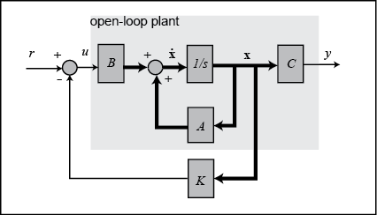

Для простоти припустімо, що завдання нульове, $r$ = 0. Тоді вхід дорівнює

$$
u = -K\mathbf{x}
$$

а рівняння стану замкненої системи:

$$
\dot{\mathbf{x}} = A\mathbf{x} + B(-K\mathbf{x}) = (A-BK)\mathbf{x}
$$

$$
y = C\mathbf{x}
$$

Стійкість і якість замкненої системи в часовій області визначаються насамперед розташуванням власних значень матриці $(A-BK)$, які й є полюсами замкненої системи. Оскільки матриці $A$ і $BK$ мають розмір 3×3, система матиме три полюси. Вибравши відповідну матрицю підсилення $K$, ці полюси можна розмістити де завгодно, бо система керована. Знайти $K$ дає змогу функція `place`.

Спершу треба вирішити, де саме розмістити полюси. Нехай вимоги такі: час встановлення менший за 0.5 с і перерегулювання менше за 5%. Тоді два домінантні полюси можна розмістити в точках −10 ± 10i (що відповідає $\zeta$ = 0.7, тобто куту 45°, за $\sigma$ = 10 > 4.6·2). Третій полюс спочатку розмістимо в −50, щоб він був достатньо швидким і мало впливав на реакцію; згодом його можна змінити.

```matlab
p1 = -10 + 10i;
p2 = -10 - 10i;
p3 = -50;

K = place(A,B,[p1 p2 p3]);
sys_cl = ss(A-B*K,B,C,0);

lsim(sys_cl,u,t,x0);
xlabel('Time (sec)')
ylabel('Ball Position (m)')
```

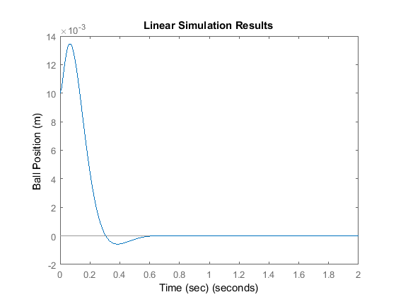

Видно, що перерегулювання завелике. Крім того, у передавальній функції є нулі, які можуть збільшувати перерегулювання, хоча у формі простору станів вони явно не видні. Спробуймо розмістити полюси лівіше, щоб поліпшити перехідний процес і зробити реакцію швидшою:

```matlab
p1 = -20 + 20i;
p2 = -20 - 20i;
p3 = -100;

K = place(A,B,[p1 p2 p3]);
sys_cl = ss(A-B*K,B,C,0);

lsim(sys_cl,u,t,x0);
xlabel('Time (sec)')
ylabel('Ball Position (m)')
```

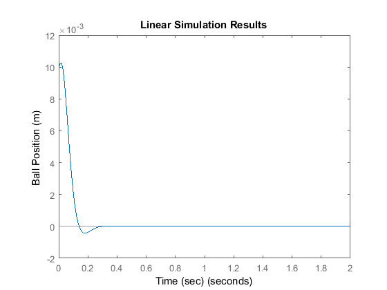

Тепер перерегулювання менше. Порівняйте також потрібні керуючі зусилля $u$ в обох випадках: загалом що далі ліворуч зміщено полюси, то більше керуюче зусилля потрібне.

> **Зауваження.** Якщо потрібно розмістити два або більше полюсів в одній точці, функція `place` не спрацює. Тоді застосовують функцію `acker`, яка розв'язує ту саму задачу, але може бути гірше обумовленою чисельно: `K = acker(A,B,[p1 p2 p3])`.

## Уведення задавального сигналу

Тепер подамо на побудовану систему ступінчастий вплив. Амплітуду виберемо малою, щоб залишитися в області справедливості лінеаризації:

```matlab
t = 0:0.01:2;
u = 0.001*ones(size(t));

sys_cl = ss(A-B*K,B,C,0);

lsim(sys_cl,u,t);
xlabel('Time (sec)')
ylabel('Ball Position (m)')
axis([0 2 -4E-6 0])
```

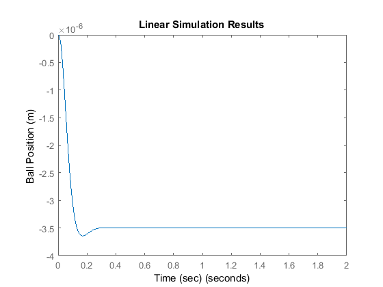

Система зовсім не відпрацьовує завдання: не лише величина не дорівнює одиниці, а й знак виявився від'ємним.

Причина в структурі схеми: ми не порівнюємо вихід із завданням, а вимірюємо всі стани, множимо їх на вектор підсилення $K$ і віднімаємо результат від завдання. Немає жодних підстав очікувати, що $K\mathbf{x}$ дорівнюватиме бажаному виходу. Щоб усунути проблему, задавальний сигнал масштабують так, щоб в усталеному режимі він дорівнював $K\mathbf{x}$. Коефіцієнт масштабування $\overline{N}$ показано на схемі:

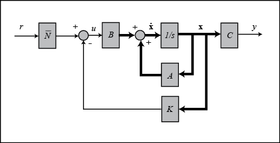

Обчислити $\overline{N}$ можна функцією `rscale`:

```matlab
Nbar = rscale(sys,K)
```

```text
Nbar =
 -285.7143
```

> Ця функція не є стандартною в MATLAB: в оригінальному курсі її потрібно завантажити окремо як `rscale.m`.

Тепер знайдімо реакцію системи зі зворотним зв'язком за станом і масштабованим завданням:

```matlab
lsim(sys_cl,Nbar*u,t)
title('Linear Simulation Results (with Nbar)')
xlabel('Time (sec)')
ylabel('Ball Position (m)')
axis([0 2 0 1.2*10^-3])
```

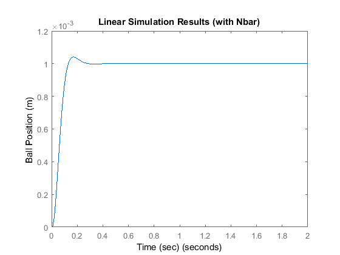

Тепер ступінчасте завдання відпрацьовується доволі добре. Зверніть увагу: обчислення коефіцієнта масштабування потребує доброго знання системи. Якщо модель має похибку, вхід буде масштабовано неправильно. Альтернатива, подібна до ПІД-керування, — додати змінну стану для інтеграла похибки виходу. Це фактично додає до регулятора інтегральну складову, яка, як відомо, зменшує усталену похибку.

## Синтез спостерігача

Коли виміряти всі змінні стану $\mathbf{x}$ неможливо (а на практиці так буває часто), будують **спостерігач**, який оцінює їх, використовуючи лише вихід $y = C\mathbf{x}$. Для прикладу з магнітним підвісом додамо до системи три нові оцінені змінні стану $\hat{\mathbf{x}}$:

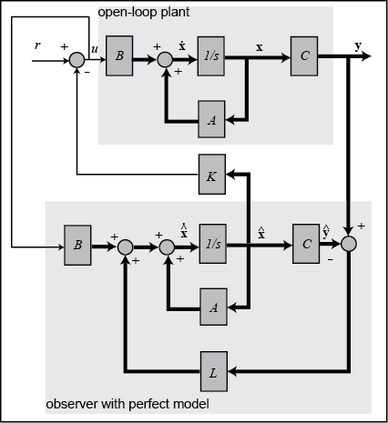

Спостерігач є, по суті, копією об'єкта: він має той самий вхід і майже те саме диференціальне рівняння. Додатковий доданок порівнює фактичний вимірюваний вихід $y$ з оціненим виходом $\hat{y} = C\hat{\mathbf{x}}$, що коригує оцінку $\hat{\mathbf{x}}$ і наближає її до справжнього стану $\mathbf{x}$, якщо похибка вимірювання мала.

$$
\dot{\hat{\mathbf{x}}} = A\hat{\mathbf{x}} + Bu + L(y - \hat{y})
$$

$$
\hat{y} = C\hat{\mathbf{x}}
$$

Динаміку похибки спостерігача визначають полюси матриці $A-LC$:

$$
\dot{\mathbf{e}} = \dot{\mathbf{x}} - \dot{\hat{\mathbf{x}}} = (A - LC)\mathbf{e}
$$

Спершу потрібно вибрати матрицю підсилення спостерігача $L$. Оскільки динаміка спостерігача має бути значно швидшою за динаміку самої системи, полюси розміщують принаймні у п'ять разів лівіше за домінантні полюси системи. Щоб скористатися функцією `place`, три полюси спостерігача мають бути різними:

```matlab
op1 = -100;
op2 = -101;
op3 = -102;
```

Завдяки двоїстості керованості та спостережуваності можна застосувати ту саму техніку, що й для матриці регулятора, замінивши матрицю $B$ на матрицю $C$ і транспонувавши матриці:

```matlab
L = place(A',C',[op1 op2 op3])';
```

Рівняння на схемі вище записані для оцінки $\hat{\mathbf{x}}$. Прийнято записувати об'єднані рівняння системи зі спостерігачем через вихідні рівняння стану й похибку оцінювання $\mathbf{e} = \mathbf{x} - \hat{\mathbf{x}}$. Для зворотного зв'язку використовують оцінений стан, $u = -K \hat{\mathbf{x}}$, оскільки не всі змінні стану вимірюються. Після нескладних перетворень дістаємо об'єднані рівняння стану й похибки:

```matlab
At = [ A-B*K             B*K
       zeros(size(A))    A-L*C ];

Bt = [    B*Nbar
       zeros(size(B)) ];

Ct = [ C    zeros(size(C)) ];
```

Подивімося на реакцію за ненульової початкової умови без задавального сигналу. Припустімо, що спостерігач стартує з нульовою початковою оцінкою, тобто початкова похибка оцінювання дорівнює початковому вектору стану, $\mathbf{e} = \mathbf{x}$:

```matlab
sys = ss(At,Bt,Ct,0);
lsim(sys,zeros(size(t)),t,[x0 x0]);

title('Linear Simulation Results (with observer)')
xlabel('Time (sec)')
ylabel('Ball Position (m)')
```

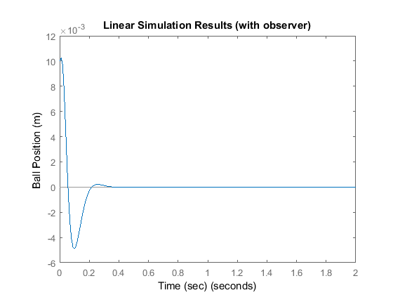

Нижче побудовано реакції всіх змінних стану. Нагадаємо, що `lsim` повертає $\mathbf{x}$ і $\mathbf{e}$; щоб отримати $\hat{\mathbf{x}}$, потрібно обчислити $\mathbf{x} - \mathbf{e}$:

```matlab
t = 0:1E-6:0.1;
x0 = [0.01 0.5 -5];
[y,t,x] = lsim(sys,zeros(size(t)),t,[x0 x0]);

n = 3;
e = x(:,n+1:end);
x = x(:,1:n);
x_est = x - e;

% Save state variables explicitly to aid in plotting
h = x(:,1); h_dot = x(:,2); i = x(:,3);
h_est = x_est(:,1); h_dot_est = x_est(:,2); i_est = x_est(:,3);

plot(t,h,'-r',t,h_est,':r',t,h_dot,'-b',t,h_dot_est,':b',t,i,'-g',t,i_est,':g')
legend('h','h_{est}','hdot','hdot_{est}','i','i_{est}')
xlabel('Time (sec)')
```

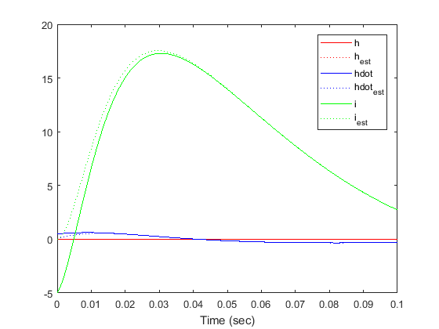

Як бачимо, оцінки спостерігача швидко збігаються до справжніх змінних стану й добре відстежують їх в усталеному режимі.

## Практика

1. Перевірте керованість і спостережуваність власної моделі та поясніть фізичний зміст результату.
2. Розмістіть полюси за своїми вимогами до часу встановлення й перерегулювання, а потім порівняйте потрібні керуючі зусилля для двох різних наборів полюсів.
3. Побудуйте спостерігач із полюсами, у 5 і в 10 разів швидшими за домінантні, і порівняйте швидкість збіжності оцінок.
