**Доступ:** MATLAB Online (basic).
**Джерело:** адаптовано з [Introduction: Digital Controller Design](https://ctms.engin.umich.edu/CTMS/index.php?example=Introduction&section=ControlDigital) (CTMS, CC BY-SA 4.0).
**Основні команди MATLAB:** `c2d`, `pzmap`, `zgrid`, `step`, `rlocus`.

У цьому модулі розглянуто перетворення моделей неперервного часу в дискретні (різницеві) моделі. Також уведено z-перетворення й показано, як застосовувати його для аналізу та синтезу регуляторів дискретних систем.

## Вступ

На рисунку нижче показано типову систему зі зворотним зв'язком у неперервному часі — саме такі ми розглядали досі. Майже будь-який неперервний регулятор можна реалізувати на аналоговій електроніці.

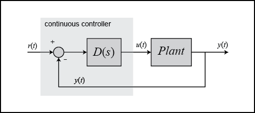

Неперервний регулятор, обведений затіненим прямокутником, можна замінити цифровим регулятором (див. нижче), який виконує те саме завдання керування. Принципова різниця полягає в тому, що цифрова система працює з дискретними сигналами (вибірками виміряних сигналів), а не з неперервними. Така заміна потрібна, коли алгоритм керування реалізують програмно на цифровому комп'ютері — а це трапляється дуже часто.

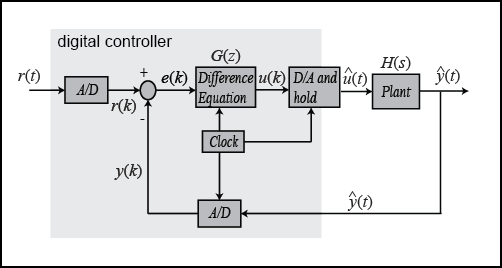

Сигнали в наведеній схемі цифрової системи можна зобразити такими графіками.

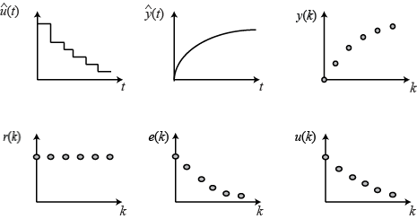

Мета цього модуля — показати, як у MATLAB працювати з дискретними функціями (у формі передавальної функції або простору станів), щоб проєктувати цифрові системи керування.

## Еквівалентність із екстраполятором нульового порядку

У схемі цифрової системи керування видно, що система містить і дискретну, і неперервну частини. Зазвичай об'єкт керування перебуває у фізичному світі, породжує неперервні сигнали й реагує на них, тоді як алгоритм керування реалізовано на цифровому комп'ютері. Проєктуючи цифрову систему, спершу треба знайти дискретний еквівалент неперервної частини системи.

Для цього розглянемо таку частину цифрової системи керування й перемалюємо її:

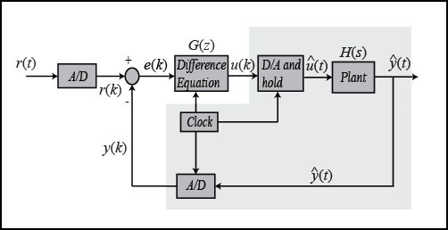

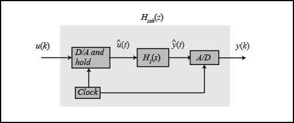

Годинник, під'єднаний до ЦАП і АЦП, видає імпульс кожні $T$ секунд, і кожен перетворювач передає сигнал лише з надходженням імпульсу. Призначення цього імпульсу — зробити так, щоб $H_{zoh}(z)$ діяв лише на періодичні вибірки входу $u(k)$ і формував періодичні виходи $y(k)$ теж лише в дискретні моменти часу; завдяки цьому $H_{zoh}(z)$ можна реалізувати як дискретну функцію.

Ідея методу така. Ми хочемо знайти дискретну функцію $H_{zoh}(z)$ таку, щоб для кусково-сталого входу неперервної системи $H(s)$ вибірки виходу неперервної системи дорівнювали виходу дискретної. Нехай сигнал $u(k)$ — це вибірка вхідного сигналу. Існують способи взяти цю вибірку $u(k)$ й утримати її, щоб дістати неперервний сигнал $\hat{u}(t)$. На рисунку нижче показано один із них: неперервний сигнал $\hat{u}(t)$ утримується сталим на рівні вибірки $u(k)$ на інтервалі від $kT$ до $(k+1)T$. Таку операцію утримання $\hat{u}(t)$ сталим протягом періоду вибірки називають **екстраполятором нульового порядку** (zero-order hold, ZOH).

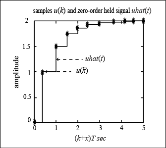

Утриманий сигнал $\hat{u}(t)$ далі подається на $H_2(s)$, і АЦП формує вихід $y(k)$, який буде тим самим кусковим сигналом, що й у випадку, коли дискретний сигнал $u(k)$ пропустили б через $H_{zoh}(z)$, отримавши дискретний вихід $y(k)$.

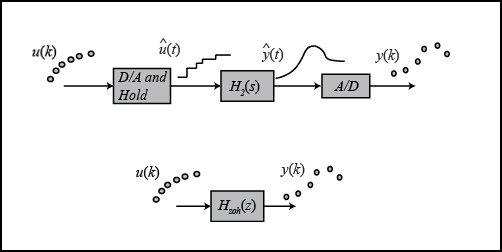

Тепер перемалюємо схему, замінивши неперервну частину системи на $H_{zoh}(z)$.

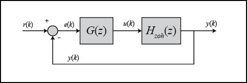

Тепер можна проєктувати цифрову систему керування, маючи справу лише з дискретними функціями.

> **Зауваження.** Є випадки, коли дискретна реакція не збігається з неперервною реакцією, яку дає схема утримання в реальній цифровій системі. Докладніше про це — в оригінальній статті CTMS «Lagging Effect Associated with a Hold».

## Перетворення за допомогою `c2d`

У MATLAB є функція `c2d`, яка перетворює задану неперервну систему (у формі передавальної функції або простору станів) на дискретну, використовуючи описану вище операцію утримання нульового порядку. Базовий синтаксис:

```matlab
sys_d = c2d(sys,Ts,'zoh')
```

Період вибірки (`Ts` у секундах на вибірку) має бути меншим за $1/(30\,BW)$, де $BW$ — смуга пропускання замкненої системи.

## Приклад: маса — пружина — демпфер

### Передавальна функція

Нехай маємо таку неперервну модель у формі передавальної функції:

$$
\frac{X(s)}{F(s)} = \frac{1}{ms^2+bs+k}
$$

Вважаючи, що смуга пропускання замкненої системи більша за 1 рад/с, виберемо період вибірки `Ts`, що дорівнює 1/100 с. Створіть новий m-файл і введіть такі команди:

```matlab
m = 1;
b = 10;
k = 20;

s = tf('s');
sys = 1/(m*s^2+b*s+k);

Ts = 1/100;
sys_d = c2d(sys,Ts,'zoh')
```

```text
sys_d =
 
  4.837e-05 z + 4.678e-05
  -----------------------
  z^2 - 1.903 z + 0.9048
 
Sample time: 0.01 seconds
Discrete-time transfer function.
```

### Простір станів

Модель тієї самої системи у просторі станів у неперервному часі має вигляд:

$$
\mathbf{\dot{x}} = \left[ \begin{array}{c} \dot{x} \\ \ddot{x} \end{array} \right] = \left[ \begin{array}{cc} 0 & 1 \\ -\frac{k}{m}  & -\frac{b}{m} \end{array} \right] \left[ \begin{array}{c} x \\ \dot{x} \end{array} \right] + \left[ \begin{array}{c} 0 \\ \frac{1}{m} \end{array} \right] F(t)
$$

$$
y = \left[ \begin{array}{cc} 1 & 0 \end{array} \right] \left[ \begin{array}{c} x \\ \dot{x} \end{array} \right]
$$

Усі сталі ті самі, що й раніше. Наведений нижче m-файл перетворює цю неперервну модель у просторі станів на дискретну:

```matlab
A = [0       1;
    -k/m   -b/m];

B = [  0;
    1/m];

C = [1 0];

D = [0];

Ts = 1/100;

sys = ss(A,B,C,D);
sys_d = c2d(sys,Ts,'zoh')
```

```text
sys_d =
 
  A = 
             x1        x2
   x1     0.999  0.009513
   x2   -0.1903    0.9039
 
  B = 
              u1
   x1  4.837e-05
   x2   0.009513
 
  C = 
       x1  x2
   y1   1   0
 
  D = 
       u1
   y1   0
 
Sample time: 0.01 seconds
Discrete-time state-space model.
```

За цими матрицями дискретну модель у просторі станів можна записати так:

$$
\left[ \begin{array}{c} x(k) \\ v(k) \end{array} \right] =
\left[ \begin{array}{cc} 0.9990 & 0.0095 \\ -0.1903 & 0.9039  \end{array} \right] \left[ \begin{array}{c} x(k-1) \\ v(k-1) \end{array} \right] +
\left[ \begin{array}{c} 0 \\ 0.0095 \end{array} \right] F(k-1)
$$

$$
y(k-1) = \left[ \begin{array}{cc} 1 & 0 \end{array} \right] \left[ \begin{array}{c} x(k-1) \\ v(k-1) \end{array} \right]
$$

Тепер ми маємо дискретну модель у просторі станів.

## Стійкість і перехідна характеристика

Для неперервних систем ми знаємо, що певна поведінка відповідає певному розташуванню полюсів у s-площині. Наприклад, система нестійка, якщо хоча б один полюс лежить праворуч від уявної осі. Для дискретних систем поведінку аналізують за розташуванням полюсів у **z-площині**. Характеристики в z-площині пов'язані з характеристиками в s-площині співвідношенням:

$$
z = e^{sT}
$$

- $T$ — період вибірки (с/вибірку);
- $s$ — точка в s-площині;
- $z$ — точка в z-площині.

На рисунку нижче показано відображення ліній сталого коефіцієнта демпфування ($\zeta$) і власної частоти ($\omega_n$) з s-площини в z-площину за наведеним співвідношенням.

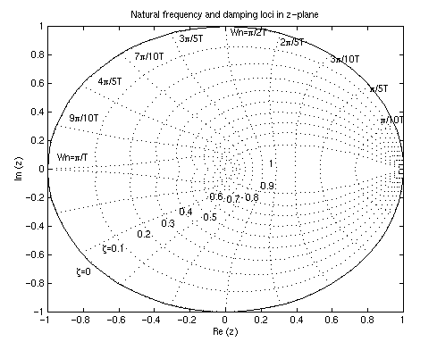

Зверніть увагу: у z-площині межею стійкості є вже не уявна вісь, а коло одиничного радіуса з центром у початку координат, $|z| = 1$ — так зване **одиничне коло**. Дискретна система стійка, коли всі полюси лежать усередині одиничного кола, і нестійка, коли хоча б один полюс лежить поза ним.

Для аналізу перехідного процесу за розташуванням полюсів у z-площині залишаються придатними ті самі три співвідношення, що й для неперервних систем:

$$
\zeta \omega_n \geq \frac{4.6}{Ts}
$$

$$
\omega_n \geq \frac{1.8}{Tr}
$$

$$
\zeta = \frac{-\ln(Mp)}{\sqrt{\pi^2+\ln^2(Mp)}}
$$

де:

- $\zeta$ — коефіцієнт демпфування;
- $\omega_n$ — власна частота (рад/с);
- $Ts$ — час встановлення за критерієм 1%;
- $Tr$ — час наростання від 10% до 90%;
- $Mp$ — максимальне перерегулювання.

> **Важливо.** Власна частота ($\omega_n$) у z-площині має одиниці рад/вибірку, але у наведених вище формулах $\omega_n$ треба підставляти в рад/с.

Нехай маємо таку дискретну передавальну функцію:

$$
\frac{Y(z)}{F(z)} = \frac{1}{z^2-0.3z+0.5}
$$

Створіть новий m-файл і введіть наведені команди. Після запуску в командному вікні ви отримаєте графік із лініями сталого коефіцієнта демпфування та власної частоти:

```matlab
numDz = 1;
denDz = [1 -0.3 0.5];
sys = tf(numDz,denDz,-1); % -1 означає, що період вибірки не визначено

pzmap(sys)
axis([-1 1 -1 1])
zgrid
```

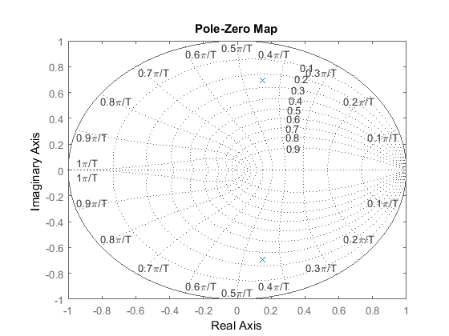

З цього графіка видно, що полюси розташовані приблизно на власній частоті $9\pi/20T$ (рад/вибірку) з коефіцієнтом демпфування 0.25. Припустивши період вибірки 1/20 с (звідки $\omega_n$ = 28.2 рад/с) і скориставшись трьома наведеними вище формулами, можна визначити, що ця система має мати час наростання 0.06 с, час встановлення 0.65 с і максимальне перерегулювання 45% (тобто на 0.45 більше за усталене значення). Побудуймо перехідну характеристику й перевірмо ці оцінки. Додайте до m-файлу такі команди й запустіть його знову:

```matlab
sys = tf(numDz,denDz,1/20);
step(sys,2.5);
```

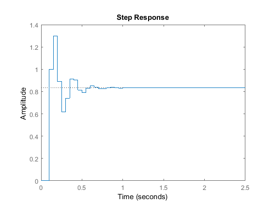

Як видно з графіка, час наростання, час встановлення й перерегулювання виявилися саме такими, як ми й очікували. Це показує, як за розташуванням полюсів і трьома наведеними формулами аналізувати перехідний процес дискретної системи.

## Дискретний кореневий годограф

Кореневий годограф — це геометричне місце точок, у яких перебувають корені характеристичного рівняння, коли один параметр змінюється від нуля до нескінченності. Характеристичне рівняння нашої системи з одиничним зворотним зв'язком і простим пропорційним підсиленням $K$ має вигляд:

$$
1+KG(z)H_{zoh}(z) = 0
$$

де $G(z)$ — цифровий регулятор, а $H_{zoh}(z)$ — передавальна функція об'єкта в z-області (отримана із застосуванням екстраполятора нульового порядку).

Правила побудови кореневого годографа в z-площині точно такі самі, як і в s-площині. Пригадайте: у модулі про кореневий годограф ми використовували функцію `sgrid`, щоб знайти на годографі область, яка дає прийнятне підсилення $K$. Для дискретного аналізу застосовують функцію `zgrid`, яка виконує ту саму роль. Синтаксис `zgrid(zeta, Wn)` малює лінії сталого коефіцієнта демпфування (`zeta`) і власної частоти (`Wn`).

Нехай маємо таку дискретну передавальну функцію:

$$
\frac{Y(z)}{F(z)} = \frac{z-0.3}{z^2-1.6z+0.7}
$$

а вимоги такі: коефіцієнт демпфування більший за 0.6 і власна частота більша за 0.4 рад/вибірку (їх можна знайти з вимог до системи, періоду вибірки та трьох формул із попереднього розділу). Наведені нижче команди будують кореневий годограф із лініями сталого демпфування та власної частоти:

```matlab
numDz = [1 -0.3];
denDz = [1 -1.6 0.7];
sys = tf(numDz,denDz,-1);

rlocus(sys)
axis([-1 1 -1 1])

zeta = 0.4;
Wn = 0.3;
zgrid(zeta,Wn)
```

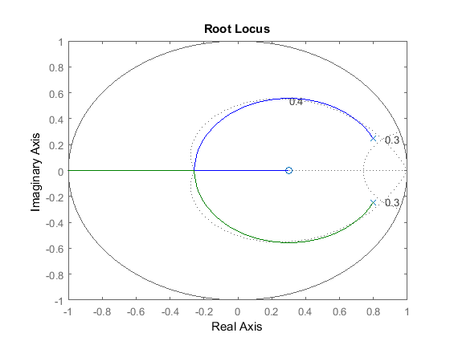

З цього графіка видно, що для деяких значень $K$ система стійка, бо існують ділянки годографа, де обидві гілки лежать усередині одиничного кола. Також помітні дві пунктирні лінії, що відповідають сталому коефіцієнту демпфування та сталій власній частоті. Власна частота більша за 0.3 поза лінією сталої `Wn`, а коефіцієнт демпфування більший за 0.4 всередині лінії сталої `zeta`. У цьому прикладі частина побудованого годографа потрапляє в бажану область. Отже, підсилення $K$, вибране так, щоб розмістити два полюси замкненої системи на ділянках годографа всередині бажаної області, має забезпечити реакцію, яка задовольняє задані вимоги.

## Практика

1. Дискретизуйте власну неперервну модель із трьома різними періодами вибірки (`c2d` із `'zoh'`). Порівняйте полюси в z-площині та перехідні характеристики й обґрунтуйте вибір періоду.
2. Для дискретної моделі побудуйте `pzmap` із `zgrid` і за трьома формулами оцініть час наростання, час встановлення та перерегулювання. Перевірте оцінки командою `step`.
3. Побудуйте дискретний кореневий годограф і виберіть підсилення $K$, що задовольняє задані вимоги до $\zeta$ і $\omega_n$.
