**Доступ:** MATLAB Online (basic).
**Джерело:** адаптовано з [Introduction: Simulink Modeling](https://ctms.engin.umich.edu/CTMS/index.php?example=Introduction&section=SimulinkModeling) (CTMS, CC BY-SA 4.0).
**Основні блоки Simulink:** Sum, Gain, Integrator, Scope, Signal Generator, Subtract.

У Simulink дуже просто подати, а потім змоделювати математичну модель фізичної системи. Моделі зображують графічно у вигляді структурних схем. Користувачеві доступний широкий набір блоків у бібліотеках для опису різноманітних явищ і моделей у різних формах. Одна з головних переваг Simulink (і моделювання загалом) для аналізу динамічних систем — можливість швидко дослідити реакцію складних систем, аналітичний аналіз яких був би надмірно важким. Simulink здатен чисельно наближати розв'язки математичних моделей, які ми не можемо — або не хочемо — розв'язувати «вручну».

Зазвичай рівняння, що є основою моделі Simulink, виводять із фізичних законів. На цій сторінці показано, як вивести математичну модель, а потім реалізувати її в Simulink. Цю саму модель використано в модулі [Керування в Simulink](../11-simulink-control/), щоб продемонструвати проєктування та моделювання системи керування.

## Система «потяг»

Розгляньмо іграшковий потяг, що складається з локомотива й вагона. Припустімо, що потяг рухається лише в одному вимірі (вздовж колії). Ми хочемо керувати ним так, щоб він плавно рушав і плавно зупинявся, а також щоб він відпрацьовував завдання сталої швидкості з мінімальною усталеною похибкою.

Маси локомотива й вагона позначимо $M_1$ і $M_2$ відповідно. Локомотив і вагон з'єднані зчепленням жорсткістю $k$ — тобто зчеплення моделюється пружиною зі сталою $k$. Сила $F$ — це сила, що виникає між колесами локомотива й колією, а $\mu$ — коефіцієнт опору коченню.


## Діаграма вільного тіла та другий закон Ньютона

Перший крок у виведенні рівнянь, що описують фізичну систему, — побудувати діаграми вільного тіла. Для нашої системи вони мають такий вигляд:


За другим законом Ньютона сума сил, які діють на тіло, дорівнює добутку маси тіла на його прискорення. У нашому випадку на локомотив $(M_1)$ у горизонтальному напрямку діють сила пружини, опір коченню та сила, що виникає в контакті «колесо — колія». На вагон $(M_2)$ у горизонтальному напрямку діють сила пружини та опір коченню. У вертикальному напрямку сили ваги зрівноважені нормальними реакціями опори $(N = mg)$, тому прискорення по вертикалі немає.

Пружину моделюємо як таку, що створює силу, лінійно пропорційну її деформації: $k(x_1 - x_2)$, де $x_1$ і $x_2$ — переміщення локомотива й вагона. Вважаємо, що пружина недеформована, коли $x_1$ і $x_2$ дорівнюють нулю. Сили опору коченню моделюємо як лінійно пропорційні добутку відповідних швидкостей на нормальні реакції (які дорівнюють силам ваги).

Застосування другого закону Ньютона в горизонтальному напрямку за цими діаграмами дає такі рівняння системи:

$$
\Sigma F_1 = F - k(x_1 - x_2) - \mu M_1 g \dot{x}_1 = M_1 \ddot{x}_1
$$

$$
\Sigma F_2 = k(x_1 - x_2) - \mu M_2 g \dot{x}_2 = M_2 \ddot{x}_2
$$

## Побудова моделі в Simulink

Цю систему рівнянь можна зобразити графічно без жодних подальших перетворень. Ми побудуємо дві копії (по одній на кожну масу) загального виразу $\Sigma F = ma$, або $a = (\Sigma F)/m$.

Спершу відкрийте Simulink і створіть нове вікно моделі. Перетягніть у нього два блоки **Sum** (з бібліотеки Math Operations) і розташуйте їх приблизно так, як показано нижче.

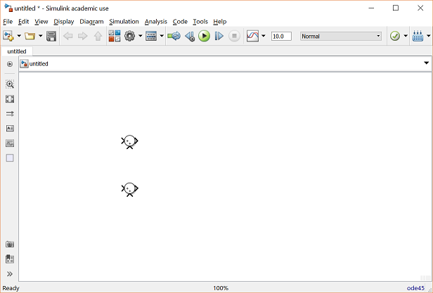

Виходи цих суматорів — це суми сил, що діють на кожну масу. Помноживши кожен вихідний сигнал на $1/M$, дістанемо відповідне прискорення кожної маси. Перетягніть у модель два блоки **Gain** (з бібліотеки Math Operations) і приєднайте кожен до виходу одного із суматорів. Підпишіть ці два сигнали як «Sum_F1» і «Sum_F2», щоб модель була зрозумілішою: двічі клацніть у порожньому місці над лінією сигналу й уведіть потрібний підпис.

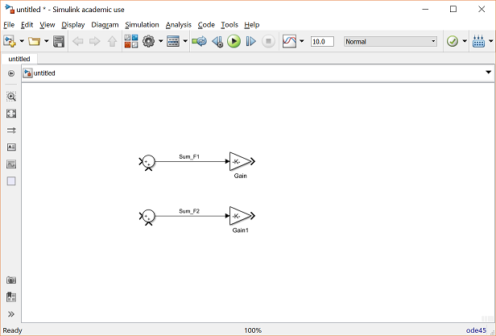

У цих блоках Gain має бути $1/M$ для кожної з мас. Змінні `M1` і `M2` ми визначимо в робочому просторі MATLAB, тож у блоках достатньо ввести відповідні імена змінних. Двічі клацніть на верхньому блоці Gain і введіть у полі **Gain** значення `1/M1`. Аналогічно введіть `1/M2` у другому блоці.

Ви помітите, що підсилення не відображаються на блоках — замість них показано `-K-`. Це тому, що блоки завеликі для того, щоб умістити повне ім'я змінної всередині трикутника. Розмір блоків можна змінити, щоб побачити справжнє значення підсилення: клацніть на блоці один раз, щоб виділити його (по кутах з'являться маленькі квадрати), і потягніть за один із квадратів. Модель має набути такого вигляду:


Виходи цих підсилювачів — прискорення кожної з мас (локомотива й вагона). Виведені вище рівняння залежать від швидкостей і переміщень мас. Оскільки швидкість дістають інтегруванням прискорення, а положення — інтегруванням швидкості, ці сигнали можна сформувати блоками-інтеграторами. Перетягніть у модель чотири блоки **Integrator** із бібліотеки Continuous — по два на кожне з двох прискорень. З'єднайте блоки й підпишіть сигнали, як показано нижче. Перший інтегратор приймає прискорення маси 1 («x1_ddot») і формує швидкість маси 1 («x1_dot»). Другий інтегратор приймає цю швидкість і видає переміщення першої маси («x1»). Те саме стосується інтеграторів для другої маси.

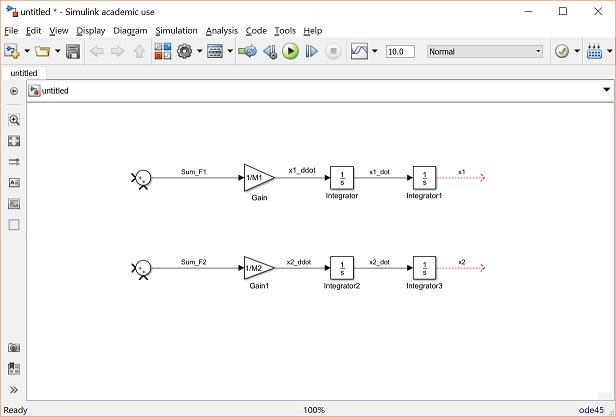

Тепер перетягніть у модель два блоки **Scope** із бібліотеки Sinks і приєднайте їх до виходів інтеграторів. Підпишіть їх «x1» і «x2».


Тепер можна додавати сили, що діють на кожну масу. Спершу потрібно налаштувати кількість входів кожного суматора відповідно до кількості сил (про знаки подбаємо пізніше). На масу 1 діють три сили, тож двічі клацніть на відповідному блоці Sum і змініть поле **List of signs** на `|+++`. Символ `|` слугує роздільником. На масу 2 діють лише дві сили, тому її суматор поки що можна не чіпати.

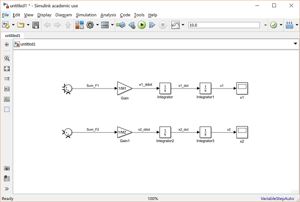

Перша сила, що діє на масу 1, — це сама вхідна сила $F$. Перетягніть блок **Signal Generator** із бібліотеки Sources й приєднайте його до найвищого входу відповідного суматора. Підпишіть цей сигнал «F».

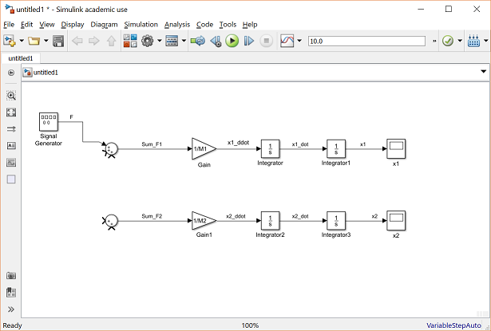

Наступна сила, що діє на масу 1, — сила опору коченню. Нагадаємо, її модель така:

$$
F_{rr,1} = \mu g M_1 \dot{x}_1
$$

Щоб сформувати цю силу, можна відгалузити сигнал швидкості й помножити його на відповідне підсилення. Перетягніть у вікно моделі блок Gain. Відгалузіть сигнал «x1_dot» і приєднайте його до входу цього нового блока (за потреби малюйте лінію кількома кроками). Вихід блока Gain приєднайте до другого входу суматора. Двічі клацніть на блоці Gain і введіть у полі Gain значення `mu*g*M1`. Проте сила опору коченню діє у від'ємному напрямку, тому змініть список знаків суматора на `|+-+`. Далі збільште блок Gain, щоб було видно повне підсилення, і підпишіть його вихід «Frr1». Тепер модель має виглядати так:

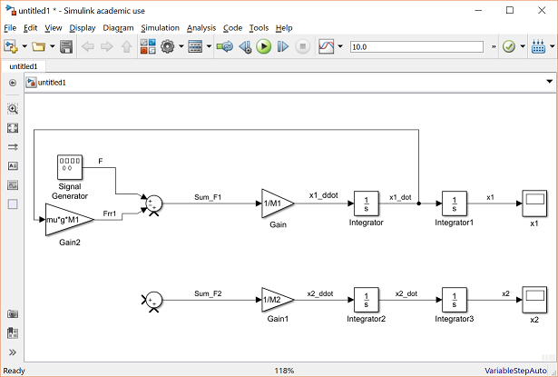

Остання сила, що діє на масу 1, — сила пружини. Нагадаємо, вона дорівнює:

$$
F_s = k(x_1-x_2)
$$

Отже, потрібно сформувати сигнал $(x_1-x_2)$, який далі можна помножити на підсилення $k$, щоб дістати силу. Перетягніть блок **Subtract** (або Sum чи Addition) під рештою моделі. Щоб змінити напрямок цього блока, клацніть на ньому правою кнопкою миші й виберіть **Rotate & Flip > Flip block**; як варіант, виділіть блок і натисніть Ctrl+I. Тепер відгалузіть сигнал «x2» і приєднайте його до від'ємного входу блока Subtract, а сигнал «x1» — до додатного входу. Через це лінії сигналів перетнуться. Лінії можуть перетинатися, але з'єднаними вони є лише там, де з'являється маленьке коло (як у точці відгалуження).

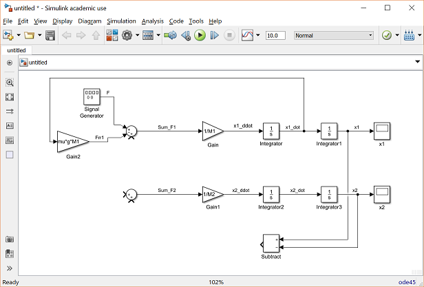

Тепер цю різницю можна помножити на сталу пружини, щоб дістати силу пружини. Перетягніть блок Gain ліворуч від блока Subtract, змініть його значення на `k` і приєднайте до нього вихід блока Subtract. Далі приєднайте вихід блока Gain до третього входу суматора маси 1 і підпишіть сигнал «Fs». Оскільки сила пружини діє на масу 1 у від'ємному напрямку, знову змініть список знаків суматора — на `|+--`. Модель має виглядати так:

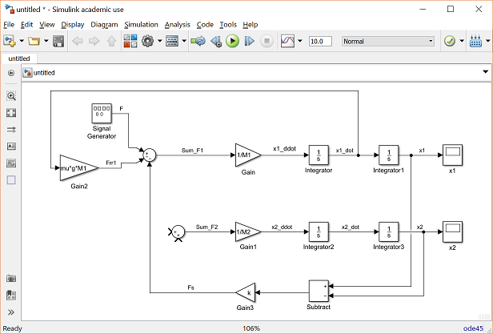

Тепер можна прикладати сили до маси 2. Перша з них — та сама сила пружини, яку ми щойно сформували, але до маси 2 вона прикладена в додатному напрямку. Просто відгалузіть сигнал «Fs» і приєднайте його до першого входу суматора маси 2.

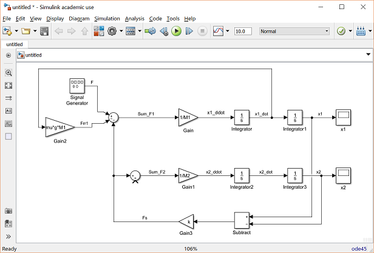

Остання сила, прикладена до маси 2, — її сила опору коченню. Вона формується так само, як і для маси 1. Відгалузіть сигнал «x2_dot» і помножте його блоком Gain зі значенням `mu*g*M2`. Потім приєднайте вихід підсилювача до другого входу відповідного суматора й підпишіть сигнал «Frr2». Зробивши другий вхід суматора від'ємним, дістанемо таку модель:

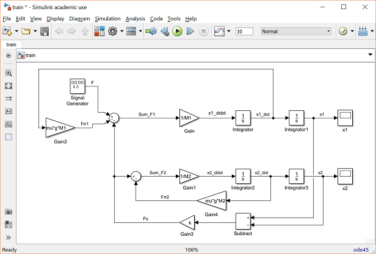

Тепер модель завершено. Залишилося подати належний вхід і визначити вихід, який нас цікавить. Вхід системи — це сила $F$, яку створює локомотив; у моделі ми вже визначили її як вихід блока Signal Generator. Виходом системи, який ми спостерігатимемо й зрештою керуватимемо, буде швидкість локомотива. Додайте до моделі ще один блок Scope із бібліотеки Sinks, відгалузіть лінію від сигналу «x1_dot» і приєднайте її до цього осцилографа. Підпишіть його «x1_dot» — модель має набути такого вигляду:


Тепер модель готова, її слід зберегти.

## Запуск моделі

Перед запуском моделі потрібно задати числові значення всіх змінних. Для системи «потяг» візьмемо такі:

- $M_1$ = 1 кг
- $M_2$ = 0.5 кг
- $k$ = 1 Н/м
- $F$ = 1 Н
- $\mu$ = 0.02 с/м
- $g$ = 9.8 м/с²

Створіть новий m-файл і введіть такі команди:

```matlab
M1 = 1;
M2 = 0.5;
k  = 1;
F  = 1;
mu = 0.02;
g  = 9.8;
```

Виконайте m-файл у командному вікні MATLAB, щоб визначити ці значення. Simulink розпізнає змінні MATLAB і використає їх у моделі.

Тепер потрібно подати на локомотив відповідний вхід. Двічі клацніть на блоці Signal Generator (він видає «F»). У списку **Wave form** виберіть `square`, а в полі **Frequency** задайте `0.001` (одиниці **Units** можна лишити типовими — герци). У полі **Amplitude** введіть `-1` (за додатної амплітуди сигнал спершу стрибає вгору, а нам потрібно навпаки).

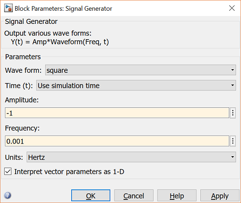

Останній крок перед запуском — вибрати відповідний час моделювання. Щоб побачити один період прямокутного сигналу частотою 0.001 Гц, модель треба прорахувати на 1000 секунд. У меню **Simulation** угорі вікна моделі виберіть **Model Configuration Parameters** і змініть поле **Stop Time** на `1000`. Закрийте діалогове вікно.

Тепер запустіть моделювання й відкрийте осцилограф «x1_dot», щоб оцінити швидкість на виході. Вхідним сигналом був прямокутний сигнал із двома стрибками — одним додатним і одним від'ємним. Фізично це означає, що локомотив спершу рушив уперед, а потім назад. Вихідна швидкість це й відображає.

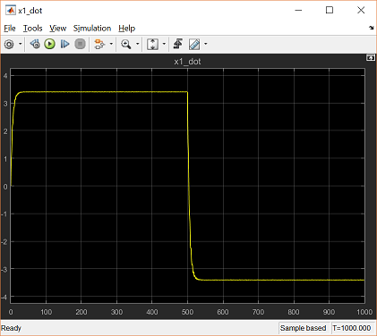

На цій сторінці ми вивели математичну модель системи «потяг» із перших принципів, а потім подали отримані рівняння в Simulink. Альтернативний підхід — описати динамічну систему засобами фізичного моделювання **Simscape**. Simscape — це доповнення до Simulink, яке дає змогу будувати модель із блоків, що відповідають фізичним величинам і об'єктам (інерції та шарніри, резистори та котушки індуктивності). Simscape дозволяє моделювати фізичну систему, не виводячи рівнянь вручну.

Далі, у модулі [Керування в Simulink](../11-simulink-control/), ми скористаємося виведеною тут моделлю, щоб показати, як проєктувати систему керування потягом у Simulink.

## Практика

1. Повторіть побудову моделі крок за кроком і збережіть її. Переконайтеся, що всі сигнали підписані так само, як на рисунках.
2. Змініть жорсткість зчеплення $k$ у кілька разів у більший і менший бік. Як змінюється коливальність швидкості локомотива?
3. Додайте осцилограф для сигналу «x2_dot» і порівняйте швидкості локомотива й вагона. Поясніть затримку між ними.
