**Доступ:** MATLAB Online (basic). Для розділів про лінеаризацію потрібен Simulink Control Design.
**Джерело:** адаптовано з [Introduction: Simulink Control](https://ctms.engin.umich.edu/CTMS/index.php?example=Introduction&section=SimulinkControl) (CTMS, CC BY-SA 4.0).
**Основні інструменти:** блок PID Controller, Signal Builder, Linear Analysis Tool, Control System Designer, `feedback`, `pole`, `zero`.

## Розімкнена модель об'єкта

У модулі [Моделювання в Simulink](../10-simulink-modeling/) ми показали, як за допомогою Simulink моделювати фізичну систему. Але Simulink може моделювати й **усю систему керування** — і алгоритм керування, і сам об'єкт. Як уже зазначалося, Simulink особливо корисний для наближених розв'язків математичних моделей, які надто важко розв'язати «вручну».

Наприклад, уявіть, що ви маєте нелінійний об'єкт. Поширений підхід — побудувати його лінійне наближення й за лінеаризованою моделлю спроєктувати регулятор аналітичними методами. Далі в Simulink можна перевірити, як цей регулятор поводиться вже з повною нелінійною моделлю. Simulink використовують для побудови лінеаризованої моделі, а MATLAB — для синтезу регулятора (як описано в попередніх модулях). Багато засобів синтезу з MATLAB доступні й безпосередньо із Simulink. На цій сторінці показано обидва підходи.

Пригадаймо модель іграшкового потяга, побудовану в модулі «Моделювання в Simulink»:

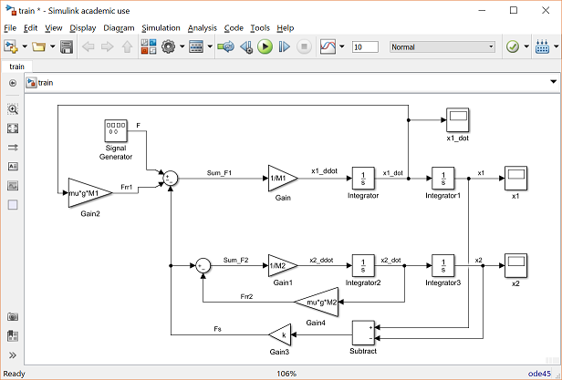

Припускаючи, що потяг рухається лише в одному вимірі (вздовж колії), ми хочемо керувати локомотивом так, щоб він плавно рушав і плавно зупинявся й відпрацьовував завдання сталої швидкості з мінімальною усталеною похибкою.

## Реалізація ПІД-регулятора в Simulink

Спершу створімо структуру для моделювання системи «потяг» в одиничному зворотному зв'язку з ПІД-регулятором. Щоб модель була зрозумілішою, спочатку згорнімо модель потяга в окрему **підсистему**.

Для цього вилучіть три блоки Scope і замініть кожен на блок **Out1** із бібліотеки Sinks. Підпишіть блоки Out1 відповідними іменами змінних: «x1_dot», «x1» і «x2». Далі вилучіть блок Signal Generator і замініть його на блок **In1** із бібліотеки Sources. Підпишіть цей вхід «F» — сила, що виникає між локомотивом і колією. Модель має виглядати так:

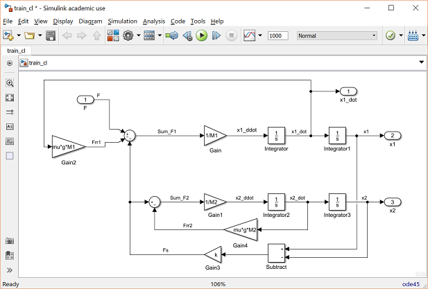

Тепер виділіть усі блоки моделі (Ctrl+A) і в контекстному меню вікна моделі виберіть **Create Subsystem from Selection**. Трохи перевпорядкувавши й перепідписавши блоки, дістанете таку модель:

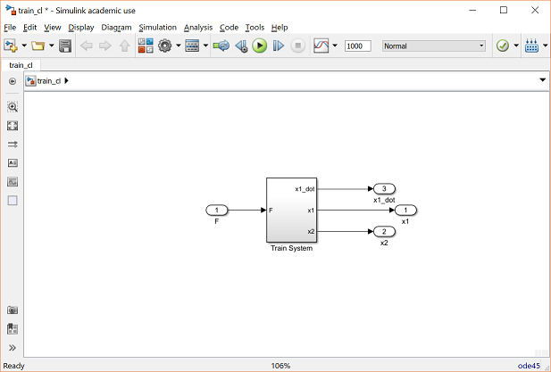

Тепер можна додати до системи регулятор. Скористаємося ПІД-регулятором — блоком **PID Controller** із бібліотеки Continuous. Розмістивши його послідовно з підсистемою потяга, дістанемо таку модель.

> **Зауваження.** Тут регулятор моделюється так, ніби він безпосередньо створює силу «F». Це нехтує динамікою, з якою локомотив формує момент на колесах, і динамікою виникнення сили в контакті «колесо — колія». Такий спрощений підхід узято тому, що зараз ми лише знайомимося з базовими можливостями Simulink для синтезу й аналізу регуляторів.

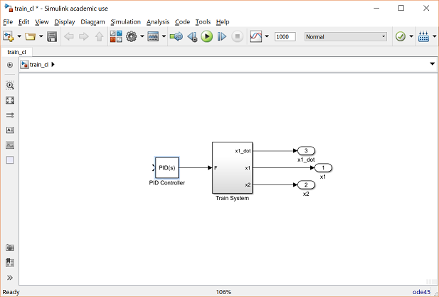

Двічі клацніть на блоці PID Controller і задайте нульове інтегральне підсилення (поле **Integral (I)** = 0), а пропорційне (**P**) і диференціальне (**D**) залиште типовими — 1 і 0 відповідно.

Далі додайте блок **Sum** із бібліотеки Math Operations. Двічі клацніть на ньому й змініть поле **List of signs** на `|+-`. Оскільки ми хочемо керувати швидкістю локомотива, саме її й подамо у зворотний зв'язок: відгалузіть лінію від сигналу «x1_dot» і приєднайте її до від'ємного входу суматора. Вихід суматора — похибка за швидкістю — має бути приєднаний до входу блока PID Controller. З'єднавши блоки та додавши підписи, дістанете:

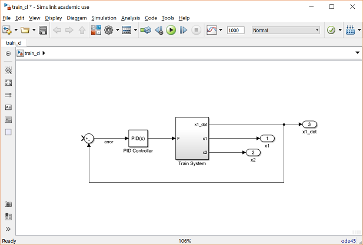

Далі додайте блок **Signal Builder** із бібліотеки Sources, щоб задати командну швидкість потяга. Оскільки ми хочемо плавно розігнати потяг і плавно його зупинити, перевірятимемо систему командою швидкості, яка стрибком зростає до 1 м/с, а потім стрибком повертається до 0 м/с (нагадаємо: наша система — іграшковий потяг).

Щоб сформувати такий сигнал, двічі клацніть на блоці Signal Builder. У меню **Axes** угорі вікна виберіть **Change time range** і задайте поле **Max time** рівним `300` секунд. Далі зробіть так, щоб зростання відбувалося на 10-й секунді, а спадання — на 150-й. Для цього клацайте на відповідних ділянках графіка (ліва й права вертикальні лінії) і або перетягуйте лінію в потрібну позицію, або вводьте потрібний час у поле **T** внизу вікна. Сигнал має набути такого вигляду:

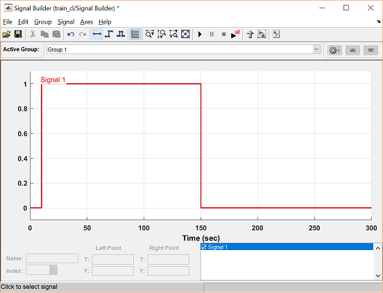

Також додайте блок **Scope** із бібліотеки Sinks і замініть ним блок Out1 для швидкості потяга. Після перепідписування блоків модель виглядатиме так:

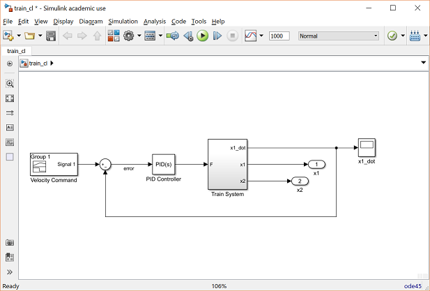

Тепер усе готово для моделювання замкненої системи.

## Запуск замкненої моделі

Перед запуском потрібно задати числові значення змінних. Для системи «потяг» візьмемо такі:

- $M_1$ = 1 кг
- $M_2$ = 0.5 кг
- $k$ = 1 Н/м
- $F$ = 1 Н
- $\mu$ = 0.02 с/м
- $g$ = 9.8 м/с²

Створіть новий m-файл і введіть такі команди:

```matlab
M1 = 1;
M2 = 0.5;
k  = 1;
F  = 1;
mu = 0.02;
g  = 9.8;
```

Виконайте m-файл у командному вікні MATLAB, щоб визначити ці значення — Simulink використає їх у моделі. Далі потрібно узгодити час моделювання з часовим діапазоном команди з блока Signal Builder: у меню **Simulation** угорі вікна моделі виберіть **Model Configuration Parameters** і змініть поле **Stop Time** на `300`.

Тепер запустіть моделювання й відкрийте осцилограф «x1_dot», щоб побачити швидкість на виході. Результат показує, що замкнена система з таким регулятором стійка:

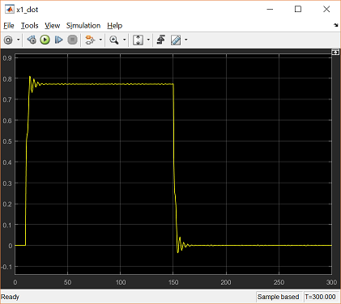

Проте така якість нас не влаштовує через усталену похибку. Далі покажемо, як перепроєктувати регулятор: спершу — як витягти модель із Simulink у MATLAB для аналізу й синтезу, а потім — як налаштувати регулятор безпосередньо в Simulink.

## Витягання моделі в MATLAB

Пакет **Simulink Control Design** дає змогу витягти модель із Simulink у робочий простір MATLAB. Це особливо зручно для складних або нелінійних моделей, а також для отримання дискретних (з вибіркою) моделей. У нашому прикладі витягнемо неперервну модель підсистеми потяга.

Спершу треба визначити входи й виходи моделі, яку ми хочемо витягти. Вхід системи «потяг» — це сила $F$. Щоб це позначити, клацніть правою кнопкою миші на сигналі «F» (вихід блока PID) і виберіть **Linear Analysis Points > Open-loop Input**. Так само позначте вихід системи: клацніть правою кнопкою на сигналі «x1_dot» і виберіть **Linear Analysis Points > Open-loop Output**. Ці входи й виходи тепер позначаються маленькими стрілками. Оскільки ми хочемо витягти модель самого лише потяга, без керування, потрібно ще й вилучити сигнал зворотного зв'язку — інакше ми дістанемо замкнену модель від $F$ до $\dot{x}_1$. Модель має виглядати так:

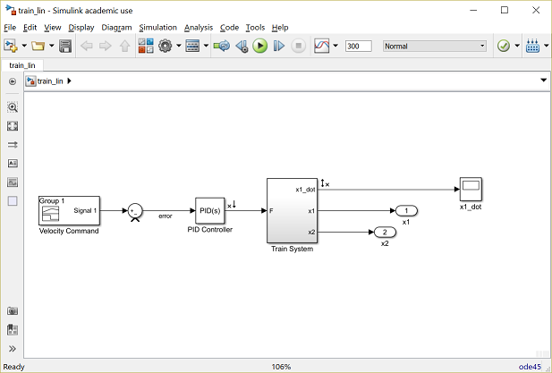

Тепер можна витягти модель, відкривши **Linear Analysis Tool**: у меню **Analysis** угорі вікна моделі виберіть **Control Design > Linear Analysis**. Відкриється таке вікно:

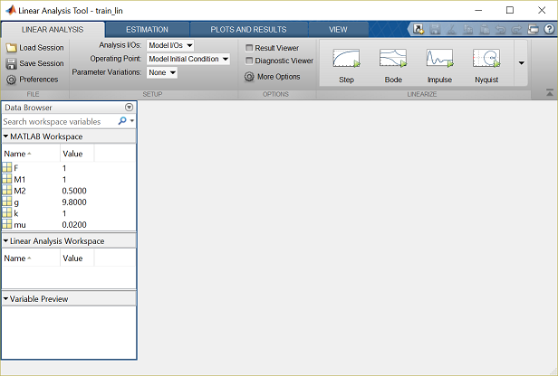

Цей інструмент створює LTI-об'єкт із (можливо, нелінійної) моделі Simulink і дає змогу задати точку, навколо якої виконується лінеаризація. Оскільки наша модель уже лінійна, вибір робочої точки не має значення — залишмо типову **Model Initial Condition**. Щоб згенерувати лінеаризовану модель, натисніть кнопку **Step** (маленький зелений трикутник). Вікно набуде такого вигляду:

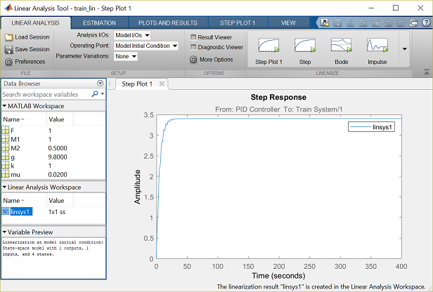

Перехідну характеристику лінеаризованої моделі побудовано автоматично. Порівнявши її з характеристикою, отриманою моделюванням розімкненої системи в модулі «Моделювання в Simulink», побачите, що вони збігаються — і це логічно, адже модель уже була лінійною. Крім того, під час лінеаризації створено об'єкт `linsys1` у Linear Analysis Workspace. Цей LTI-об'єкт можна експортувати в MATLAB, просто перетягнувши його в розділ **MATLAB Workspace** того самого вікна.

Витягши модель, ми дістаємо доступ до всіх засобів синтезу MATLAB. Наприклад, побудуймо й проаналізуймо замкнену систему, що відповідає створеній моделі Simulink:

```matlab
sys_cl = feedback(linsys1,1);
p = pole(sys_cl)
z = zero(sys_cl)
```

```text
p =

  -0.9237 + 0.0000i
   0.0000 + 0.0000i
  -0.2342 + 1.6574i
  -0.2342 - 1.6574i
```

```text
z =

  -0.0980 + 1.4108i
  -0.0980 - 1.4108i
   0.0000 + 0.0000i
```

Як бачимо, у початку координат відбувається скорочення полюса й нуля. Решта полюсів мають від'ємну дійсну частину, а два «найповільніші» полюси — комплексні. Отже, замкнена система в поточному вигляді стійка, а домінантні полюси недодемпфовані. Це узгоджується з результатом моделювання вище. Далі в MATLAB можна було б спроєктувати новий регулятор, щоб, наприклад, погасити коливання. Натомість покажемо, як скористатися частиною можливостей MATLAB прямо із Simulink.

## Синтез регулятора всередині Simulink

Інтерактивні засоби налаштування регулятора можна запускати просто із Simulink. Один зі способів — двічі клацнути на блоці PID Controller і натиснути кнопку **Tune**, щоб відкрити PID Tuner. Замість цього скористаємося загальнішим інструментом **Control System Designer**: у меню **Analysis** угорі вікна моделі виберіть **Control Design > Control System Designer**. Відкриється таке вікно:

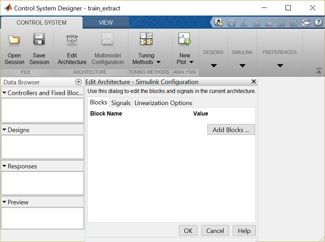

Найперше треба вказати блок регулятора, який налаштовуватимемо. Натисніть кнопку **Add Blocks** і у вікні, що з'явиться, виберіть блок PID Controller, після чого натисніть **OK**. Зверніть увагу: налаштовувати можна й регулятори, подані іншими блоками (Transfer Function, State Space тощо).

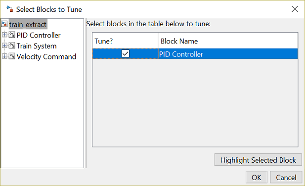

Перш ніж налаштовувати регулятор, потрібно визначити входи й виходи замкненої системи, яку аналізуємо. Це робиться подібно до витягання лінеаризованої моделі. Клацніть правою кнопкою миші на сигналі завдання швидкості (вихід блока Signal Builder) і виберіть **Linear Analysis Points > Input Perturbation**, щоб задати вхід замкненої системи. Далі клацніть правою кнопкою на сигналі швидкості локомотива («x1_dot») і виберіть **Linear Analysis Points > Output Measurement**. Модель має виглядати так, де маленькі стрілки позначають вхід і вихід:

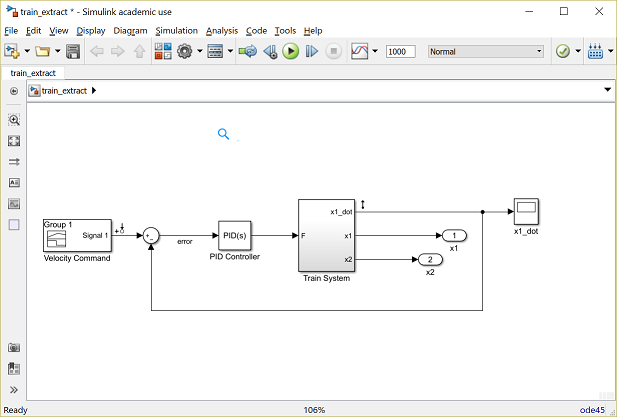

Тепер, коли блок для налаштування та вхідні й вихідні сигнали визначено, можна братися до налаштування. Натисніть **OK** у вікні Edit Architecture — побачите таке вікно:

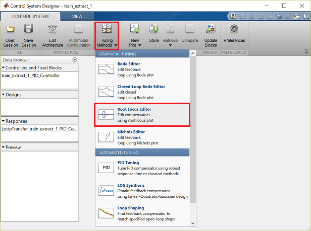

Натиснувши кнопку **Tuning Methods**, виберіть графіки, за якими проєктуватимете регулятор. У цьому прикладі застосуємо підхід кореневого годографа, тож виберіть **Root Locus Editor** у розділі Graphical Tuning. Метод кореневого годографа використовує графік усіх можливих полюсів замкненої системи, коли параметр (коефіцієнт підсилення контуру) змінюється від нуля до нескінченності. У вікні **Select Response to Edit** зробіть такий вибір і натисніть **Plot**:

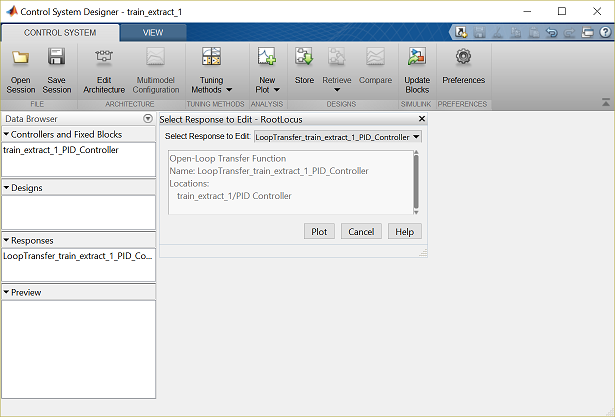

Ви дістанете кореневий годограф, який показує всі можливі положення полюсів замкненої системи «потяг» за простого пропорційного керування. З графіка видно, що за будь-якого підсилення контуру полюси замкненої системи лежать у лівій півплощині, тобто реакція стійка.

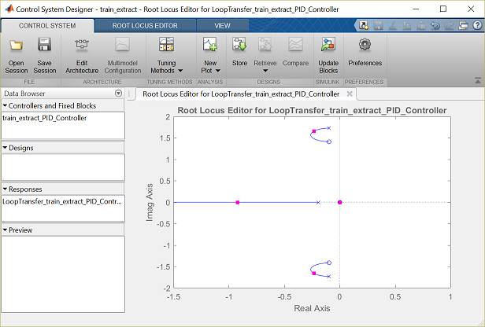

Достатньо зменшивши підсилення контуру, можна зсунути полюси замкненої системи далі вліво й змінити якість системи. Графічно це роблять, «схопивши» рожеві квадратики, що позначають полюси замкненої системи, і перетягнувши їх до положень полюсів розімкненої системи (позначених хрестиками).

Відповідну перехідну характеристику замкненої системи можна побачити, натиснувши **New Plot** на вкладці CONTROL SYSTEM і вибравши **New Step**. У вікні, що з'явиться, виберіть **New Input-Output Transfer Response** з випадного списку **Select Response to Plot**:

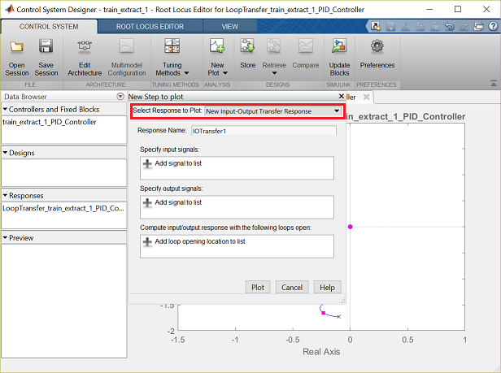

Потім задайте вхідний і вихідний сигнали у вікні New Step to plot:

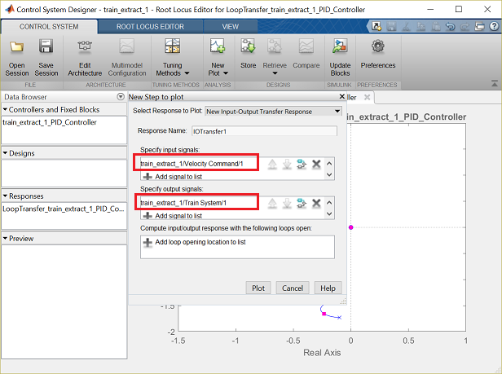

Натисніть кнопку **Plot**. З отриманої перехідної характеристики видно, що реакція стійка, але має певну усталену похибку.

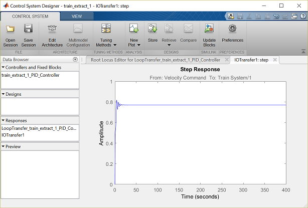

Нагадаємо: один зі способів зменшити усталену похибку замкненої системи — додати інтегральну складову. У цьому разі інтегратор у регуляторі зробить систему системою 1-го типу, а системи 1-го типу відпрацьовують ступінчасте завдання з нульовою усталеною похибкою. Пригадаймо вигляд ПІ-регулятора:

$$
C(s) = K_p + \frac{K_i}{s} = \frac{K_ps + K_i}{s}
$$

Із цього виразу видно, що ПІ-регулятор додає до розімкненої системи інтегратор і нуль. Інтегратор додають, клацнувши правою кнопкою миші в полі кореневого годографа й вибравши **Add Pole/Zero > Integrator**. Нуль додають так само — **Add Pole/Zero > Real Zero**, після чого клацають на дійсній осі в потрібній точці. Нуль можна переміщувати, перетягуючи його мишею. Коректор можна редагувати й безпосередньо, вводячи положення полюсів і нулів: клацніть правою кнопкою на кореневому годографі й виберіть **Edit Compensator**. У вікні, що відкриється, розмістимо інтегратор, дійсний нуль у точці −0.15 і виберемо підсилення контуру 0.05.

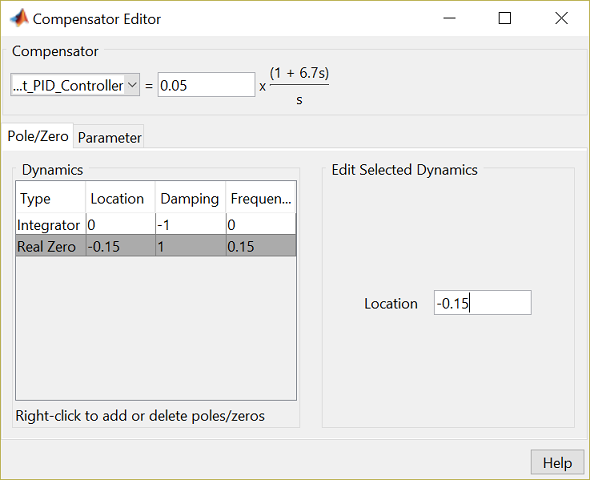

Отримана перехідна характеристика замкненої системи показує, що локомотив плавно зупиняється й відпрацьовує завдання сталої швидкості з нульовою усталеною похибкою:

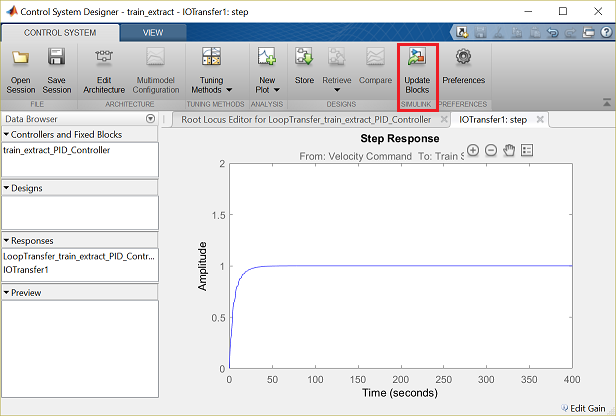

Вибрані коефіцієнти можна застосувати до моделі Simulink, натиснувши кнопку **Update Blocks** на вкладці CONTROL SYSTEM. Після цього моделювання можна запустити з уже налаштованим регулятором. Осцилограф швидкості локомотива покаже такий графік:

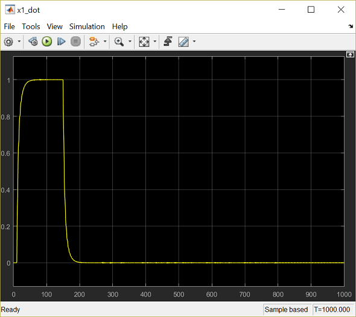

Загалом ця реакція відповідає нашій меті — плавно розігнати потяг і плавно його зупинити, зберігаючи мінімальну усталену похибку. Результат збігається з тим, що дав Control System Designer, бо і той аналіз, і модель Simulink використовували ту саму лінійну модель.

## Практика

1. Згорніть власну модель у підсистему, додайте блок PID Controller і Signal Builder із завданням «розгін — витримка — зупинка». Перевірте стійкість замкненої системи.
2. Витягніть лінеаризовану модель через Linear Analysis Tool, експортуйте її в MATLAB і обчисліть полюси та нулі замкненої системи командами `feedback`, `pole`, `zero`.
3. У Control System Designer додайте інтегратор і дійсний нуль, доберіть підсилення контуру й порівняйте усталену похибку до та після додавання інтегральної складової.
