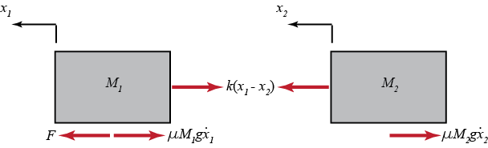
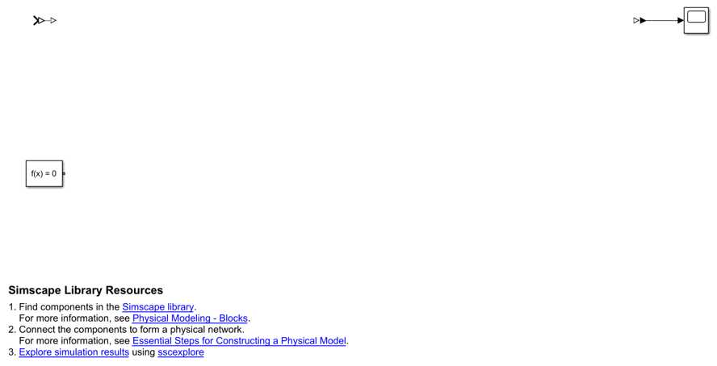
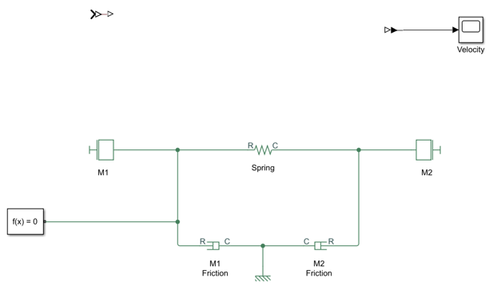
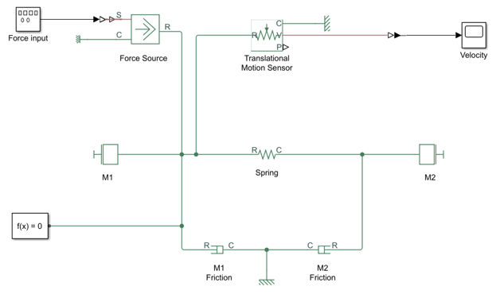
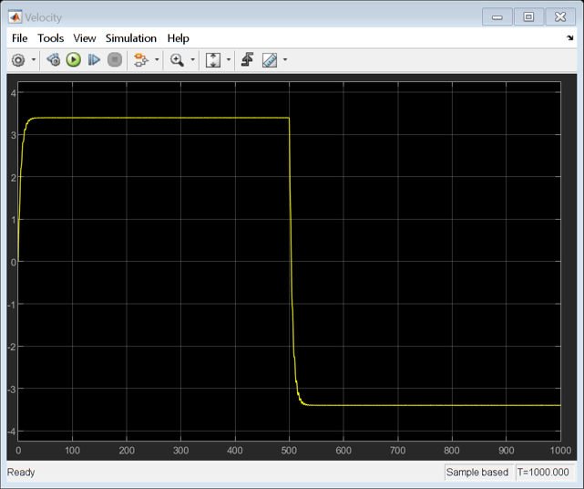

**Доступ:** потрібен Simscape — він **не входить** до MATLAB Online (basic). Цей модуль не є обов'язковим для проходження курсу.
**Джерело:** адаптовано з [Introduction: Simscape Modeling](https://ctms.engin.umich.edu/CTMS/index.php?example=Introduction&section=SimulinkSimscape) (CTMS, CC BY-SA 4.0).
**Основні блоки:** Mass, Translational Spring, Translational Damper, Mechanical Translational Reference, Ideal Force Source, Translational Motion Sensor, Solver Configuration, PS-Simulink Converter.

У цьому модулі показано альтернативний спосіб побудувати систему «потяг» із модуля [Моделювання в Simulink](../10-simulink-modeling/) — за допомогою блоків фізичного моделювання розширення **Simscape**. Блоки бібліотеки Simscape відповідають реальним фізичним компонентам, тому складні багатодоменні моделі можна будувати, не виводячи рівнянь із фізичних принципів, як ми це робили за законами Ньютона.

Пригадаймо схему системи «потяг»:


## Фізична постановка

Як і раніше, маси локомотива й вагона позначено $M_1$ і $M_2$. Локомотив і вагон з'єднані зчепленням жорсткістю $k$. Сила $F$ — це сила, що виникає між колесом локомотива й колією, а $\mu$ — коефіцієнт опору коченню.



Параметри системи такі:

| Параметр | Опис | Значення |
| --- | --- | --- |
| $M_1$ | маса локомотива | 1 кг |
| $M_2$ | маса вагона | 0.5 кг |
| $k$ | стала пружини | 1 Н/м |
| $\mu$ | коефіцієнт тертя | 0.02 |
| $F$ | сила | 1 Н |
| $g$ | прискорення вільного падіння | 9.8 м/с² |

Відкрийте нову модель Simscape, увівши в командному вікні MATLAB:

```matlab
ssc_new
```

Відкриється нова модель із кількома типовими блоками, які вже додано:



Елементи цієї заготовки:

- блок **Solver Configuration**;
- блоки **PS-Simulink** і **Simulink-PS** (показані подвійними трикутниками);
- блок **Scope**, приєднаний до блока PS-Simulink.

Блоки PS-Simulink і Simulink-PS задають межу між частиною Simulink (де блоки обчислюються послідовно за схемою «вхід — вихід») і частиною Simscape (де рівняння розв'язуються одночасно).

## Побудова моделі

Щоб побудувати модель, потрібно додати кілька блоків.

> **Поради щодо додавання блоків.**
>
> - Користуйтеся швидким уставлянням (Quick Insert): клацніть на схемі й почніть вводити назву блока — з'явиться список, з якого можна вибрати потрібний.
> - Після додавання блока з'явиться запит на введення параметра.
> - Щоб повернути або віддзеркалити блок, клацніть на ньому правою кнопкою миші й виберіть потрібний пункт у меню **Rotate & Flip**.
> - Щоб показувати значення параметра під назвою блока, див. розділ *Set Block Annotation Properties* у документації Simulink.

Додайте такі блоки:

- два блоки **Mass** (перейменуйте їх на «M1» і «M2»);
- один блок **Translational Spring** (перейменуйте на «spring»);
- один блок **Mechanical Translational Reference**;
- два блоки **Translational Damper** (перейменуйте на «M1 friction» і «M2 friction»).

Задайте кожному з цих блоків значення параметрів із таблиці вище. Зверніть увагу: в'язке тертя в системі моделюємо блоками Translational Damper — коефіцієнт демпфування кожного блока дорівнює коефіцієнту тертя, помноженому на нормальну реакцію (`mu*mass*g`). Якби була потрібна складніша модель тертя, можна було б узяти блоки **Translational Friction**.

З'єднайте блоки, як показано нижче, і перейменуйте осцилограф на «Velocity»:



Тепер додайте до моделі такі елементи:

- блок **Ideal Force Source** (перейменуйте на «Force Source»);
- блок **Signal Generator** (перейменуйте на «Force input»);
- блок **Translational Motion Sensor**.

У блоці Signal Generator виберіть форму сигналу (**Waveform**) `square` з амплітудою `-1` і частотою `0.001 Hz`. Відкрийте діалог Configuration Parameters (Ctrl+E), задайте **Type** = `Variable-step`, **Solver** = `auto`, а час завершення моделювання (**Stop time**) — `1000`. З'єднайте блоки так, як показано нижче, щоб завершити модель:



## Результати

Запустіть моделювання (Ctrl+T або зелена кнопка Run) і відкрийте осцилограф, щоб оцінити швидкість на виході. Вхідною силою був прямокутний сигнал із двома стрибками — додатним і від'ємним. З графіка видно, що локомотив спершу рушив уперед, коли було прикладено додатну силу, а згодом, після прикладання від'ємної сили, — у протилежному напрямку. Швидкість точно збігається з результатами моделі Simulink із модуля [Моделювання в Simulink](../10-simulink-modeling/).



## Якщо Simscape недоступний

Simscape не входить до набору MATLAB Online (basic), тому цей курс не вимагає запуску таких моделей. Якщо у вас є університетська чи інша відповідна ліцензія, використовуйте Simscape як альтернативний спосіб побудови тих самих об'єктів і порівняйте результат із рівняннями та звичайною моделлю Simulink.

Без додаткової ліцензії дійте так: опишіть фізичний об'єкт рівняннями, реалізуйте його передавальною функцією або моделлю у просторі станів і дослідіть у стандартному Simulink. Це не замінює фізичного експерименту, але зберігає основні навчальні цілі з моделювання та керування.

## Апаратні роботи

CTMS містить роботи з RC- та LRC-колами, маятником, лампою, підвищувальним перетворювачем і двигуном постійного струму. Вони можуть потребувати:

- конкретної плати або набору компонентів;
- джерела живлення та вимірювального обладнання;
- пакетів підтримки й драйверів;
- настільної версії MATLAB/Simulink;
- окремих процедур електробезпеки.

Не відтворюйте апаратну роботу лише за текстом без перевіреної специфікації стенда та нагляду відповідального викладача.

## Практика

1. Якщо Simscape доступний, побудуйте модель потяга з фізичних блоків і переконайтеся, що швидкість збігається з результатом звичайної моделі Simulink.
2. Замініть блоки Translational Damper на Translational Friction і порівняйте поведінку системи поблизу нульової швидкості.
3. Якщо Simscape недоступний, опишіть той самий об'єкт у просторі станів і повторіть експеримент із прямокутним вхідним сигналом у звичайному Simulink.
